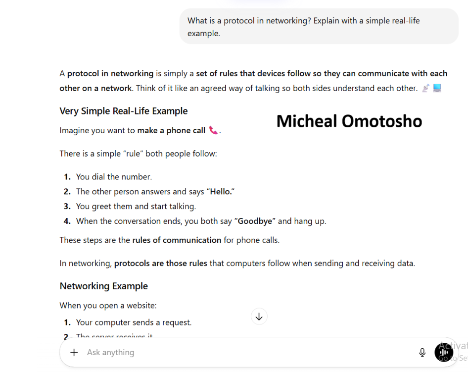
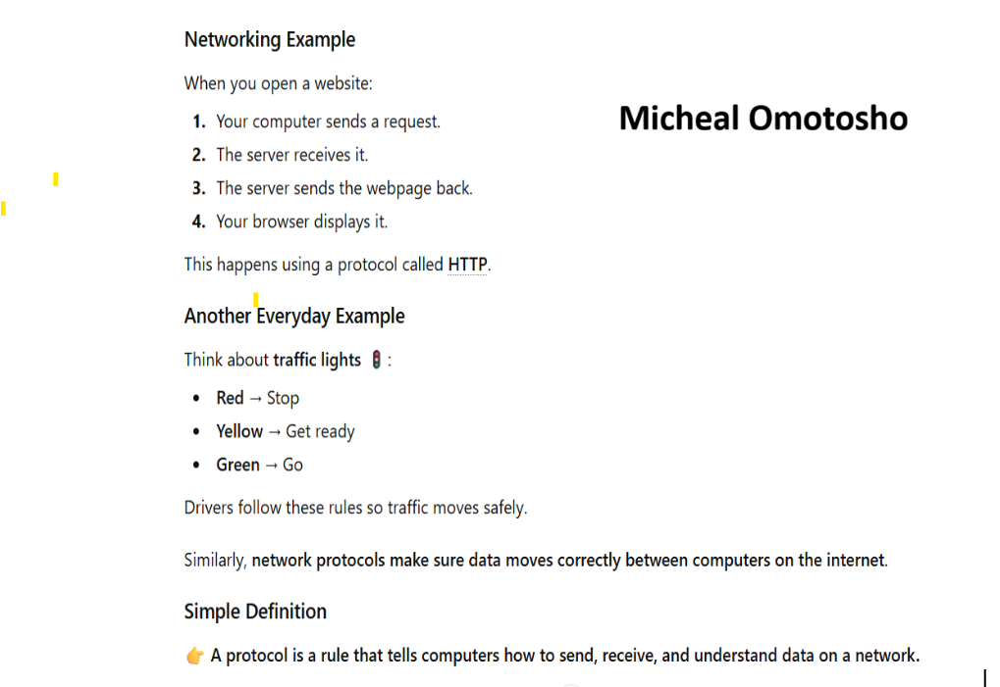
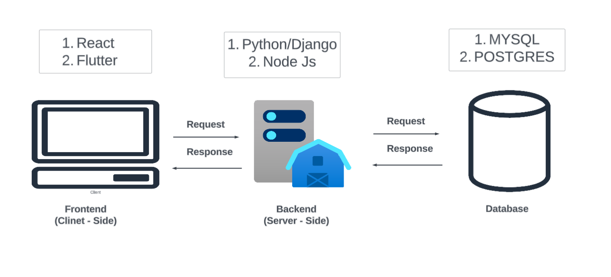
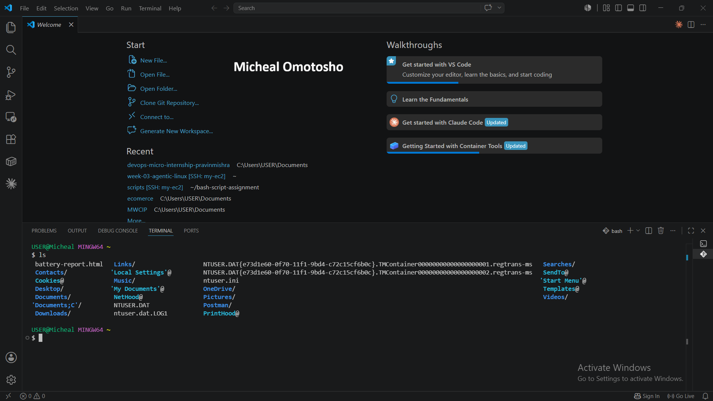

# Week 00 - Internet and Networking

Part of the DevOps Micro Internship (DMI) Cohort 3 with Agentic AI

---

# 🧑‍💻 Task 1: Using ChatGPT as Your Learning Assistant

## Scenario

You're new to DevOps and will frequently encounter technical questions. ChatGPT can be your learning companion.

## Your Task

Write a clear ChatGPT prompt to help you understand:

> "What is a protocol in networking? Explain with a simple real-life example."

Take a screenshot of your interaction showing:

* Your detailed prompt (with clear expectations)
* ChatGPT's simplified response with an example

## Screenshot

Save your screenshot in the `screenshots` folder and update the file name below.






Replace `task-1-chatgpt.png` with your actual screenshot file name.

---

## What I Learned (2–3 lines)

I learned that a network protocol is a set of rules that enables devices to communicate and exchange data correctly over a network. I also learned that protocols can be understood through real-life examples, such as people using a common language to communicate effectively.

---

# 🌐 Task 2: Internet and Networking

## Scenario

Your friend is launching an online bookstore named **EpicReads**.

He asked you to explain how users globally can access his website hosted in Finland.

## Your Task

Write a short explanation (**100–150 words**) that includes:

* Packet Switching
* IP Address
* TCP/IP
* HTTP/HTTPS

💡 **Tip:** You may use ChatGPT (as demonstrated in Task 1) to refine your explanation.

## Answer

The internet uses packet switching to send data by breaking it into small packets that can travel different routes before being reassembled at their destination. Each device connected to a network has a unique IP address, which identifies where the packets should be sent and received. The TCP/IP protocol suite manages this communication: IP handles the addressing and routing of packets, while TCP ensures they arrive correctly, in order, and without missing data. When you visit a website, your browser uses HTTP (Hypertext Transfer Protocol) to request and receive web pages. Most modern websites use HTTPS, the secure version of HTTP, which encrypts data using SSL/TLS to protect sensitive information such as passwords and payment details during transmission.

---

# 🏗️ Task 3: Application Architecture & Stack

## Scenario

EpicReads bookstore has two application versions:

### Two-Tier Application

* Frontend
* Database

### Three-Tier Application

* Frontend
* Backend
* Database

## Your Task

* Draw simple diagrams (hand-drawn or tool-based such as draw.io)
* Label each layer clearly
* List at least two common technologies or tools used for each layer
* Submit a screenshot or photo clearly showing your own drawing

## Diagram Screenshot / Photo

Save your diagram image in the `screenshots` folder and update the file name below.




Replace `task-3-diagram.png` with your actual diagram file name.

---

## Technologies Used

### Frontend

* React
* Flutter

### Backend

* Python/Django
* Node/Express

### Database

* MYSQL
* Postgres

---

# 🌍 Task 4: Domain Name & DNS (Basic Concepts)

## Scenario

Your friend's bookstore **EpicReads** is currently accessible through:

```text
52.172.142.222:3000
```

He purchased the domain:

```text
epicreads.com
```

## Your Task

In **50–100 words**, explain in your own words:

1. What is DNS (Domain Name System)?
2. Which DNS record type should be used to connect the domain to the given IP, and why?

## Answer

1. The Domain Name System (DNS) works like a phone book for the internet. Its main function is to translate or map IP addresses into domain names so that they are easier for humans to read and remember. For example, instead of remembering a numerical IP address, users can simply type a domain name like a website address in their browser. DNS servers handle this translation process. Every domain name is also connected to a domain registrar, which is the organization responsible for registering and managing that domain name.

2. Which DNS record type should be used to connect the domain to the given IP and why: I will choose the A and CNAME Record Types. The reason for my answer is because the A Record type works very well with IPV4 network address. It maps a domain name to an IPV4 Address. For example  mikky.com -> 10.50.20.21. While the CNAME Record type is majorly use for alias of one domain name to another domain name. It also allows multiple domain names point to one host server.

---

# 💻 Task 5: Visual Studio Code Setup (Hands-on)

## Your Task

Install Visual Studio Code (if not already installed).

Take a screenshot of your VS Code environment showing:

* Terminal open inside VS Code
* Running a basic command:

### Windows

```powershell
dir
```

### Linux / macOS

```bash
pwd
ls
```

* Your selected VS Code theme clearly visible

⚠️ **Important:** The screenshot must show your username or another identifiable detail to confirm it is your environment.

## Screenshot

Save your screenshot in the `screenshots` folder and update the file name below.




Replace `task-5-vscode.png` with your actual screenshot file name.

---

# 🔗 Task 6: Publish Your Assignment as a LinkedIn Post

## Objective

Publishing on LinkedIn helps you:

* Build your professional online presence
* Reinforce your learning
* Document your DevOps journey publicly

## Your Task

Summarize your answers from Tasks 1–5 into a LinkedIn post.

Clearly structure your post into the following sections:

* ChatGPT
* Internet & Networking
* App Architecture
* DNS
* VS Code Setup

Add the following credit note at the end of your post:

> **P.S. This post is part of the DevOps Micro Internship (DMI) with Agentic AI — Cohort 3 — by Pravin Mishra. My graded progress is public: https://github.com/michealdayo64/devops-micro-internship-pravinmishra.git · Start your DevOps journey: https://dmi.pravinmishra.com/?utm_source=student&utm_medium=ps-linkedin&utm_campaign=cohort3**

---

## LinkedIn Post URL

Paste your LinkedIn post URL here:

```text
https://www.linkedin.com/posts/micheal-omotosho-577230199_after-spending-the-last-6-months-learning-activity-7438048385485520896-2m9H?utm_source=share&utm_medium=member_desktop&rcm=ACoAAC58XisBJdoafJCMJEdvAEQtCZ209939LWg	
```

---

## LinkedIn Post Backup Copy

Paste the full text of your LinkedIn post here:

After spending the last 6 months learning Cloud Foundations and Cloud Architecture, I strongly believe that true growth comes from hands-on experience after learning the theory. Knowledge becomes more valuable when it is applied to real tasks and challenges.
At this stage of my journey, I want to dedicate more time to practical learning and building real-world skills using cloud services. My long-term goal is to become a DevOps Engineer, and I believe this goal is achievable if I am selected as one of the 100 participants for the DevOps Micro-Internship (Cohort 3).
Being part of this program will give me the opportunity to stay accountable, collaborate with like-minded individuals, and continuously improve my technical abilities. These are key factors that will significantly contribute to my career growth in cloud and DevOps.
As proof of my commitment and readiness for this challenge, I successfully completed the first five assignments given by our tutor, Pravin Mishra.
Tasks Completed
1. Using ChatGPT as a Learning Assistant
As a beginner in DevOps, I explored how ChatGPT can simplify complex technical concepts, answer questions, and support problem-solving. I created a prompt to demonstrate how AI can enhance my learning experience.

2. Internet and Networking
I watched a 58-minute video explaining how the internet works and the importance of networking. I learned key concepts such as Packet Switching, IP Addresses, TCP/IP, and HTTP/HTTPS, and gained a better understanding of how computers communicate over networks.

3. Application Architecture & Stack
This task introduced me to application architecture and how different components interact. I designed a basic application architecture and identified the technologies required to build and support scalable applications.

4. Domain Name & DNS (Basic Concepts)
I learned how the Domain Name System (DNS) translates human-readable domain names into IP addresses, making it easier for users to access websites without remembering numerical addresses.

5. Visual Studio Code Setup (Hands-on)
I installed and configured Visual Studio Code as my primary development environment. This tool will support coding, configuration management, and other DevOps-related activities throughout my learning journey.

I look forward to the opportunity to grow, contribute, and learn alongside other passionate individuals in the DevOps Micro-Internship Cohort 3.

This post is part of the DevOps Micro Internship (DMI) with Agentic AI — Cohort 3 — by Pravin Mishra. My graded progress is public: https://lnkd.in/eKFMaM5i · Start your DevOps journey: https://lnkd.in/eDwscBku

---

# Reflection – Week 0

### What did you find easy?

I found the assignments easy to complete because they gave me a better understanding of fundamental networking concepts through research. Learning about networking, IP addressing, DNS, packet switching, and other internet technologies helped strengthen my knowledge and made the tasks easier to understand and complete.

---

### What was difficult?

The interview process was a bit challenging for me because I am not yet used to that kind of experience. However, I believe it will help build my confidence, improve my communication skills, and better prepare me for future interviews.

---

### What will you improve next week?

Next week, I will improve by starting my tasks earlier, managing my time more effectively, and staying consistent throughout the week. I also want to strengthen my determination to complete tasks on time while continuously improving my understanding of DevOps concepts.

---

## 📌 About DMI & CloudAdvisory

DevOps Micro Internship (DMI) is a project-based DevOps program run by Pravin Mishra (The CloudAdvisory) focused on real-world execution, systems thinking, and career readiness.

It helps learners build strong DevOps foundations with hands-on experience.


## 📌 Resources

- 🌐 **DMI Official Website:** https://pravinmishra.com/dmi  
- 🎓 **DevOps for Beginners (Udemy):** https://www.udemy.com/course/devops-for-beginners-docker-k8s-cloud-cicd-4-projects/  
- 🎓 **Ultimate Agentic AI DevOps with Clude Code** https://www.udemy.com/course/ultimate-agentic-ai-devops-with-claude-code/?referralCode=448389767BC96284087B
- 🎓 **DevOps with Claude Code: Terraform, EKS, ArgoCD & Helm** https://www.udemy.com/course/devops-with-claude-code-terraform-eks-argocd-helm/?referralCode=1C5B734505D65A010FA3
- ▶️ **YouTube Playlist (DMI Cohort 3):** https://www.youtube.com/playlist?list=PLFeSNDtI4Cho  
- 🔗 **Pravin Mishra (LinkedIn):** https://www.linkedin.com/in/pravin-mishra-aws-trainer/  
- 🏢 **CloudAdvisory (LinkedIn):** https://www.linkedin.com/company/thecloudadvisory/

---

*This submission is part of DevOps Micro Internship (DMI) Cohort 3 — Agentic AI Track*