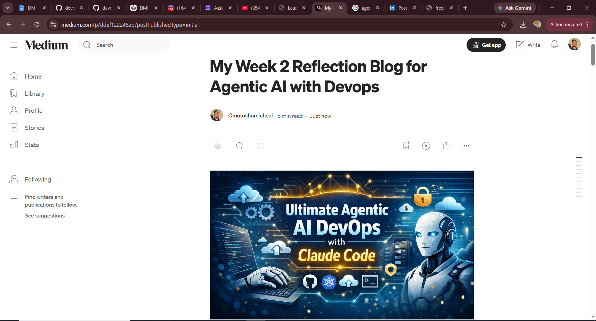
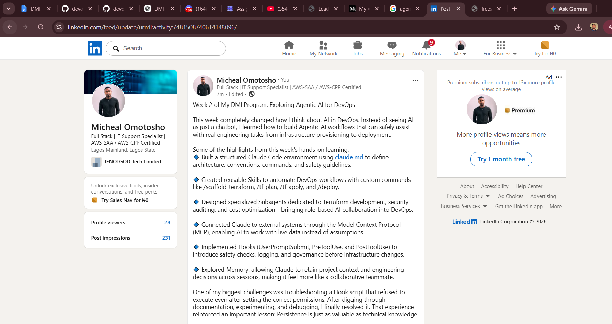

# Assignment 8 — Week 2 Reflection Blog

Part of the DevOps Micro Internship (DMI) Cohort 3 with Agentic AI

---

# Purpose

In this assignment, you will reflect on your Week 2 learning journey and write a short blog capturing your experience working with Agentic AI tools such as Claude Code, Skills, Subagents, MCP, Hooks, Permissions, and Memory.

You will also publish a LinkedIn post summarizing your learning and share both links for evaluation.

---

# Task 1 — Write Your Reflection Blog

## Goal

Write a reflection blog covering your Week 2 learning experience.

### Blog Requirements

Your blog must include:

* Title: **Reflection – Week 2**
* Minimum 300 words
* At least 2–3 topics from Week 2 (Claude Code, Skills, Subagents, MCP, Hooks, Permissions, Memory)
* Honest personal reflection (learning, challenges, mindset)
* One habit/system you plan to implement
* Your full name clearly visible

### Allowed Platforms

You can publish your blog on:

* Hashnode
* Medium
* Dev.to
* LinkedIn Article
* GitHub Markdown file
* Substack

---

### Evidence

#### Screenshot 1 — Blog published and visible



---

### Submission Field

Blog Link:

https://medium.com/@omotoshomicheal93/my-week-2-reflection-blog-for-agentic-ai-with-devops-ddef122248ab?sharedUserId=omotoshomicheal93

---

# Task 2 — Create LinkedIn Post

## Goal

Share your Week 2 learning publicly on LinkedIn.

---

### LinkedIn Post Requirements

Your post must include:

* One screenshot from any Week 2 assignment
* Short reflection (what you learned or built)
* Required P.S. line exactly as given below

---

### Required P.S. Line (Must Include Exactly)

> **P.S. This post is part of the DevOps Micro Internship (DMI) with Agentic AI — Cohort 3 — by [Pravin Mishra](https://www.linkedin.com/in/pravin-mishra-aws-trainer/). My graded progress is public: https://dmi.pravinmishra.com/s/YOUR-GITHUB-USERNAME.html · Start your DevOps journey: https://dmi.pravinmishra.com/?utm_source=student&utm_medium=ps-linkedin&utm_campaign=cohort3**

---

### Suggested Hashtags

#DMIByPravinMishra #AgenticAI #ClaudeCode #DevOps #LearningInPublic

---

### Evidence

#### Screenshot 2 — LinkedIn post published



---

### Submission Field

LinkedIn Post Content (copy-paste here):

```
Week 2 of My DMI Program: Exploring Agentic AI for DevOps

This week completely changed how I think about AI in DevOps. Instead of seeing AI as just a chatbot, I learned how to build Agentic AI workflows that can safely assist with real engineering tasks from infrastructure provisioning to deployment.

Some of the highlights from this week's hands-on learning:
🔹 Built a structured Claude Code environment using claude.md to define architecture, conventions, commands, and safety guidelines.

🔹 Created reusable Skills to automate DevOps workflows with custom commands like /scaffold-terraform, /tf-plan, /tf-apply, and /deploy.

🔹 Designed specialized Subagents dedicated to Terraform development, security auditing, and cost optimization—bringing role-based AI collaboration into DevOps.

🔹 Connected Claude to external systems through the Model Context Protocol (MCP), enabling AI to work with live data instead of assumptions.

🔹 Implemented Hooks (UserPromptSubmit, PreToolUse, and PostToolUse) to introduce safety checks, logging, and governance before infrastructure changes.

🔹 Explored Memory, allowing Claude to retain project context and engineering decisions across sessions, making it feel more like a collaborative teammate.

One of my biggest challenges was troubleshooting a Hook script that refused to execute even after setting the correct permissions. After digging through documentation, experimenting, and debugging, I finally resolved it. That experience reinforced an important lesson: Persistence is just as valuable as technical knowledge.

Beyond the technical skills, I'm becoming more confident with Git, the terminal, and approaching complex problems with a research-first mindset.
My biggest takeaway from this week is that Agentic AI isn't about replacing engineers, it's about empowering them through structured, safe, and autonomous workflows built around a simple loop:
Gather → Act → Verify

Next week, I'll be applying these concepts by building a full-stack application with Python, Django, and JavaScript, using Claude Code throughout the development lifecycle.

A huge thank you to Pravin Mishra for creating this incredible learning platform and to my amazing mentors Anjana Muthunayake and Tanisha Borana for their guidance, encouragement, and continuous support throughout this journey.
You can check my week 2 reflection on Medium via the link below:
https://lnkd.in/en3W-bPT

Excited to keep learning, building, and growing! 

P.S. This post is a part of DevOps Micro Internship with Agentic AI Cohort-3 by Pravin Mishra. You can start your DevOps journey by joining this Discord community ( https://lnkd.in/eRacCQDM ).

#DMIByPravinMishra #AgenticAI #ClaudeCode #DevOps #LearningInPublic #DevOps #AgenticAI #ClaudeCode #Terraform #CloudComputing #Automation #Git #MCP #AIEngineering #DevSecOps #DMI #ContinuousLearning
```

---

### LinkedIn Post Link:

https://www.linkedin.com/posts/micheal-omotosho-577230199_dmibypravinmishra-agenticai-claudecode-ugcPost-7481508737376247808-IVdr/?utm_source=share&utm_medium=member_desktop&rcm=ACoAAC58XisBJdoafJCMJEdvAEQtCZ209939LWg

---

# Submission Instructions

* Blog must be publicly accessible
* LinkedIn post must be visible (public or unlisted where applicable)
* All required fields must be filled
* Screenshot proofs must be added to GitHub repository
* Do not include sensitive information in blog or post

---

# Completion Checklist

* [ ] Blog written with required structure
* [ ] Blog includes at least 2–3 Week 2 topics
* [ ] Blog is publicly accessible
* [ ] LinkedIn post created
* [ ] Required P.S. line included
* [ ] LinkedIn post content copied in submission field
* [ ] Blog link added
* [ ] LinkedIn post link added
* [ ] Screenshots added to GitHub repo

---

# About DMI & CloudAdvisory

DevOps Micro Internship (DMI) is a project-based DevOps program run by Pravin Mishra (The CloudAdvisory), focused on real-world execution, systems thinking, and agentic AI workflows.

It helps learners build strong DevOps foundations through hands-on experience.

---

# Resources

* 🌐 DMI Official Website: [https://pravinmishra.com/dmi](https://pravinmishra.com/dmi)
* 🎓 DevOps for Beginners (Udemy): [https://www.udemy.com/course/devops-for-beginners-docker-k8s-cloud-cicd-4-projects/](https://www.udemy.com/course/devops-for-beginners-docker-k8s-cloud-cicd-4-projects/)
* 🎓 Agentic AI DevOps with Claude Code: [https://www.udemy.com/course/ultimate-agentic-ai-devops-with-claude-code/](https://www.udemy.com/course/ultimate-agentic-ai-devops-with-claude-code/)
* 🎓 DevOps with Claude Code: Terraform, EKS, ArgoCD & Helm: [https://www.udemy.com/course/devops-with-claude-code-terraform-eks-argocd-helm/](https://www.udemy.com/course/devops-with-claude-code-terraform-eks-argocd-helm/)
* ▶️ YouTube Playlist: [https://www.youtube.com/playlist?list=PLFeSNDtI4Cho](https://www.youtube.com/playlist?list=PLFeSNDtI4Cho)
* 🔗 Pravin Mishra (LinkedIn): [https://www.linkedin.com/in/pravin-mishra-aws-trainer/](https://www.linkedin.com/in/pravin-mishra-aws-trainer/)
* 🏢 CloudAdvisory (LinkedIn): [https://www.linkedin.com/company/thecloudadvisory/](https://www.linkedin.com/company/thecloudadvisory/)

