# Assignment 3 — Production Maintenance Drill (OPS Checklist)

Part of the DevOps Micro Internship (DMI) Cohort 3 with Agentic AI

---

## Purpose

In this assignment, you will treat your already deployed React application (on Ubuntu VM with Nginx) as a live production system. You will perform structured operational checks covering network validation, service health, log analysis, resource monitoring, configuration verification, and incident simulation with recovery — mirroring real on-call DevOps responsibilities.

---

# Task 1 — Server Access & Networking Validation

## Goal

Verify that the deployed React application is reachable from the browser and confirm basic network connectivity of the Ubuntu VM.

### Evidence

#### Screenshot 1 — Browser showing the React app with your Full Name visible on the UI

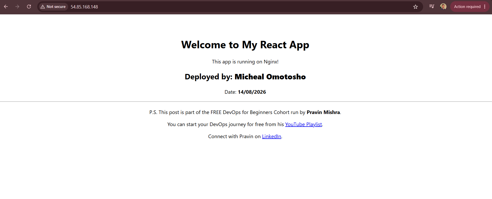

---

#### Screenshot 2 — Output of `ip a`

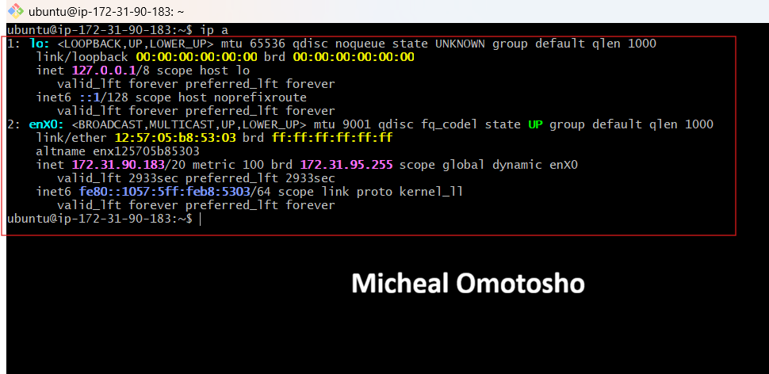

---

#### Screenshot 3 — Output of `sudo ss -tulpen`

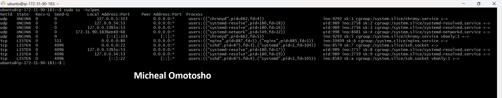

---

#### Screenshot 4 — Output of `sudo ufw status`

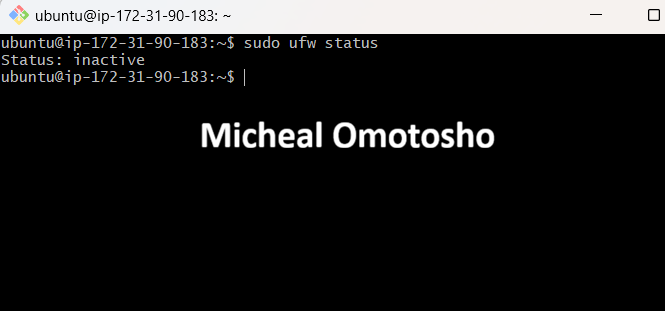

---

### Notes

Answer the following in your own words:

**1. What proves Nginx is listening on 0.0.0.0:80?**

It means nginx is listening on all IP addresses on port 80, allowing it to accept http request from any reachable IP addresses

---

**2. What proves SSH is active on port 22?**

SSH is active on port 22 if the SSH service is listening on port 22 and accepting incoming SSH connections. This can be verified using commands such as "ss -tulnp | grep :22" or by successfully connecting with ssh user@server.

---

**3. Did you find any unexpected open ports? Explain briefly.**

No, I did not find any unexpected open ports. Based on the output of sudo ss -tulnp, the only externally open ports are SSH (port 22) and Nginx (port 80), which are expected. Other listening services, such as chronyd (time synchronization) and systemd-resolved (DNS resolution), are bound only to loopback addresses (127.0.0.1, 127.0.0.53, and 127.0.0.54), meaning they are accessible only from within the server.

---

# Task 2 — Service Health & Systemd Validation (Nginx)

## Goal

Verify that Nginx is properly installed, running, enabled at boot, and safely configured.

### Evidence

#### Screenshot 1 — Output of `systemctl status nginx --no-pager`

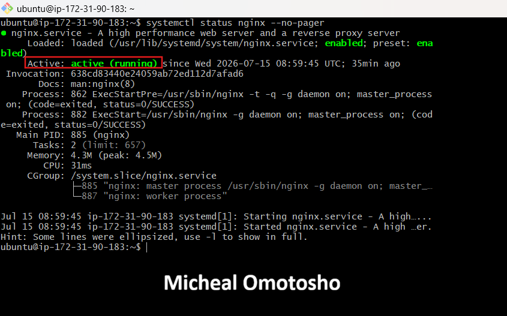

---

#### Screenshot 2 — Output of `sudo nginx -t`

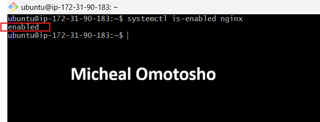

---

#### Screenshot 3 — Output of `sudo ss -lptn '( sport = :80 )'`

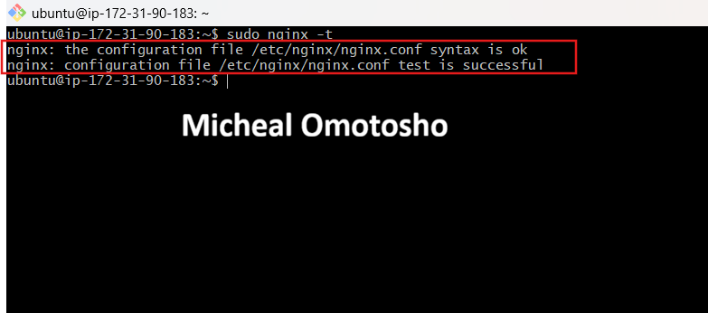

---

### Notes

Answer the following in your own words:

**1. What happens if Nginx fails to restart in production?**

If Nginx fails to restart in production, the website or application it serves becomes unavailable/unreachable. Users will not be able to access the site and may receive a connection refused or connection timeout.

---

**2. What's your basic rollback plan?**

Before initiating a rollback, I would first verify the Nginx configuration and service status using nginx -t and sudo systemctl status nginx --no-pager. This helps identify configuration or service errors before attempting a restart. If the failure is caused by a misconfiguration, I would restore the previous known working Nginx configuration or deployment, validate it again with nginx -t, and then restart the Nginx service. Finally, I would ensure the Nginx service is enabled using systemctl enable nginx so that it starts automatically whenever the virtual machine is rebooted.

---

# Task 3 — Logs & Request Trace

## Goal

Verify real traffic flow and analyze logs to understand system behavior and errors.

### Evidence

#### Screenshot 1 — Output of `sudo tail -n 30 /var/log/nginx/access.log`

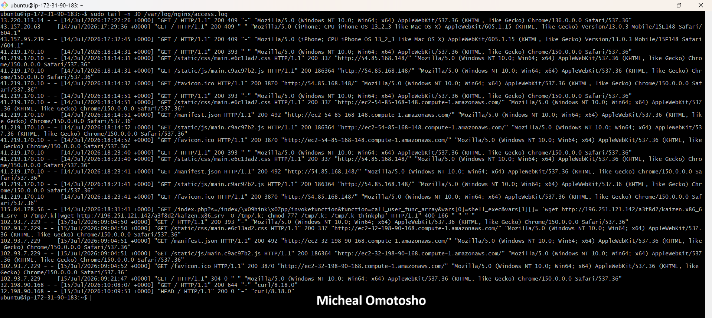

---

#### Screenshot 2 — Output of `sudo tail -n 30 /var/log/nginx/error.log`

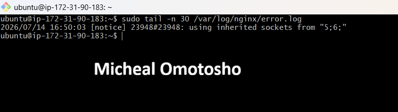

---

#### Screenshot 3 — Output of `sudo journalctl -u nginx --no-pager -n 50`

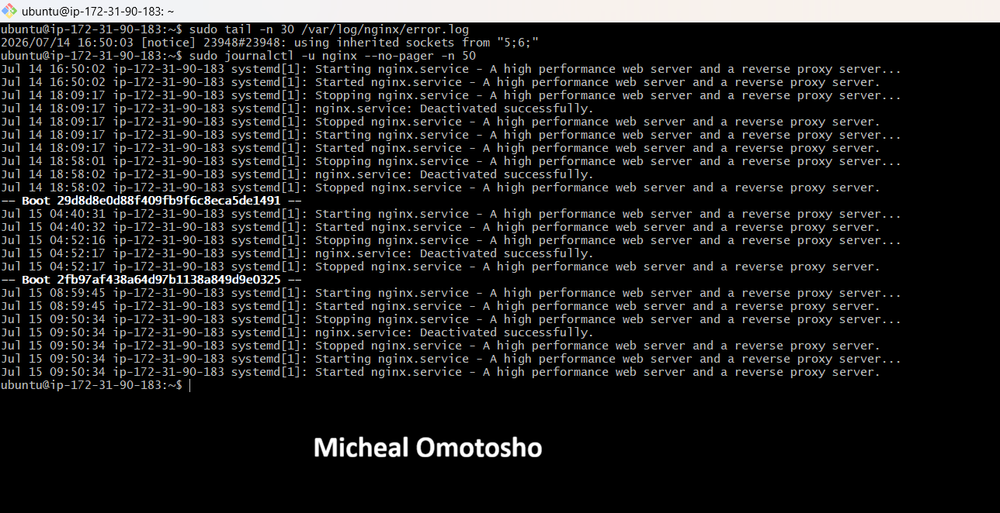

---

### Notes

Answer the following in your own words:

**1. Were there any errors in the logs?**

- If yes, mention 1–2 example error lines from the logs and explain what each one means in simple terms.
- If no, explain what it means if the error log is empty or shows no recent errors during your check.

No errors were detected in either the Nginx error log or the journalctl output. The Nginx error log was empty, indicating no recorded errors, while the journalctl logs showed only successful service events, including Started, Stopped, Reloaded, and Deactivated successfully**, with no indications of failures or abnormal exits.

---

**2. If there were no errors, what does that indicate about the system?**

It indicates that the system is operating normally. It suggests there are no configuration issues, service failures, or internal errors recorded at the time the logs were checked. Additionally, the successful service status entries confirm that Nginx and the related system services are running as expected.

---

**3. Based on the access logs, were your curl requests visible in the log entries? What does that prove about traffic flow?**

Yes, my curl requests were visible in the Nginx access logs. This confirms that the requests successfully reached the Nginx web server and were processed correctly. The HTTP status code **200 (OK)** indicates that the GET request was successfully handled and the requested resource was served without errors. The access log also records the client's IP address, client's browser, request method, response status, and other details, confirming that traffic is flowing correctly from the client to the Nginx server and back to the client.

---

# Task 4 — System Resource Health Check (Capacity Red Flags)

## Goal

Assess server capacity and detect potential performance or failure risks.

### Evidence

#### Screenshot 1 — Output of `uptime`

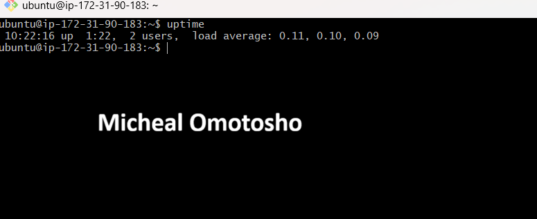

---

#### Screenshot 2 — Output of `free -h`

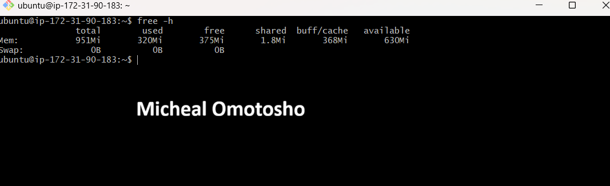

---

#### Screenshot 3 — Output of `df -h`

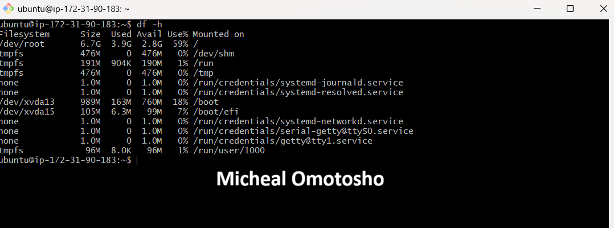

---

#### Screenshot 4 — Output of `sudo du -sh /var/* | sort -h`

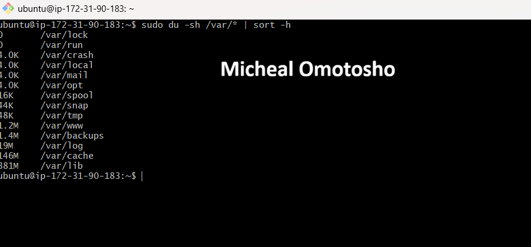

---

### Notes

Answer the following in your own words:

**1. Which resource looks most critical right now? (CPU/load, memory, or disk) Explain why.**

None of the resources appear to be under critical pressure at the time of assessment. The CPU is largely idle, indicating a low processing load. Memory utilization is healthy, with sufficient available capacity and no swap usage, suggesting there is no memory pressure. Disk usage is approximately 59%, which is within a safe operating range and leaves adequate free space for normal system operations. Overall, the server appears to have sufficient CPU, memory, and disk resources to operate efficiently.

---

**2. What happens if disk becomes 100% full in a production server?**

If the disk becomes 100% full on a production server, it can lead to serious operational issues. Log files may no longer be able to record new entries, making it difficult to troubleshoot problems during an active incident. Applications, package managers, and build tools that rely on temporary storage may fail or crash because they cannot create or write temporary files. If a database is running on the server, it may refuse write operations or, in severe cases, risk data corruption. When disk space is completely exhausted, the operating system itself can become unstable, and essential tasks such as creating new files, writing system logs, or even logging in via SSH—may fail due to the lack of available storage.

---

# Task 5 — Configuration & Deployment Verification

## Goal

Ensure the correct React build is deployed and Nginx is serving it properly.

### Evidence

#### Screenshot 1 — Output of `ls -lah /var/www/html | head -n 20`

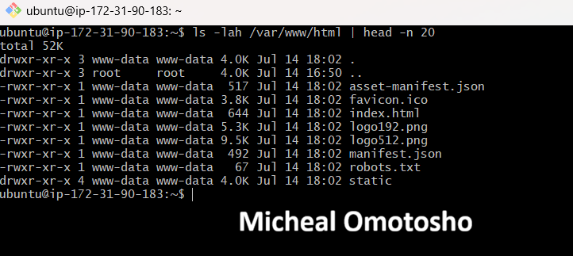

---

#### Screenshot 2 — Output of `grep -R "Deployed by" -n /var/www/html 2>/dev/null | head`

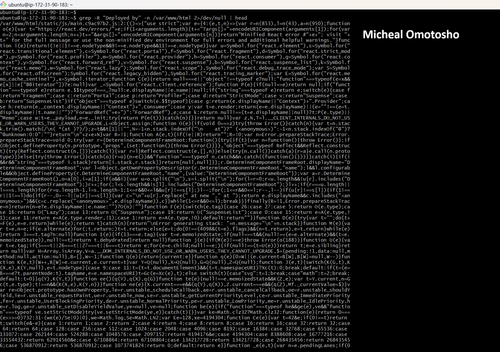

---

#### Screenshot 3 — Output of `grep -n "try_files" /etc/nginx/sites-available/default`

---

### Notes

Answer the following in your own words:

**1. How do you confirm that the correct version of the application is deployed?**

The correctness of the deployment was verified through a series of validation checks rather than a single command. First, ls -lah /var/www/html confirmed that the expected Create React App production build files, including index.html and the static/ directory, were present and owned by www-data, the user under which Nginx runs. Next, grep -R "Deployed by" verified that the unique deployment identifier was embedded in the compiled JavaScript bundle and matched the original source, confirming that the intended build—not a stale or cached version—was deployed. The Nginx configuration was then validated by confirming the presence of the try_files directive, ensuring that all unmatched routes correctly fall back to index.html for proper single-page application (SPA) routing. Finally, a curl request to the live server returned the same index.html content being served by Nginx, confirming that the deployed files on disk matched the content delivered to end users. Together, these checks verified that the correct version of the application was successfully deployed and served in the production environment.

---

# Task 6 — Nginx Configuration Failure Simulation

## Goal

Simulate a real-world Nginx misconfiguration and recover the service safely.

### Evidence

#### Screenshot 1 — Output of `sudo nginx -t` showing the syntax error (broken config)

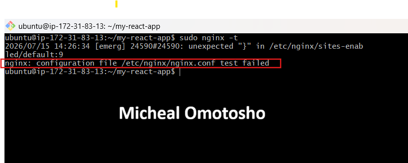

---

#### Screenshot 2 — Output of `sudo nginx -t` showing syntax ok (fixed config)

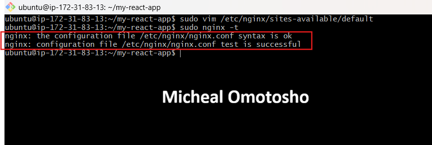

---

#### Screenshot 3 — Output of `curl -I http://<public-ip>` confirming recovery (200 OK)

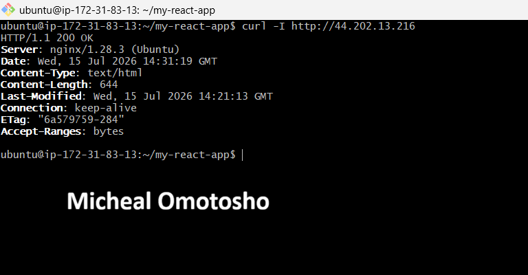

---

### Notes

Answer the following in your own words:

**1. What caused the configuration failure?**

The configuration failure was caused by a syntax error in the Nginx configuration file located at `/etc/nginx/sites-available/default`. Specifically, I intentionally removed the semicolon (`;`) from the `try_files $uri /index.html;` directive as instructed. This caused Nginx to fail parsing the configuration correctly, resulting in a configuration syntax error that prevented the service from reloading or restarting until the error was corrected.

---

**2. How did you fix the issue?**

To fix the issue, I reopened the Nginx configuration file and restored the missing semicolons in the affected directives. I then ran `sudo nginx -t` to validate the configuration and ensure the syntax was correct before restarting the service. After receiving the **"syntax is ok"** and **"test is successful"** messages, I restarted Nginx using `sudo systemctl restart nginx`. Finally, I verified that the application was serving traffic correctly by performing an external `curl -I` request, which confirmed that the website was accessible again.

---

**3. How can you avoid this kind of issue in real production systems?**

This type of issue can be avoided by following a robust deployment validation process. Before deploying any configuration changes, I would carefully review the Nginx configuration for syntax errors and run `sudo nginx -t` to verify that the configuration is valid. Only after the configuration test passes would I reload or restart the Nginx service. After the restart, I would perform an HTTP health check, such as `curl -I`, to confirm that the application is responding with a **200 OK** status and is accessible to users.

To further reduce the risk of configuration failures in production, I would always run `nginx -t` after every configuration change without exception, maintain all Nginx configuration files in version control (Git) so changes can be quickly rolled back if necessary, and test configuration updates in a staging environment before deploying them to production. Where possible, I would also automate configuration validation as part of the CI/CD pipeline, ensuring that invalid configurations are detected during continuous integration and never reach the live production server.

---

# Task 7 — Web Application Failure Simulation

## Goal

Simulate missing deployment content and recover the application safely.

### Evidence

#### Screenshot 1 — Output of `curl -I http://<public-ip>` showing failure (non-200 response)

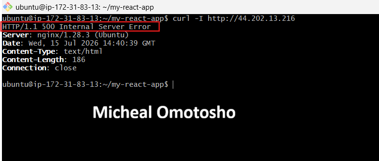

---

#### Screenshot 2 — Output of `curl -I http://<public-ip>` confirming recovery (200 OK)

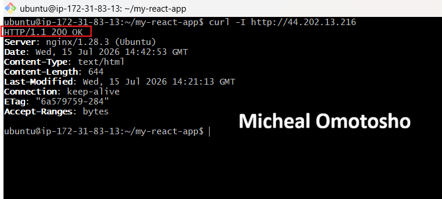

---

### Notes

Answer the following in your own words:

**1. What caused the application to break in this scenario?**

The application broke because all deployment files were removed from the web root directory (`/var/www/html`), which is the location from which Nginx serves the application. Although Nginx itself remained running and its configuration was still valid, the required application files, including `index.html` and the compiled React assets, were no longer available. As a result, Nginx was unable to serve the application and returned a **500 Internal Server Error** because the configured fallback file could not be found.

---

**2. How did you fix the issue and restore the application?**

The application was restored by using the backup that had been created before the deployment. Instead of deleting the original application files, they had been safely moved to an html_backup directory, making recovery straightforward.
The recovery process involved removing the empty, incorrectly deployed directory and moving the backed-up application back to its original location. Once the files were restored, Nginx was restarted to ensure it was serving content from the correct directory.
To verify that the restoration was successful, an external curl -I request was performed. The server responded with HTTP 200 OK

---

**3. What steps would you take to prevent this kind of issue in real production systems?**

To prevent this type of issue in a real production environment, I would implement the following best practices:

1. Automated pre-deployment backups: Before every release, automatically create a backup of the current production version. This enables an immediate rollback without requiring manual intervention if the deployment fails.
2. Atomic deployments: Deploy each release to a separate, versioned directory (for example, /var/www/releases/<timestamp>) and atomically switch a symbolic link (such as /var/www/current) to point to the new release. This avoids overwriting the live directory in place, ensuring users are never served an empty or partially deployed application.
3. CI/CD deployment validation: Incorporate automated validation steps into the CI/CD pipeline to verify that critical application files (such as index.html) exist, are non-empty, and that the build artifacts have been deployed successfully before the deployment is marked as complete.
4. Automated health checks and monitoring: Perform post-deployment health checks that confirm the application is responding with a healthy HTTP 200 OK status and that key endpoints are functioning correctly. Combined with monitoring and alerting, this ensures deployment issues are detected within seconds rather than being discovered manually.

---

# Task 8 — Security & Reliability Review

## Goal

Review and reflect on the security and reliability practices applied during this assignment.

### Security & Reliability Notes

Answer the following in your own words:

**1. Why is SSH key-based authentication more secure than sharing passwords?**

SSH key-based authentication is more secure than password-based authentication because it uses a cryptographic key pair consisting of a private key and a public key. The public key is stored on the server, while the private key remains securely on the user's device and is never transmitted over the network.

Unlike passwords, which can be guessed, reused, or intercepted through brute-force or phishing attacks, SSH private keys are extremely difficult to compromise due to their strong cryptographic nature. Authentication is performed using a cryptographic challenge-response process rather than sending a password to the server.

Additionally, SSH keys eliminate the need to share or manually enter passwords when connecting to a server. The private key remains known only to the user, making unauthorized access significantly more difficult. For even greater security, the private key itself can be protected with a passphrase, adding an extra layer of protection if the key file is ever stolen.

---

**2. Why should only required ports be open on a production server?**

Only the ports required for the application or service should be open on a production server to minimize the server's attack surface. Every open port exposes a network service that could potentially be exploited if it contains a vulnerability or is misconfigured.

By closing unnecessary ports, you reduce the number of entry points available to attackers, making unauthorized access and network-based attacks much more difficult. For example, a web server may only need ports 80 (HTTP) and 443 (HTTPS) open to the public, while administrative services such as SSH (port 22) should be restricted to trusted IP addresses or accessed through a VPN.

---

**3. Why is it important for Nginx to be enabled on boot?**

It is important for Nginx to be enabled on boot so that it starts automatically whenever the server is restarted or rebooted. This ensures the web application or website becomes available immediately without requiring manual intervention from an administrator.
If Nginx is not enabled on boot, the server may come back online after a reboot, but the web service will remain unavailable until someone manually starts Nginx. This can lead to unnecessary downtime, failed health checks, and a poor user experience.

Enabling Nginx to start automatically improves the reliability and availability of the application, which is essential for production systems where continuous uptime is expected.

---

**4. What are the risks of sharing secrets, keys, or credentials publicly?**

The risks include:

* Unauthorized access: Attackers can log in to servers, databases, or cloud accounts using the exposed credentials.
Data breaches: Sensitive customer or business data may be stolen, modified, or deleted.

* Service disruption: Malicious users could alter configurations, stop services, or deploy malicious code, leading to downtime.
Financial loss: Exposed cloud credentials can be used to create resources, mine cryptocurrency, or incur unexpected infrastructure costs.
* Reputation damage: Security incidents caused by leaked credentials can erode customer trust and harm an organization's reputation.

---

**5. Why should cloud resources be stopped or terminated when they are no longer needed?**

Cloud resources should be stopped or terminated when they are no longer needed to avoid unnecessary costs and improve resource management. Running resources such as virtual machines, databases, or load balancers continue to incur charges even if they are not actively being used. While stopping a virtual machine may eliminate compute charges, you may still be billed for attached storage volumes, static IP addresses, snapshots, or other associated resources. Terminating resources that are no longer required helps eliminate these unnecessary costs.

---

# LinkedIn Post (Required)

## Evidence

#### LinkedIn Post URL

Paste your LinkedIn post URL here:

https://www.linkedin.com/posts/micheal-omotosho-577230199_devops-cloudcomputing-linux-ugcPost-7484070282148737025-VU5f/?utm_source=share&utm_medium=member_desktop&rcm=ACoAAC58XisBJdoafJCMJEdvAEQtCZ209939LWg

---

#### Screenshot — Published LinkedIn post

---

# Submission Instructions

- Add all required screenshots in your submission
- Full name must be visible in required screenshots
- Do not expose sensitive information (keys, passwords, account IDs)

---

# Completion Checklist

- [ ] Task 1: Screenshots (browser, ip a, ss -tulpen, ufw status) + Notes answered
- [ ] Task 2: Screenshots (nginx status, nginx -t, ss port 80) + Notes answered
- [ ] Task 3: Screenshots (access log, error log, journalctl) + Notes answered
- [ ] Task 4: Screenshots (uptime, free -h, df -h, du -sh) + Notes answered
- [ ] Task 5: Screenshots (ls html, grep deployed by, grep try_files) + Notes answered
- [ ] Task 6: Screenshots (nginx -t fail, nginx -t pass, curl recovery) + Notes answered
- [ ] Task 7: Screenshots (curl failure, curl recovery) + Notes answered
- [ ] Task 8: Security & Reliability Notes answered
- [ ] LinkedIn post published and URL submitted
- [ ] Full Name visible in all required screenshots
- [ ] No sensitive data exposed

---

## 📌 About DMI & CloudAdvisory

DevOps Micro Internship (DMI) is a project-based DevOps program run by Pravin Mishra (The CloudAdvisory) focused on real-world execution, systems thinking, and career readiness.

It helps learners build strong DevOps foundations with hands-on experience.

---

## 📌 Resources

- 🌐 DMI Official Website: https://pravinmishra.com/dmi  
- 🎓 DevOps for Beginners (Udemy): https://www.udemy.com/course/devops-for-beginners-docker-k8s-cloud-cicd-4-projects/  
- 🎓 Agentic AI DevOps with Claude Code: https://www.udemy.com/course/ultimate-agentic-ai-devops-with-claude-code/  
- 🎓 DevOps with Claude Code: Terraform, EKS, ArgoCD & Helm: https://www.udemy.com/course/devops-with-claude-code-terraform-eks-argocd-helm/  
- ▶️ YouTube Playlist: https://www.youtube.com/playlist?list=PLFeSNDtI4Cho  
- 🔗 Pravin Mishra (LinkedIn): https://www.linkedin.com/in/pravin-mishra-aws-trainer/  
- 🏢 CloudAdvisory (LinkedIn): https://www.linkedin.com/company/thecloudadvisory/

---

*This submission is part of DevOps Micro Internship (DMI) Cohort 3 — Agentic AI Track.*