# Assignment 5 — Bash Script Automation Drill (OPS Checklist)

Part of the DevOps Micro Internship (DMI) Cohort 3 with Agentic AI

---

## Purpose

In this assignment, you will practice Bash scripting by building a series of small automation scripts covering environment setup, variables, arrays, loops, file conditionals, if-else logic, and functions. These scripts form the foundation of real-world Linux automation used in DevOps, cloud, and production support environments.

---

# Task 1 — Bash Environment & Workspace Setup

## Goal

Verify that Bash is available on your system and create a clean workspace for this assignment.

### Evidence

#### Screenshot 1 — Output of `echo $SHELL` and `bash --version`

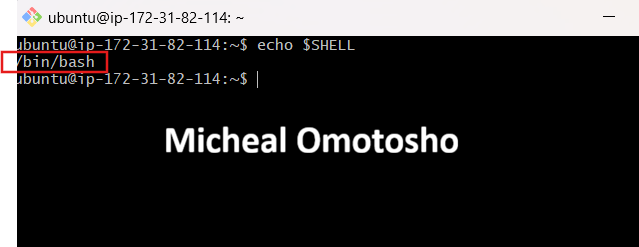

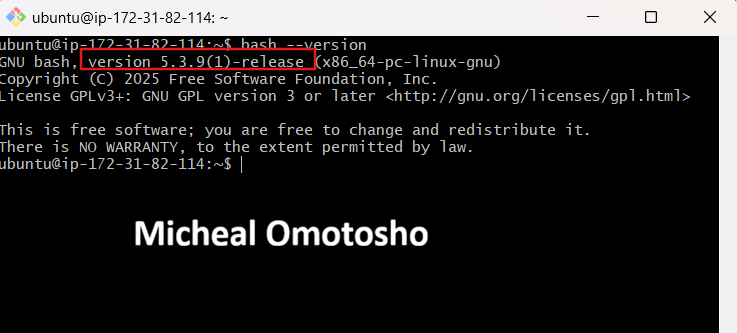

---

#### Screenshot 2 — Output of `pwd` and `ls -lah` showing the scripts directory

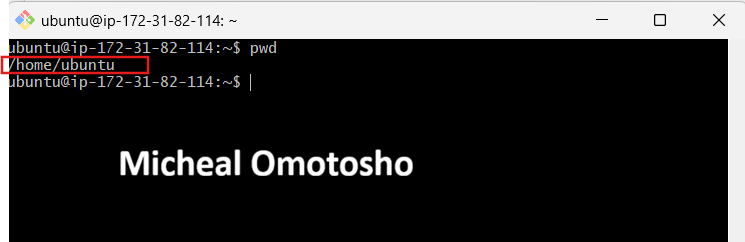

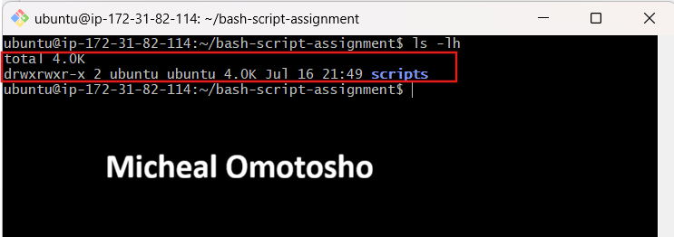

---

### Notes

Answer the following in your own words:

**1. What is Bash?**

Bash (Bourne Again SHell) is a command-line shell and scripting language used to interact with the operating system, execute commands, manage files, and automate tasks through shell scripts.

---

**2. What is the difference between shell and Bash?**

A shell is a command line interpreter that allow users interact with the operating system. While bash is a specific kind of shell. There are other kinds of shell like zh, zsh.

---

**3. Why is it important to confirm the Bash version before writing scripts?**

Confirming the Bash version before writing or running scripts is important because different versions of Bash support different features. A script that works perfectly on one system may fail on another if the installed Bash version is older or different.

---

# Task 2 — Your First Bash Script

## Goal

Create your first Bash script, make it executable, and run it from the terminal.

### Evidence

#### Screenshot 1 — Content of `first-script.sh`

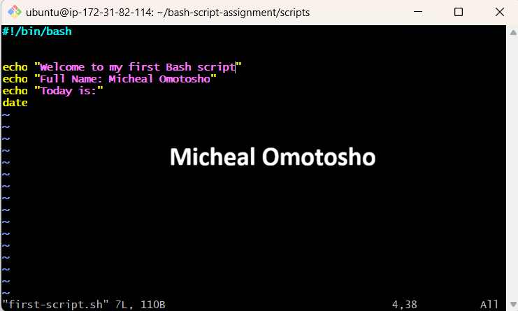

---

#### Screenshot 2 — Output of `./first-script.sh`

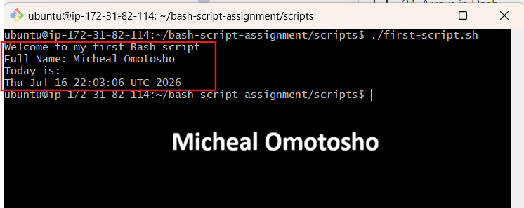

---

#### Screenshot 3 — Output of `ls -l first-script.sh` showing executable permission

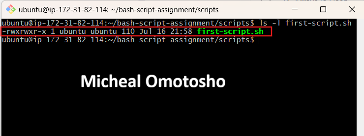

---

### Notes

Answer the following in your own words:

**1. What is the purpose of `#!/bin/bash`?**

It is called a shebang (or hashbang). Its purpose is to tell the operating system which interpreter should execute the script.

---

**2. Why do we use `chmod +x` before running a script?**

We use chmod +x to give a script execute permission, making it an executable file so it can be run directly from the command line.

---

**3. What is the difference between running a script using `./script.sh` and `bash script.sh`?**

./script.sh: Runs the script as an executable file, requires execute permission, and uses the interpreter specified by the shebang.
bash script.sh: Runs the script with the Bash interpreter directly, does not require execute permission, and ignores the shebang because you've already chosen the interpreter.

---

# Task 3 — Variables: User Information Script

## Goal

Use variables to store and display user-related information.

### Evidence

#### Screenshot 1 — Content of `user-info.sh`

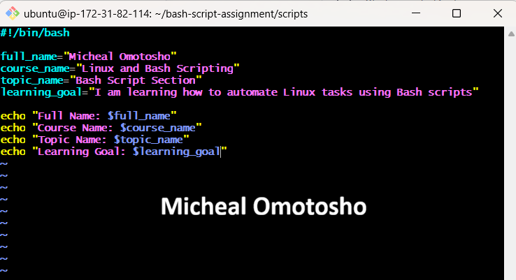

---

#### Screenshot 2 — Output of `./user-info.sh`

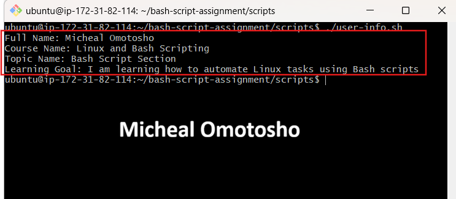

---

### Notes

Answer the following in your own words:

**1. What is a variable in Bash?**

A variable in Bash is a named placeholder used to store a value that can be referenced and used later in a script or command.

---

**2. Why should we avoid spaces around the `=` sign when creating variables?**

We should avoid spaces aroud the `=` sign because the shell interprets spaces as argument separators, not as part of a variable assignment.
E.g: correct syntax ` name="david" `
    incorrect syntax ` name = "david" `

---

**3. How do you access the value stored inside a Bash variable?**

You access the value stored in a Bash variable by referencing the variable name with a $ (dollar sign)
Eg: name="Micheal"
    echo $name

---

# Task 4 — Arrays & Loops: Tools Checklist Script

## Goal

Use arrays and loops to print a checklist of tools used in Bash scripting.

### Evidence

#### Screenshot 1 — Content of `tools-checklist.sh`

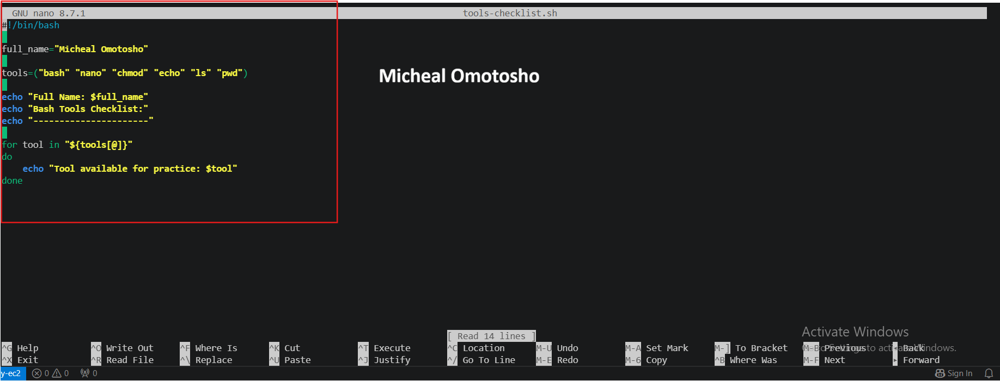

---

#### Screenshot 2 — Output of `./tools-checklist.sh`

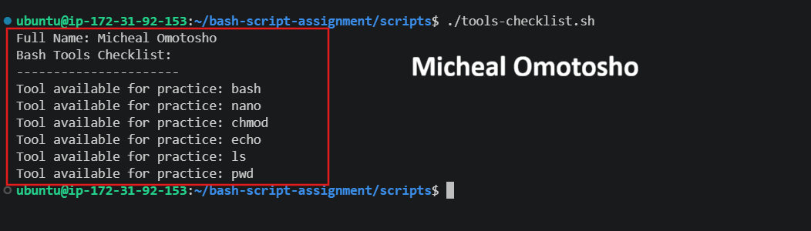

---

### Notes

Answer the following in your own words:

**1. What is an array in Bash?**

An array in Bash is a variable that stores multiple values in a single variable. Each value is accessed using an index, making it easy to store, retrieve, and loop through a list of items.

example

tools=("bash" "nano" "chmod" "echo" "ls" "pwd")

---

**2. Why are arrays useful in scripts?**

Arrays allow us to keep related values together. Instead of creating a separate variable for every tool, we can store all the tools in one array and process them using a loop. This makes the script shorter and easier to update.

---

**3. What does `"${tools[@]}"` mean?**

"${tools[@]}" represents all the items of the tools array, with each item treated as a separate quoted string. It is commonly used to loop through every item in the array or pass all array elements to a command.

---

**4. What is the purpose of the `for` loop in this script?**

The for loop is used to iterate (loop) through each element in an array or a list of items and execute a block of code for each element.

---

# Task 5 — Loops: Number Counter Script

## Goal

Use loops to repeat a task multiple times.

### Evidence

#### Screenshot 1 — Content of `counter.sh`

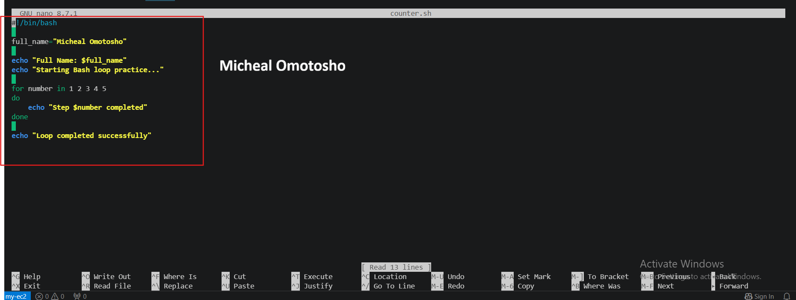

---

#### Screenshot 2 — Output of `./counter.sh`

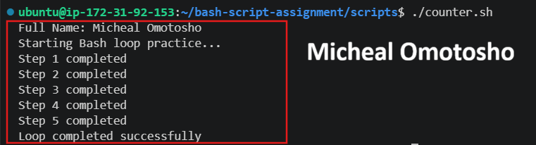

---

### Notes

Answer the following in your own words:

**1. What is a loop?**

A loop is a way to repeat a set of instructions multiple times, either for each item in a collection (such as an array) until a condition is met

---

**2. Why do we use loops in Bash scripting?**

We use loops in Bash scripting to automate repetitive tasks by executing the same block of code multiple times. Loops can iterate through arrays, files, command output, or repeat actions while a condition is true, helping to avoid writing the same code repeatedly.

---

**3. How many times did the loop run in your script?**

Loop ran in my script five times

---

**4. What would you change if you wanted the loop to run 10 times?**

I would add the numbers 6 to 10 to the for loop:
for number in 1 2 3 4 5 6 7 8 9 10
do
   	echo "Step $number completed"
done

---

# Task 6 — Files & Conditionals: File Validation Script

## Goal

Use file checks and conditionals to verify whether files and directories exist.

### Evidence

#### Screenshot 1 — Output of `ls -lah ../test-folder`

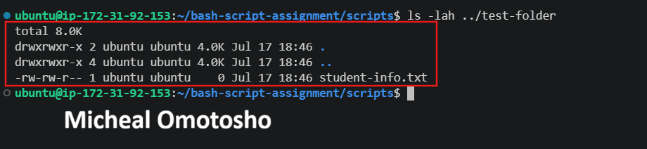

---

#### Screenshot 2 — Content of `file-check.sh`

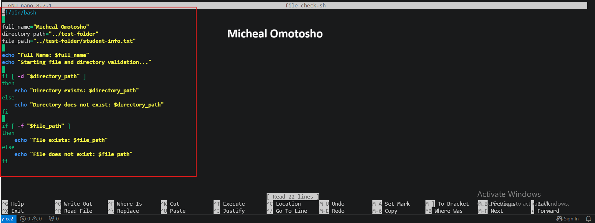

---

#### Screenshot 3 — Output of `./file-check.sh`

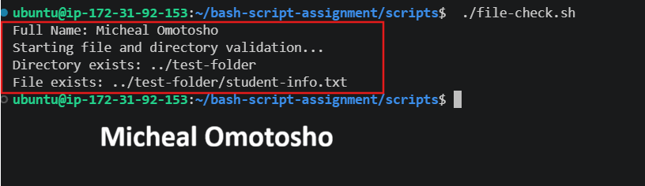

---

### Notes

Answer the following in your own words:

**1. What does `-d` check in Bash?**

The -d option checks whether the given path exists and whether it is a directory. If the directory exists, the condition becomes true.

---

**2. What does `-f` check in Bash?**

The -f option checks whether the given path exists and whether it is a regular file. If the file exists, the condition becomes true.

---

**3. Why should file and directory paths be stored in variables?**

File and directory paths should be stored in variables so they can be easily referenced, reused, and modified without changing multiple parts of the script. This also makes it easier to perform operations or check conditions on those paths.

---

**4. What happens if the file does not exist?**

if the path does not exist, the condition returns false which obviously means the file does not exist

---

# Task 7 — Conditionals: Pass or Retry Script

## Goal

Use if-else conditionals to make decisions based on a variable value.

### Evidence

#### Screenshot 1 — Content of `score-check.sh` with `score=85`

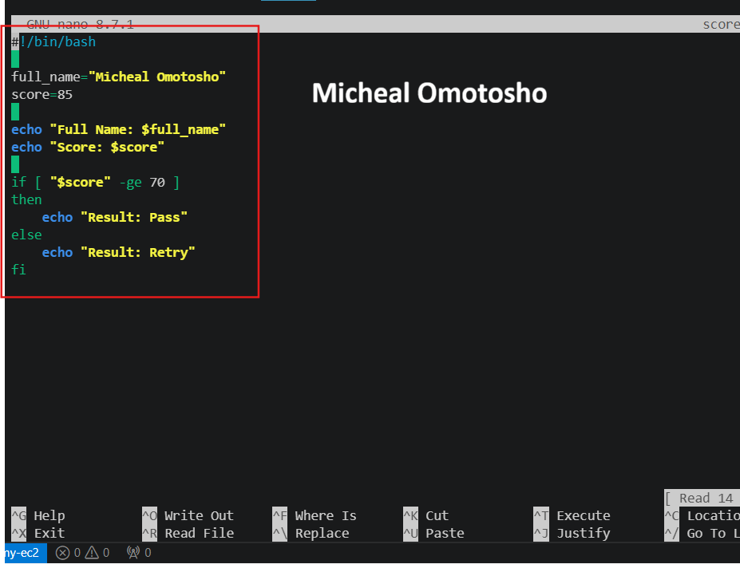

---

#### Screenshot 2 — Output showing `Result: Pass`

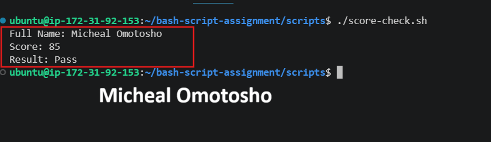

---

#### Screenshot 3 — Content of `score-check.sh` with `score=55`

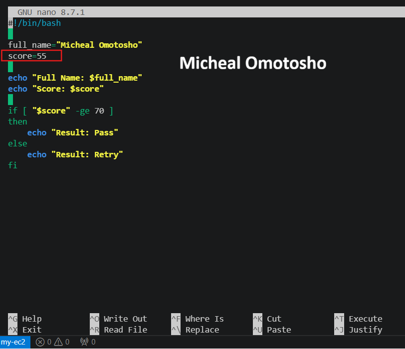

---

#### Screenshot 4 — Output showing `Result: Retry`

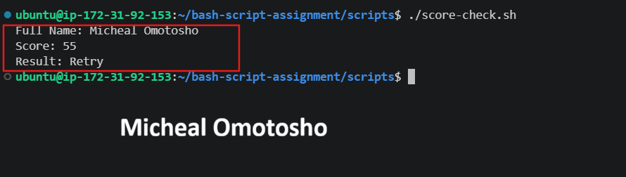

---

### Notes

Answer the following in your own words:

**1. What is the purpose of if-else in Bash?**

The purpose of if-else in Bash is to make decisions by evaluating one or more conditions. If a condition is true, the if block is executed; otherwise, the else block is executed.

---

**2. What does `-ge` mean?**

-ge is a comparison operator in Bash that means "greater than or equal to". It is used to compare two integer values in a conditional statement.

---

**3. Why should conditions be tested with different values?**

We test conditions with different values to ensure the script produces the correct output for different inputs and that all possible outcomes are handled correctly.

---

**4. How can conditionals help in automation scripts?**

Conditionals help automation scripts decide what to do based on the current situation. For example, a script can check whether a service is running, a file exists, or a disk is almost full, and then take the correct action based on the result.

---

# Task 8 — Functions: Final Bash Automation Script

## Goal

Create a final Bash script using functions to organize reusable code.

### Evidence

#### Screenshot 1 — Content of `final-automation.sh`

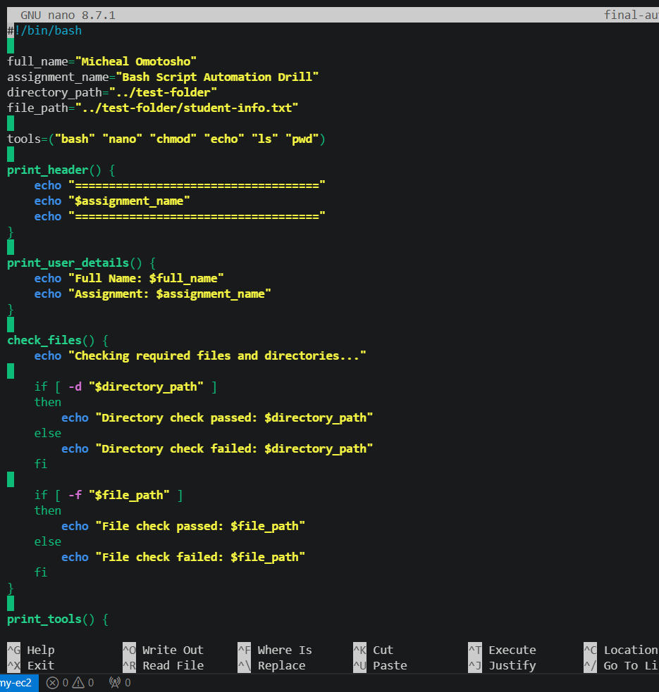

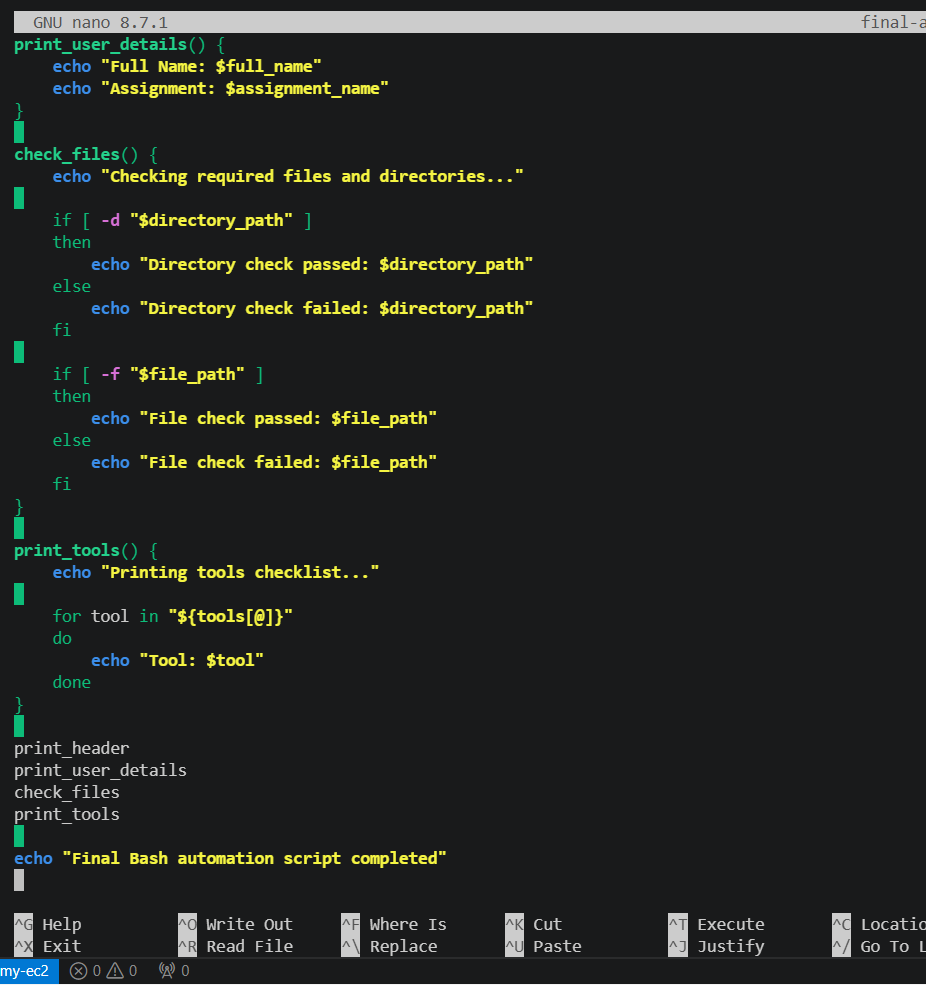

---

#### Screenshot 2 — Output of `./final-automation.sh`

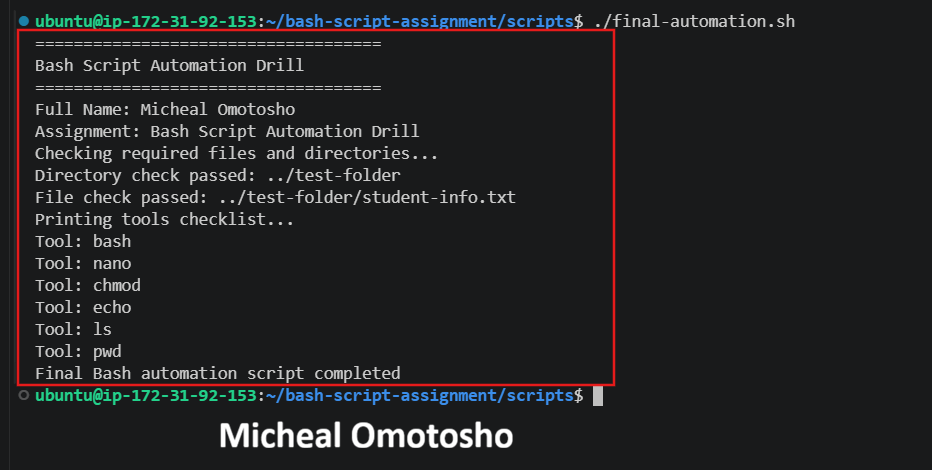

---

#### Screenshot 3 — Output of `ls -lah` showing all created scripts

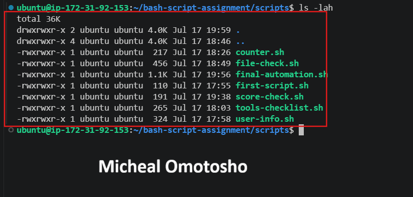

---

### Notes

Answer the following in your own words:

**1. What is a function in Bash?**

A function in Bash is a reusable block of code that performs a specific task. It can be called (invoked) whenever needed, which helps avoid repeating the same code and makes scripts easier to read and maintain.

---

**2. Why are functions useful in scripts?**

Functions are useful in Bash scripts because they allow code to be reused, reduce code duplication, improve readability, and make scripts easier to maintain and debug.

---

**3. Which functions did you create in this script?**

I created `Print_header, print_user_details, check_files, print_tools`

---

**4. How does this final script combine variables, arrays, loops, conditionals, files, and functions?**

The script uses variables to store my name, the assignment name, and the required paths. It uses an array to store the tool names and a loop to print them one by one.

It uses if-else conditionals with -d and -f to check the required directory and file. Finally, the related commands are organized into functions, and those functions are called in the correct order to run the complete automation script.

---

# LinkedIn Post (Required)

## Evidence

#### LinkedIn Post URL

Paste your LinkedIn post URL here:

`Add your URL here`

---

#### Screenshot — Published LinkedIn post

Add your screenshot here.

---

# Submission Instructions

- Add all required screenshots in your submission
- Full name must be visible in required screenshots
- All script files must be created and run successfully
- Required notes must be answered clearly for every task
- Do not expose sensitive information (keys, passwords, credentials)

---

# Completion Checklist

- [ ] Task 1: Environment setup verified, workspace created (Screenshots 1–2, Notes answered)
- [ ] Task 2: First script created, executed, permissions verified (Screenshots 1–3, Notes answered)
- [ ] Task 3: Variables script created and run (Screenshots 1–2, Notes answered)
- [ ] Task 4: Arrays and loops script created and run (Screenshots 1–2, Notes answered)
- [ ] Task 5: Counter loop script created and run (Screenshots 1–2, Notes answered)
- [ ] Task 6: File validation script created and run (Screenshots 1–3, Notes answered)
- [ ] Task 7: Pass/Retry conditional script tested with both values (Screenshots 1–4, Notes answered)
- [ ] Task 8: Final automation script created and run (Screenshots 1–3, Notes answered)
- [ ] All scripts run without errors
- [ ] Full Name visible in all required screenshots
- [ ] LinkedIn post published and URL submitted
- [ ] No sensitive data exposed

---

## 📌 About DMI & CloudAdvisory

DevOps Micro Internship (DMI) is a project-based DevOps program run by Pravin Mishra (The CloudAdvisory) focused on real-world execution, systems thinking, and career readiness.

It helps learners build strong DevOps foundations with hands-on experience.

---

## 📌 Resources

- 🌐 DMI Official Website: https://pravinmishra.com/dmi  
- 🎓 DevOps for Beginners (Udemy): https://www.udemy.com/course/devops-for-beginners-docker-k8s-cloud-cicd-4-projects/  
- 🎓 Agentic AI DevOps with Claude Code: https://www.udemy.com/course/ultimate-agentic-ai-devops-with-claude-code/  
- 🎓 DevOps with Claude Code: Terraform, EKS, ArgoCD & Helm: https://www.udemy.com/course/devops-with-claude-code-terraform-eks-argocd-helm/  
- ▶️ YouTube Playlist: https://www.youtube.com/playlist?list=PLFeSNDtI4Cho  
- 🔗 Pravin Mishra (LinkedIn): https://www.linkedin.com/in/pravin-mishra-aws-trainer/  
- 🏢 CloudAdvisory (LinkedIn): https://www.linkedin.com/company/thecloudadvisory/

---

*This submission is part of DevOps Micro Internship (DMI) Cohort 3 — Agentic AI Track.*