# Assignment 6 — Build an AI-Assisted Linux Health Check (AI-Assisted Linux Incident Triage)

Part of the DevOps Micro Internship (DMI) Cohort 3 with Agentic AI

---

## Purpose

In this assignment, you will build a read-only Bash triage script that checks the health of your Ubuntu server and Nginx application, connect it to Claude Code as a reusable `/linux-triage` skill, simulate a controlled Nginx incident, use the skill to gather and analyze evidence, recover the service manually, and verify recovery. The workflow follows the Agentic Loop: Gather → Analyze → Human Act → Verify.

---

# Task 1 — Confirm the Healthy Baseline and Create the Workspace

## Goal

Confirm that Nginx and the React application are healthy before building the automation.

### Evidence

#### Screenshot 1 — Output of `systemctl is-active nginx`, `ss -ltn | grep ':80'`, and `curl -I http://localhost`

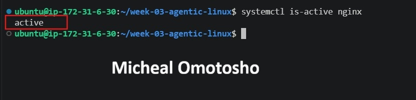

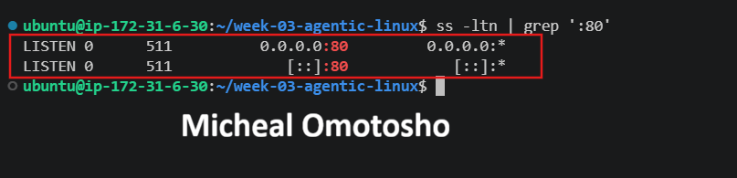

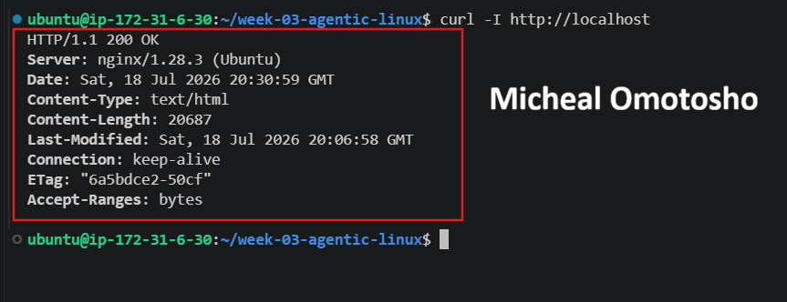

---

#### Screenshot 2 — Output of `pwd` and `find . -maxdepth 4 -type d | sort` showing the workspace folder structure

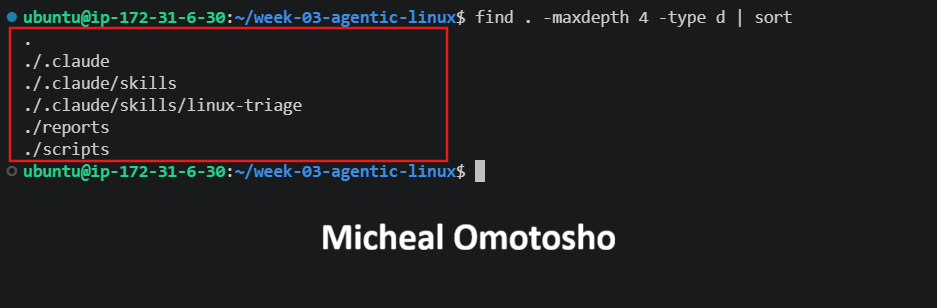

---

### Notes

Answer the following in your own words:

**1. What proves that Nginx is running?**

Nginx is confirmed to be running by checking its service status with sudo systemctl status nginx. If the output shows Active: active (running), it proves that the Nginx service is running successfully.

---

**2. What proves that the server is listening for HTTP traffic?**

The server is proven to be listening for HTTP traffic by checking the listening ports using the ss -tuln (or ss -tulen) command. If the output shows that port 80 is in the LISTEN state and is associated with the Nginx process, it confirms that the server is listening for incoming HTTP traffic.

---

**3. Why must you capture a healthy baseline before simulating an incident?**

A healthy baseline is captured to record the system's normal state before simulating an incident. This provides a reference point for identifying changes, diagnosing problems, and confirming that the system has returned to normal after recovery.

---

# Task 2 — Create Project Context and Safety Rules in CLAUDE.md

## Goal

Tell Claude exactly what this project does and what it is not allowed to do.

### Evidence

#### Screenshot 3 — CLAUDE.md open in VS Code showing all four sections (Project Overview, Incident Workflow, Safety Rules, Output Rules)

---

### Notes

Answer the following in your own words:

**1. Why should Claude receive project-specific operational rules?**

Claude should receive project-specific operational rules so it understands the project's purpose, follows the correct procedures, and avoids actions that could cause problems. This ensures its responses align with the project's incident workflow and remain accurate, consistent, and safe.

---

**2. Why is the human required to execute the recovery command?**

The human is required to execute the recovery command because they are responsible for verifying that it is safe and appropriate. Claude can suggest recovery steps, but only a human should make changes to the server to prevent unintended actions or mistakes.

---

**3. Which rule prevents Claude from making an unsupported diagnosis?**

The rule, “Do not claim a root cause unless the report contains supporting evidence,” prevents Claude from making an unsupported diagnosis. It ensures that conclusions are based only on verified evidence from the report, not assumptions or guesses.

---

# Task 3 — Use Agentic AI to Plan Before Writing the Script

## Goal

Use Claude Code to inspect the environment and produce a read-only plan before creating any Bash code.

### Evidence

#### Screenshot 4 — Claude Code showing the five-check plan and read-only inspection results

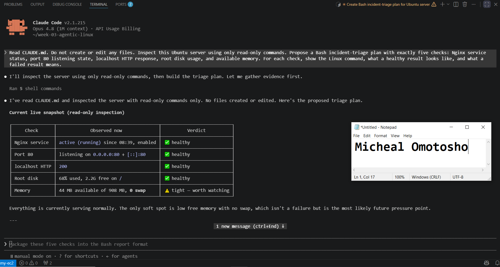

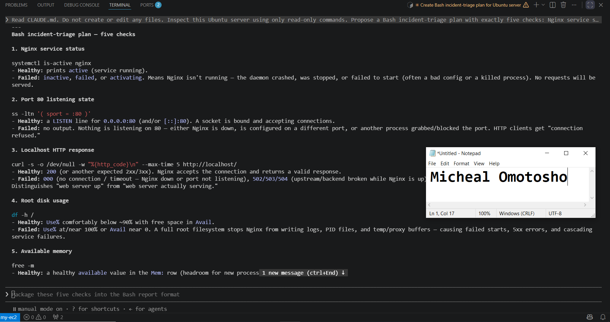

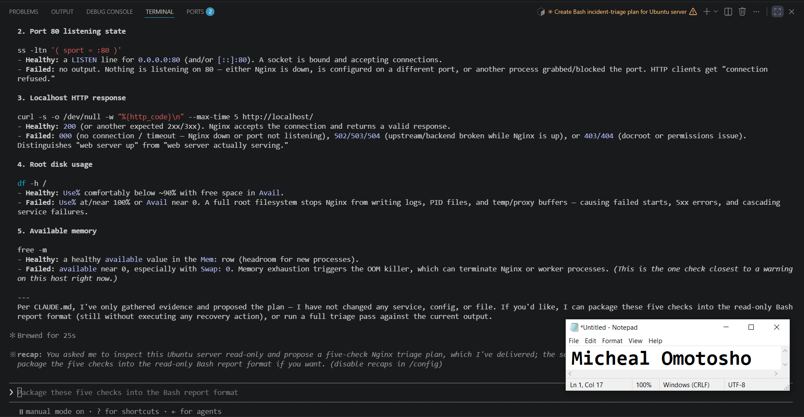

---

### Notes

Answer the following in your own words:

**1. Which part of this task represents the Gather phase?**

The Gather phase is the read-only inspection of the Ubuntu server. During this phase, Claude collects information about Nginx, port 80, the HTTP response, disk usage, and available memory using read-only commands without making any changes to the system.

---

**2. Did Claude follow the instruction not to create files? How did you verify this?**

Yes, Claude followed the instruction not to create files. I verified this by checking the workspace and confirming that no new files, such as Bash scripts or other artifacts, were created. Claude only performed read-only inspection commands.

---

**3. Why is planning before coding useful in DevOps automation?**

Planning before coding is useful in DevOps automation because it defines the script's objectives, identifies the checks to perform, and ensures safe, efficient execution. It also helps detect potential issues early, reducing errors and unnecessary changes during implementation.

---

# Task 4 — Build the Linux Triage Bash Script

## Goal

Create one Bash script that gathers consistent Linux and Nginx health evidence.

### Evidence

#### Screenshot 5 — Top section of `linux-triage.sh` showing variables, thresholds, and the checks array

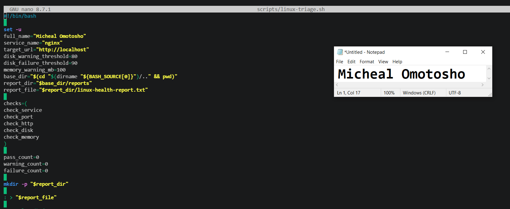

---

#### Screenshot 6 — Middle section showing check functions and conditionals

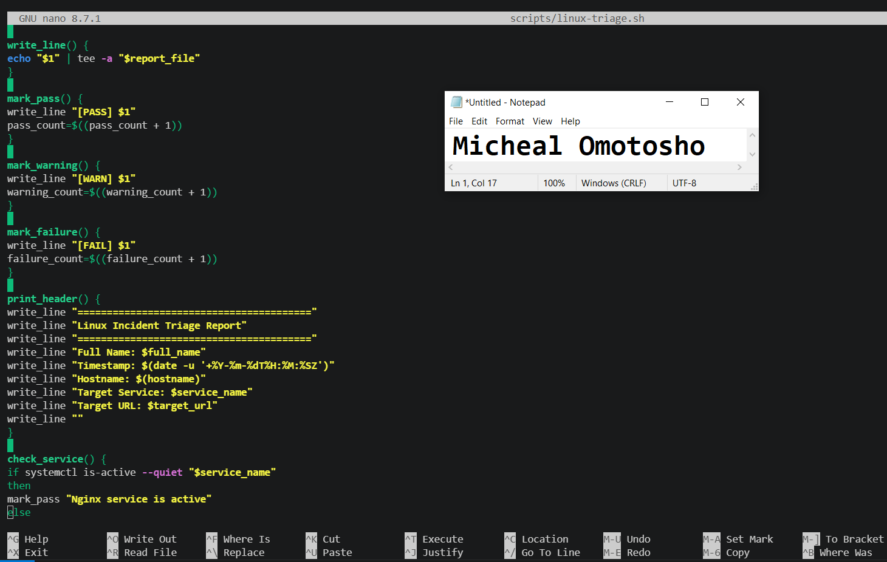

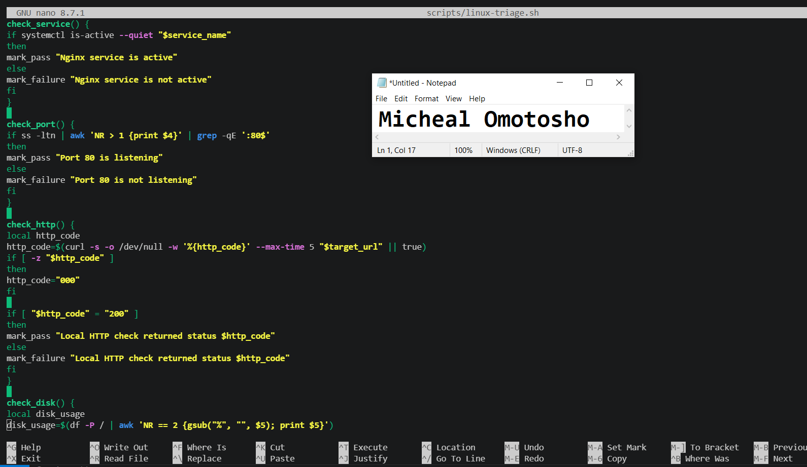

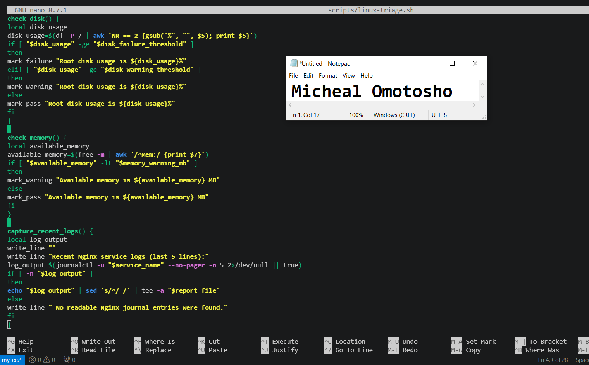

---

#### Screenshot 7 — Bottom section showing the loop, summary function, and exit behavior

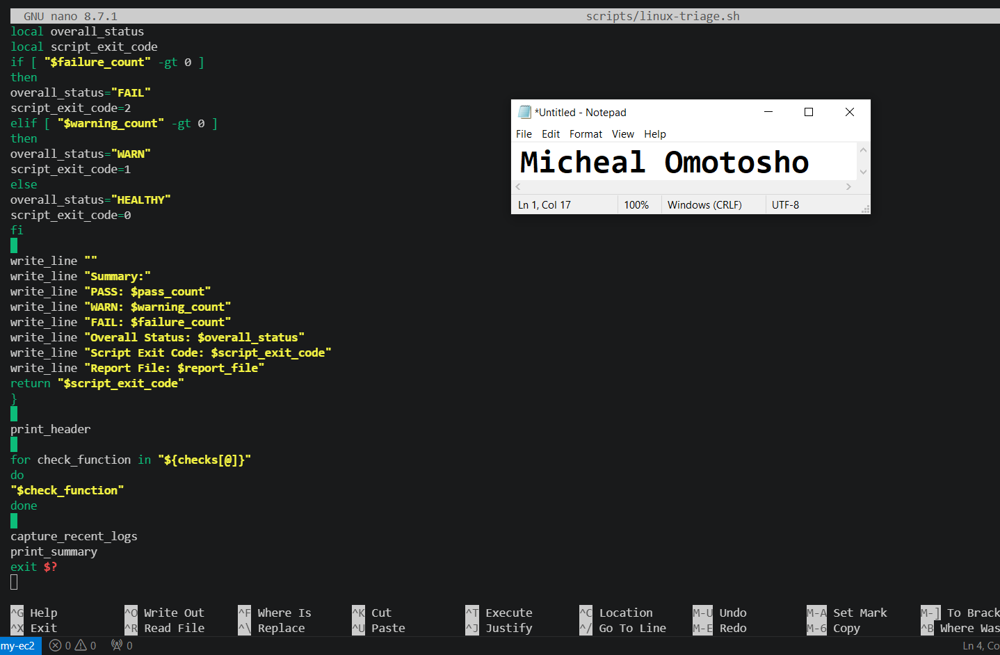

---

#### Screenshot 8 — Output of `bash -n scripts/linux-triage.sh` (no syntax errors) and `ls -l scripts/linux-triage.sh` showing executable permission

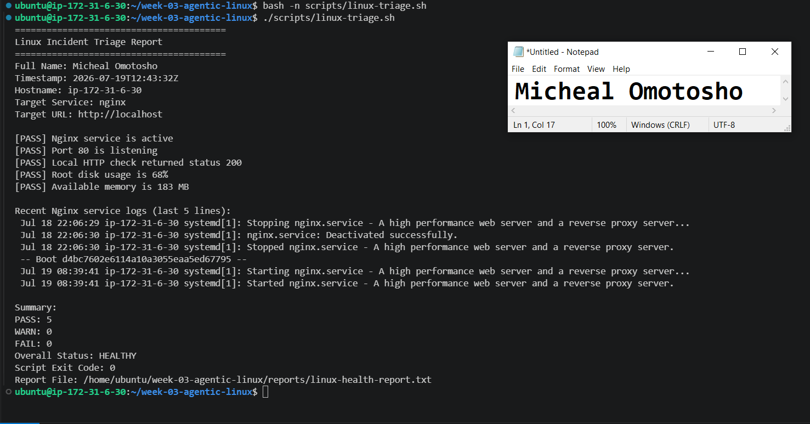

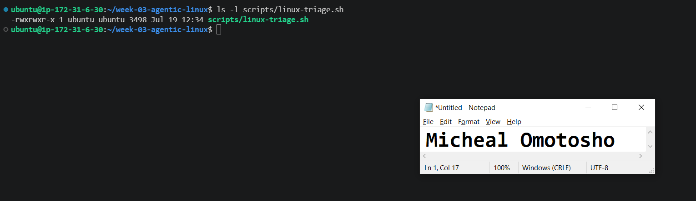

---

### Notes

Answer the following in your own words:

**1. What is stored in the checks array?**

The checks array stores the names of the five diagnostic functions used to verify the system's health. These functions check the Nginx service, port 80, the HTTP response, disk usage, and available memory.

---

**2. How does the `for` loop use that array?**

The for loop iterates through each function name stored in the checks array and executes the corresponding function one by one. This ensures that all five health checks are performed automatically in the specified order.

---

**3. Why are the health checks separated into functions?**

The health checks are separated into functions so that each function performs one specific task. This makes the script easier to read, maintain, test, and troubleshoot, since changes to one check do not affect the others.

---

**4. What is the purpose of `$(...)` in this script?**

$(...) is used for command substitution. It executes a command and stores its output so it can be assigned to a variable or used within another command. In this script, it captures values such as the timestamp, hostname, HTTP status code, disk usage, available memory, and recent Nginx logs.

---

**5. Why does the script use different exit codes for HEALTHY, WARN, and FAIL?**

The script uses different exit codes to indicate the overall health status of the Ubuntu server after completing all five health checks. This allows users and automation tools to determine the result without reading the full report: exit code 0 means all checks passed (HEALTHY), 1 indicates a warning (WARN), and 2 indicates that one or more checks failed (FAIL). This makes it easier to automate monitoring and respond appropriately based on the severity of the issue.

---

# Task 5 — Run and Understand the Healthy-State Report

## Goal

Run the Bash script against the healthy server and verify that it creates a report.

### Evidence

#### Screenshot 9 — Output of `./scripts/linux-triage.sh` showing your Full Name and all five check results

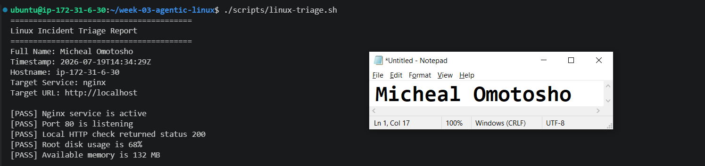

---

#### Screenshot 10 — Output showing the captured exit code and final summary

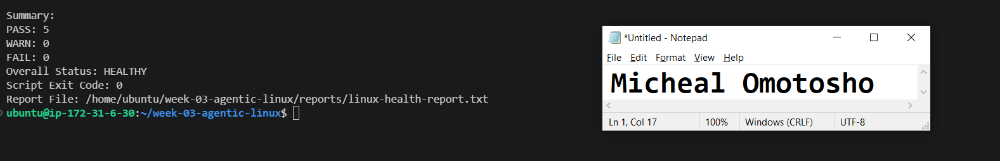

---

### Notes

Answer the following in your own words:

**1. What is the overall status of your healthy baseline?**

The overall status of my healthy baseline is HEALTHY. All health checks passed successfully, with no failed checks detected, indicating that the system is operating normally and is ready for the incident simulation.

---

**2. Which exact Linux evidence proves the application is serving traffic?**

The Linux evidence proving the application is serving traffic is:
[PASS] Port 80 is listening — This confirms the server is accepting HTTP connections on port 80.
[PASS] Local HTTP check returned status 200 — This confirms the application is responding successfully to HTTP requests.

---

**3. Did your script return exit code 0 or 1? Explain why.**

My script returned exit code 0 because all five health checks passed successfully. Nginx was running, port 80 was listening, the application returned an HTTP 200 response, and both disk usage and available memory were within the defined healthy thresholds. This indicates the system was in a HEALTHY state.

---

**4. What is the difference between a warning and a failure in this script?**

A warning indicates that the server and application are still functioning, but a resource threshold requires attention. In this script, warnings occur when root disk usage is between 80% and 89% or available memory falls below 100 MB.

A failure indicates that a critical health check has failed and may affect the application's availability. Failures occur when Nginx is inactive, port 80 is not listening, the application does not return an HTTP 200 response, or root disk usage reaches 90% or higher.

---

# Task 6 — Create and Run the /linux-triage Skill

## Goal

Turn the Bash script into a reusable, manually invoked Agentic AI workflow.

### Evidence

#### Screenshot 11 — `SKILL.md` showing the frontmatter, allowed tool restrictions, and safety rules

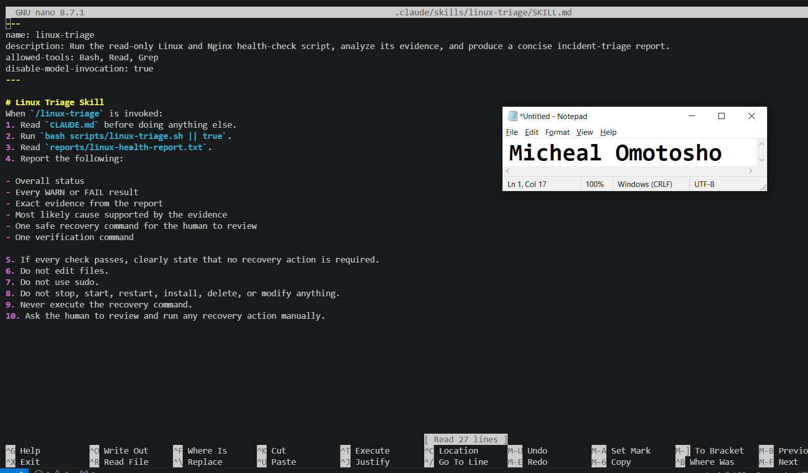

---

#### Screenshot 12 — `/linux-triage` output for the healthy server

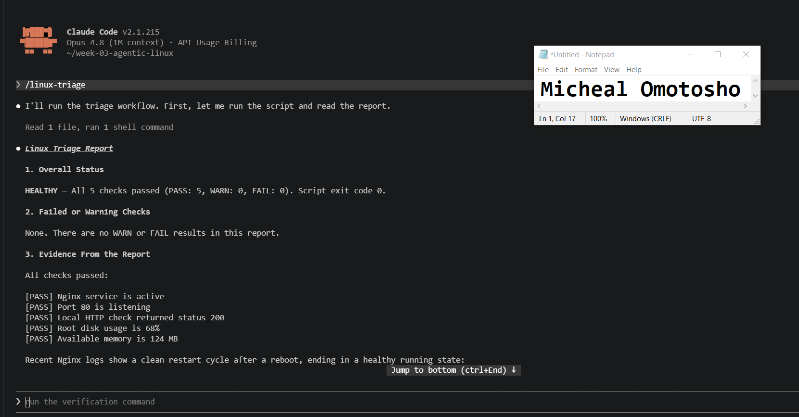

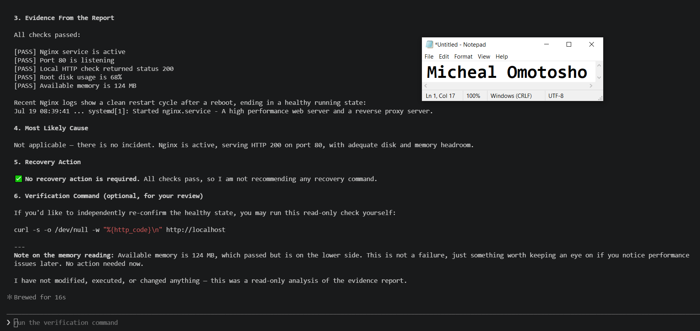

---

### Notes

Answer the following in your own words:

**1. Why does this skill have Bash, Read, and Grep, but not Write?**

The skill includes Bash to execute the Linux triage script, Read to view the generated report, and Grep to search for specific PASS, WARN, or FAIL results. It does not include the Write tool because Claude's role is limited to running diagnostics and analyzing results, not creating or modifying project files.

---

**2. Why is `disable-model-invocation: true` useful for this skill?**

The disable-model-invocation: true setting prevents Claude from automatically invoking the skill. This requires the user to run /linux-triage manually, ensuring that server inspections and diagnostic actions remain under human control and are only performed when intentionally requested.

---

**3. What part is performed by Bash, and what part is performed by Claude?**

Bash performs the automated system checks by verifying the Nginx service, port 80, the HTTP response, disk usage, available memory, and recent logs, then records the results in linux-health-report.txt. Claude reads and analyzes the report, explains the findings, identifies any warnings or failures, and recommends appropriate recovery steps. However, Claude does not execute the recovery action; that decision and action remain the responsibility of the user.

---

**4. Why is this better than asking Claude "Is my server healthy?" without giving it evidence?**

This approach is better because it provides Claude with real, up-to-date evidence from the server rather than relying on assumptions. The /linux-triage skill first collects diagnostic data using the Bash script, and Claude then analyzes the Nginx status, port 80, HTTP response, disk usage, memory, and logs to give an accurate, evidence-based assessment of the server's health.

---

# Task 7 — Simulate an Nginx Incident and Let the Skill Diagnose It

## Goal

Create a controlled service failure, gather evidence through Bash, and let Claude analyze the evidence without taking recovery action.

### Evidence

#### Screenshot 13 — Output showing Nginx is inactive and the HTTP request fails

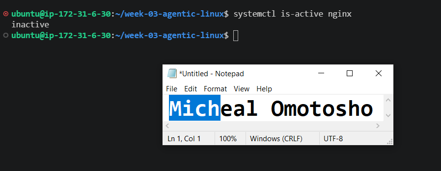

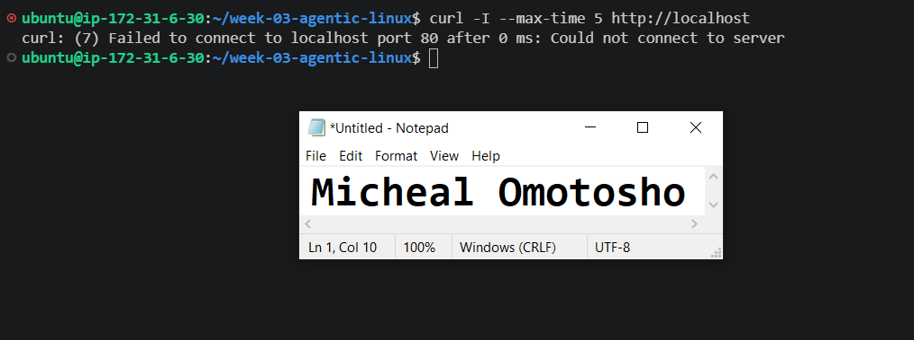

---

#### Screenshot 14 — `/linux-triage` output showing failed evidence, most likely cause, and a suggested recovery command

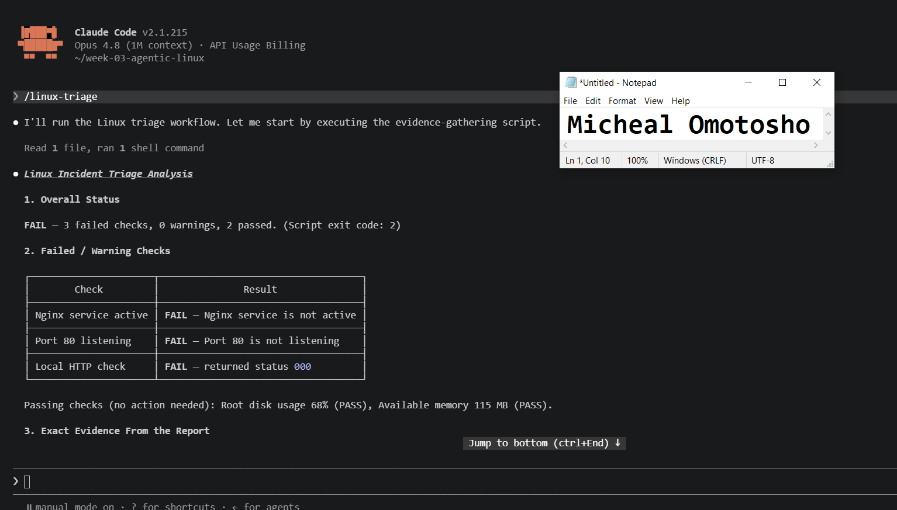

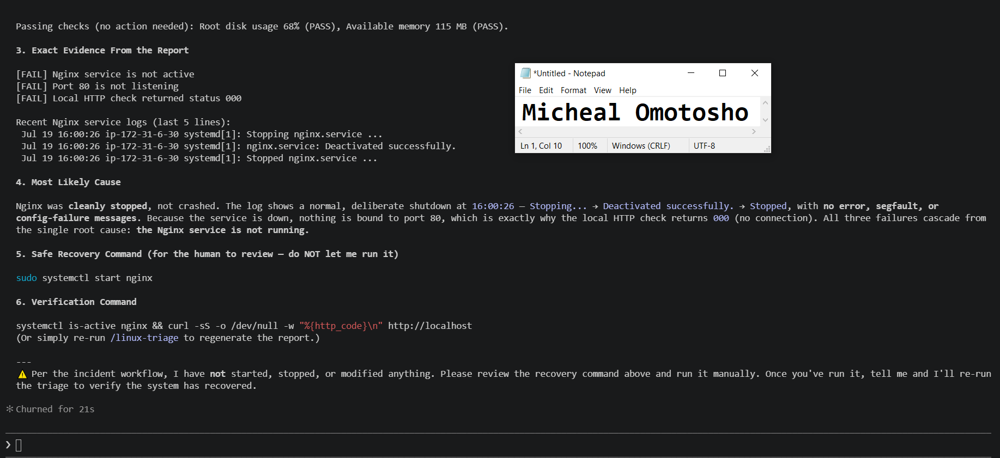

---

#### Screenshot 15 — `incident-failure-report.txt` showing the failed checks and your Full Name

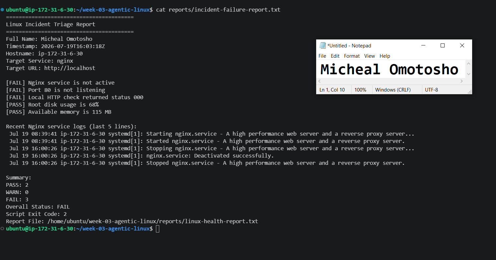

---

### Notes

Answer the following in your own words:

**1. Which three checks failed?**

The three failed checks were the Nginx service check, the port 80 listening check, and the local HTTP response check. The disk usage and available memory checks continued to pass because they were not affected by stopping the Nginx service.

---

**2. What evidence supports the conclusion that Nginx is unavailable?**

The evidence showing that Nginx is unavailable is that the report indicates Nginx is not active, port 80 is not listening, and the local HTTP request returned status 000. Together, these results confirm that the web server is not running and the application is unable to receive or respond to HTTP traffic.

---

**3. Did Claude execute the recovery command? Why is that important?**

No, Claude did not execute the recovery command; it only recommended it. This is important because a human must review the evidence and approve any changes before they are applied to the server. Keeping recovery actions under human control helps prevent unintended or unsafe changes during an incident.

---

**4. Which phase of the Agentic Loop is represented by the Bash report?**

Which phase of the Agentic Loop is represented by the Bash report?
The Bash report represents the Gather phase. The script collects current evidence about Nginx, port 80, the HTTP response, disk usage, memory, and recent logs.

---

**5. Which phase is represented by Claude's explanation?**

Claude’s explanation represents the Analyze phase. During this phase, Claude reviews the collected evidence, identifies the failed health checks, explains the likely cause of the issue, and recommends an appropriate recovery command for human review and approval.

---

# Task 8 — Recover Manually, Verify Again, and Write the Incident Summary

## Goal

Recover the service as the human operator and prove that the system is healthy again.

### Evidence

#### Screenshot 16 — Output showing Nginx is active and `curl -I http://localhost` returns 200 OK

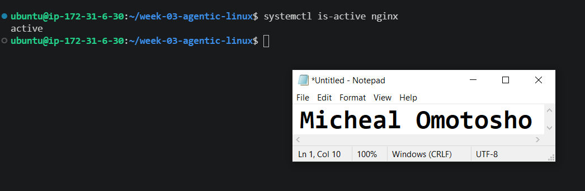

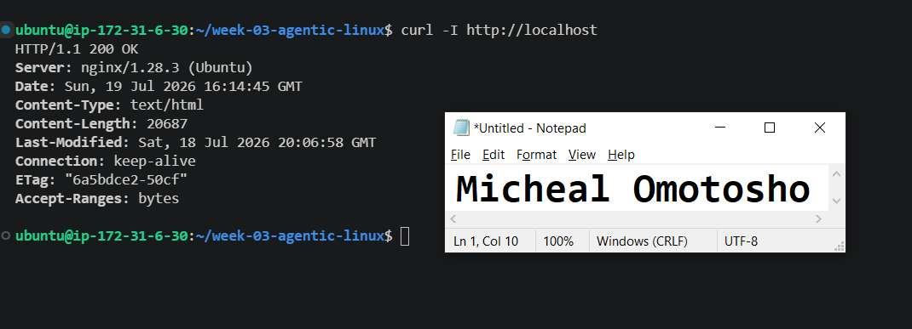

---

#### Screenshot 17 — Second `/linux-triage` output showing successful recovery with no FAIL results

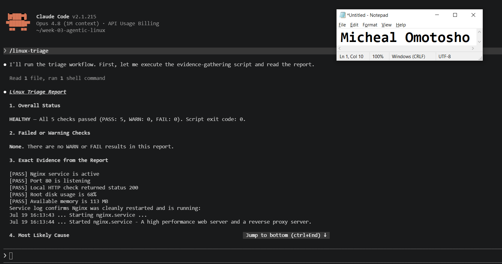

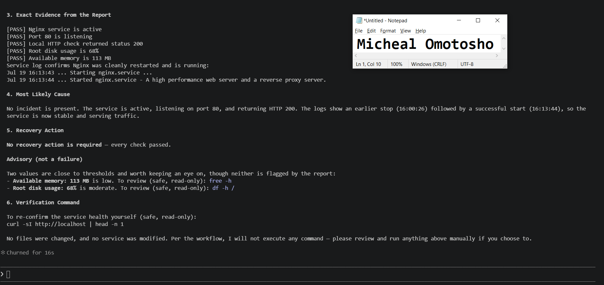

---

#### Screenshot 18 — Output of `ls -lah reports` showing both `incident-failure-report.txt` and `recovery-report.txt`

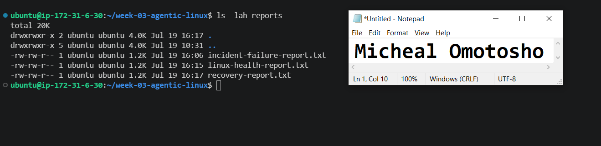

---

#### Screenshot 19 — `incident-summary.md` showing all required sections and your Full Name

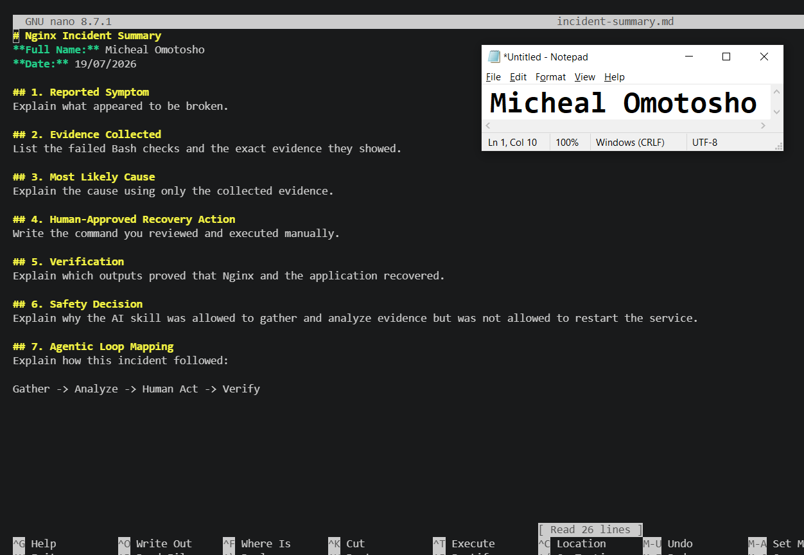

---

### Notes

Answer the following in your own words:

**1. What action did you execute manually?**

After reviewing the evidence and Claude’s recommendation, I manually executed the following command:
`sudo systemctl start nginx`
This command restarted the Nginx service, restoring the web server so it could begin serving HTTP traffic again.

---

**2. What evidence proves that the service recovered?**

The evidence proving that the service recovered is that systemctl is-active nginx returned active, the local HTTP request returned HTTP/1.1 200 OK, and the second /linux-triage report showed that the Nginx service, port 80, and HTTP response checks all passed successfully.

---

**3. Why is the second triage run necessary?**

The second triage run is necessary to verify that the recovery was successful. Restarting Nginx alone does not confirm that the entire application is healthy. Running the triage script again rechecks the Nginx service, port 80, HTTP response, disk usage, and available memory to ensure the server has fully returned to a healthy state.

---

**4. What could go wrong if an AI agent automatically restarted every failed service?**

If an AI agent automatically restarted every failed service, it could hide the underlying cause of the failure, trigger repeated restart loops, or worsen the incident if the problem is related to configuration, dependencies, or system resources. Reviewing the evidence before taking action ensures that recovery is safe and appropriate.

---

**5. In one sentence, explain the difference between using AI as a chatbot and using AI in this agentic workflow.**

A chatbot simply answers questions, whereas in an agentic workflow, AI uses tools to gather and analyze real system evidence, then recommends actions that a human reviews and executes.

---

# Incident Summary

Fill in all seven sections below in your own words.

**Full Name:** Micheal Omotosho

**Date:** 20/07/2026

---

**1. Reported Symptom**

The application became unavailable after the Nginx service stopped. The server was not accepting HTTP requests on port 80, and users could no longer access the web application.

---

**2. Evidence Collected**

* systemctl is-active nginx showed that the Nginx service was inactive.
* The port 80 listening check failed.
* The local HTTP request returned status 000, indicating no response from the web server.
* Disk usage and available memory remained within healthy thresholds.
* The /linux-triage report identified failures in the Nginx service, port 80, and HTTP response checks.

---

**3. Most Likely Cause**

Based on the collected evidence, the most likely cause was that the Nginx service had stopped, preventing the server from listening on port 80 and serving HTTP traffic. No evidence suggested that disk space or memory shortages caused the incident.

---

**4. Human-Approved Recovery Action**

After reviewing the evidence and Claude's recommendation, I manually executed the following command:
`sudo systemctl start nginx`
This restarted the Nginx service and restored the web server.

---

**5. Verification**

The recovery was verified by:

* systemctl is-active nginx returning active.
* The local HTTP request returning HTTP/1.1 200 OK.
* A second /linux-triage run confirming that the Nginx service, port 80, and HTTP response checks all passed successfully.
* The overall health status returned to HEALTHY (exit code 0).

---

**6. Safety Decision**

Claude did not execute the recovery automatically. It only analyzed the collected evidence and recommended a recovery command. I reviewed the recommendation and manually approved and executed the recovery action, ensuring that server changes remained under human control and preventing unsafe automated modifications.

---

**7. Agentic Loop Mapping**

1. Plan: Defined the health checks, incident workflow, and operational rules before creating the Linux triage script.
2. Gather: The Bash script collected server evidence by checking the Nginx service, port 80, HTTP response, disk usage, available memory, and recent logs.
3. Analyze: Claude read the generated report, identified the failed health checks, explained the likely cause based on the evidence, and recommended a recovery command.
4. Act: After reviewing Claude's recommendation, I manually executed sudo systemctl start nginx to restart the Nginx service.
5. Verify: I ran the /linux-triage script again to confirm that Nginx was active, port 80 was listening, the HTTP request returned 200 OK, and the overall system status was HEALTHY (exit code 0).

---

# LinkedIn Post (Required)

## Evidence

#### LinkedIn Post URL

Paste your LinkedIn post URL here:

https://www.linkedin.com/posts/micheal-omotosho-577230199_devops-linux-bash-share-7485043430948016128-5cTN/?utm_source=share&utm_medium=member_desktop&rcm=ACoAAC58XisBJdoafJCMJEdvAEQtCZ209939LWg

---

#### Screenshot — Published LinkedIn post

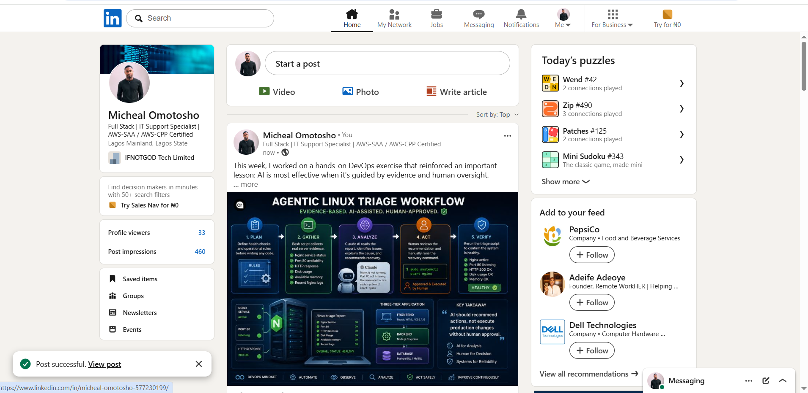

---

# GitHub Repository URL

Paste the URL of your GitHub folder or repository containing the assignment files here:

https://github.com/michealdayo64/devops-micro-internship-pravinmishra.git

---

# Submission Instructions

- Add all required screenshots in your submission
- Full Name must be visible in required screenshots and the Bash report
- All written answers must be in your own words
- Do not expose sensitive information (keys, passwords, AWS account IDs, tokens)
- GitHub URL must be included in this document

---

# Completion Checklist

- [ ] Task 1: Healthy baseline confirmed, workspace created (Screenshots 1–2, Notes answered)
- [ ] Task 2: CLAUDE.md created with all four sections (Screenshot 3, Notes answered)
- [ ] Task 3: Five-check plan produced by Claude using read-only tools (Screenshot 4, Notes answered)
- [ ] Task 4: `linux-triage.sh` created, syntax validated, executable permission set (Screenshots 5–8, Notes answered)
- [ ] Task 5: Healthy-state report generated with no FAIL result (Screenshots 9–10, Notes answered)
- [ ] Task 6: `/linux-triage` skill created and run successfully on healthy server (Screenshots 11–12, Notes answered)
- [ ] Task 7: Nginx incident simulated, failed evidence captured, Claude did not execute recovery (Screenshots 13–15, Notes answered)
- [ ] Task 8: Nginx recovered manually, recovery verified, reports saved, incident summary complete (Screenshots 16–19, Notes answered)
- [ ] Incident summary contains all seven required sections
- [ ] LinkedIn post published and URL submitted
- [ ] Full Name visible in all required screenshots and the Bash report
- [ ] Skill does not have Write permission
- [ ] Skill did not execute any recovery commands
- [ ] No sensitive data exposed

---

## 📌 About DMI & CloudAdvisory

DevOps Micro Internship (DMI) is a project-based DevOps program run by Pravin Mishra (The CloudAdvisory) focused on real-world execution, systems thinking, and career readiness.

It helps learners build strong DevOps foundations with hands-on experience.

---

## 📌 Resources

- 🌐 DMI Official Website: https://pravinmishra.com/dmi  
- 🎓 DevOps for Beginners (Udemy): https://www.udemy.com/course/devops-for-beginners-docker-k8s-cloud-cicd-4-projects/  
- 🎓 Agentic AI DevOps with Claude Code: https://www.udemy.com/course/ultimate-agentic-ai-devops-with-claude-code/  
- 🎓 DevOps with Claude Code: Terraform, EKS, ArgoCD & Helm: https://www.udemy.com/course/devops-with-claude-code-terraform-eks-argocd-helm/  
- ▶️ YouTube Playlist: https://www.youtube.com/playlist?list=PLFeSNDtI4Cho  
- 🔗 Pravin Mishra (LinkedIn): https://www.linkedin.com/in/pravin-mishra-aws-trainer/  
- 🏢 CloudAdvisory (LinkedIn): https://www.linkedin.com/company/thecloudadvisory/

---

*This submission is part of DevOps Micro Internship (DMI) Cohort 3 — Agentic AI Track.*