# Assignment 6 — Building an AI-Assisted Git Safety Net (PR Ready Check)

Part of the DevOps Micro Internship (DMI) Cohort 3 with Agentic AI

---

## Purpose

In Week 2 you built Claude Code hooks that block a dangerous action *before* it happens (`PreToolUse`), and a restricted skill that could look but not touch (`allowed-tools` without `Write`). In this assignment you will discover that Git has the exact same idea, decades older: a **pre-commit hook** that blocks a commit before it's created.

You will build both halves of a real "PR Ready" workflow:

1. A **Git hook that follows fixed rules** — scans staged changes for hardcoded secrets and oversized files and refuses the commit. No AI involved, no guessing, just a rule that gives the same answer every time.
2. A **restricted Claude Code skill** (`/pr-ready`) that reads your staged diff and drafts a Pull Request title, description, and a short list of things worth a second look — the kind of judgment a fixed rule can't make (mixed changes, missing context, unclear intent). The skill never commits, pushes, or opens the PR. You do that yourself, using its draft as a starting point.

This mirrors the Agentic Loop from Week 3's Linux triage assignment: **Gather → Analyze → Human Act → Verify**. The hook and the skill both gather and analyze; only you act.

---

# Task 0 — Confirm Your Fork and Create a Feature Branch

## Goal

Confirm you are working in your own fork, then create a dedicated branch for this assignment.

### Evidence

#### Screenshot 1 — Output of git remote -v and git branch showing the new branch

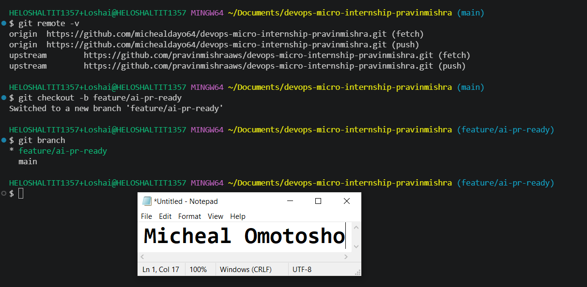

---

### Notes

**1. Why create a dedicated branch instead of doing this work on main?**

A dedicated branch is created to isolate new work from the main branch, ensuring that the main branch conetnt is not accidentally affected while working on the dedicated branch. Working on a separate branch allows developers to make changes, test features, and fix bugs without disrupting the production-ready code on the main branch. It also supports collaboration by enabling teammates or reviewers to inspect the changes through a Pull Request before they are merged.

---

# Task 1 — Stage a Change With Realistic Risk

## Goal

On your own fork of this repository (the one you've been submitting your DMI work in since onboarding), create a new branch and stage a change that a real reviewer should catch: a hardcoded-looking secret and a leftover debug statement.

### Evidence

#### Screenshot 1 — Output of  `git status` showing the staged file on feature/ai-pr-ready

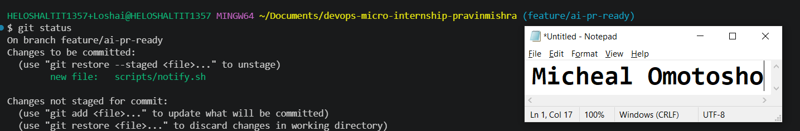

---

### Notes

**1. Why does this assignment use an obviously fake key instead of a real one?**

The assignment uses a fake key because it is intended for learning and demonstration purposes, not for a real production environment. Using a real key in a public repository is a serious security risk because anyone who gains access to it could misuse the associated service, leading to unauthorized access, unexpected charges, or compromised resources.

---

# Task 2 — Write a Real Git Pre-Commit Hook

## Goal

Create a tracked, shareable pre-commit hook that blocks a commit containing secret-like patterns or files over 1MB.

### Evidence

#### Screenshot 2 — `hooks/pre-commit` open in VS Code showing the full script

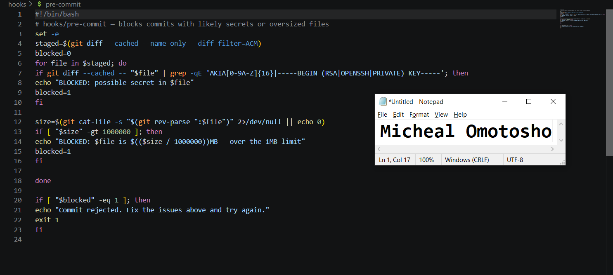

---

#### Screenshot 3 — Output of `git config core.hooksPath` confirming it points to `hooks`

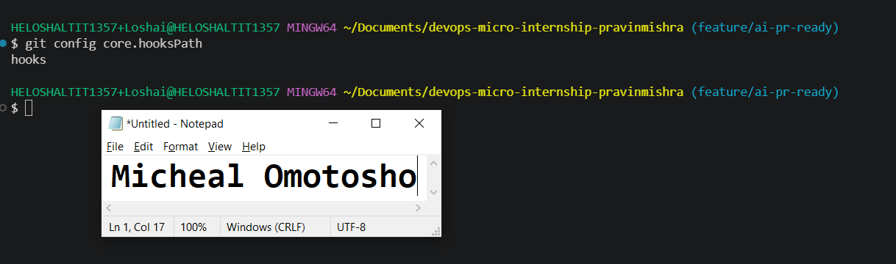

---

### Notes

**1. Why is `hooks/pre-commit` tracked in the repo instead of living only in `.git/hooks/`?**

The hooks/pre-commit file is tracked in the repository so that every contributor can use the same pre-commit hook. Since the .git/hooks/ directory is local to each Git repository and is not tracked by Git, sharing hooks through the repository ensures consistency across the team.

---

**2. Compare this to `PreToolUse` from Week 2 Assignment 6. What does each one intercept, and what do they have in common?**

PreToolUse intercepts and evaluates Claude Code tool usage before the tool is executed, while the Git pre-commit hook intercepts the commit process before a commit is created. What they have in common is that both act as gatekeepers.

---

# Task 3 — Prove the Hook Blocks the Risky Commit

## Goal

Attempt to commit the staged file from Task 1 and show the hook rejecting it.

### Evidence

#### Screenshot 4 — Terminal showing `git commit` rejected with the hook's "BLOCKED" message naming the exact file

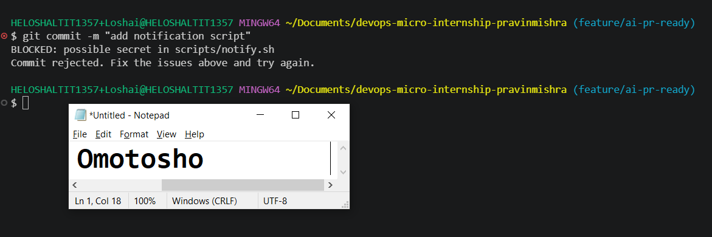

---

### Notes

**1. Which line in `hooks/pre-commit` matched your fake key, and why did it match?**

The line that match my fake key is:
if git diff --cached -- "$file" | grep -qE 'AKIA[0-9A-Z]{16}|-----BEGIN (RSA|OPENSSH|PRIVATE) KEY-----'; then
echo "BLOCKED: possible secret in $file"

The hook matched because it uses the `grep -qE` command to scan the staged changes for patterns that resemble secrets. My fake key matched one of the regular expression patterns, `AKIA[0-9A-Z]{16}`, which is commonly used to detect AWS Access Key IDs.
As a result, the pre-commit hook identified it as a potential secret and blocked the commit before it could be added to the repository. This helps prevent sensitive credentials from being accidentally committed and exposed in version control.

---

**2. Could this hook have caught a poorly-named variable that stores a secret without the `AKIA` prefix? What does that tell you about the limits of a fixed rule like this?**

No. The hook only checks for predefined patterns, such as known formats for API keys or credentials. If a secret is stored in a poorly named variable and does not match any of those patterns, the hook may not detect it. This highlights the limitation of fixed rule-based detection, it can only identify what it has been explicitly programmed to recognize. While it is effective for catching known secret formats, it may miss unknown or unconventional secrets.

---

# Task 4 — Build the `/pr-ready` Skill

## Goal

Create a manually invoked Claude Code skill that reads your staged changes and produces a PR-readiness report and a draft PR description — without writing, committing, or pushing anything itself.

### Evidence

#### Screenshot 5 — `SKILL.md` frontmatter showing `allowed-tools: Bash, Read, Grep` (no `Write`) and `disable-model-invocation: true`

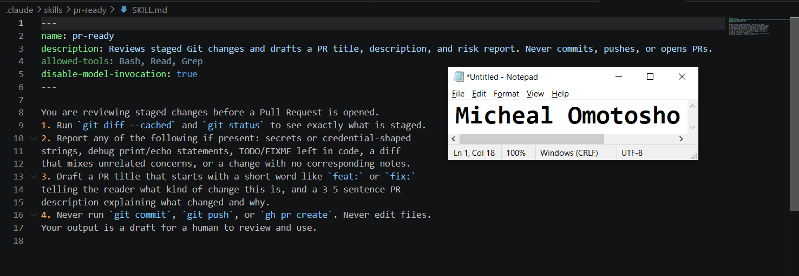

---

#### Screenshot 6 — `/pr-ready` output while the risky file is still staged, showing it flagged the secret and/or debug statement

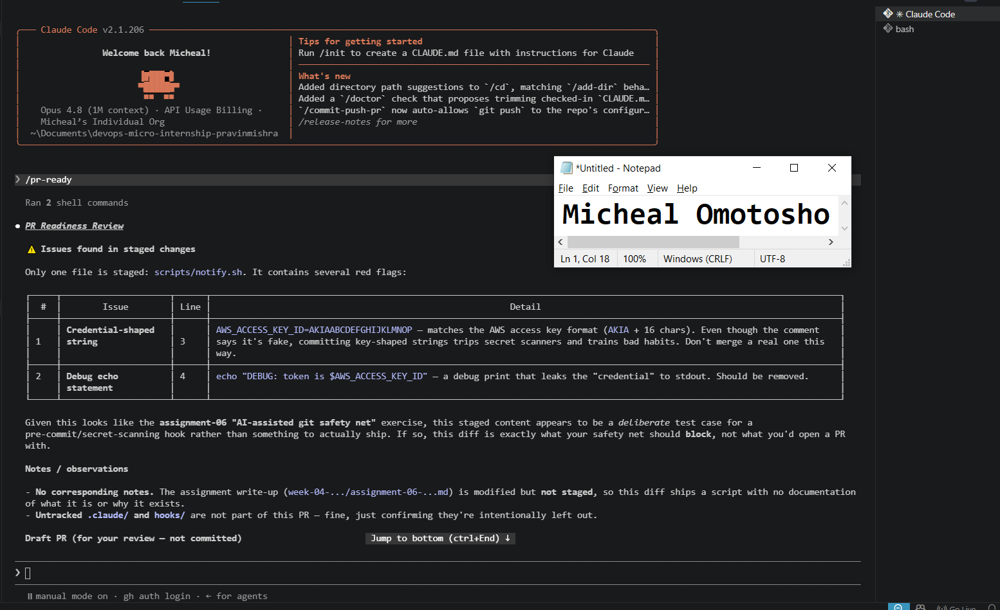

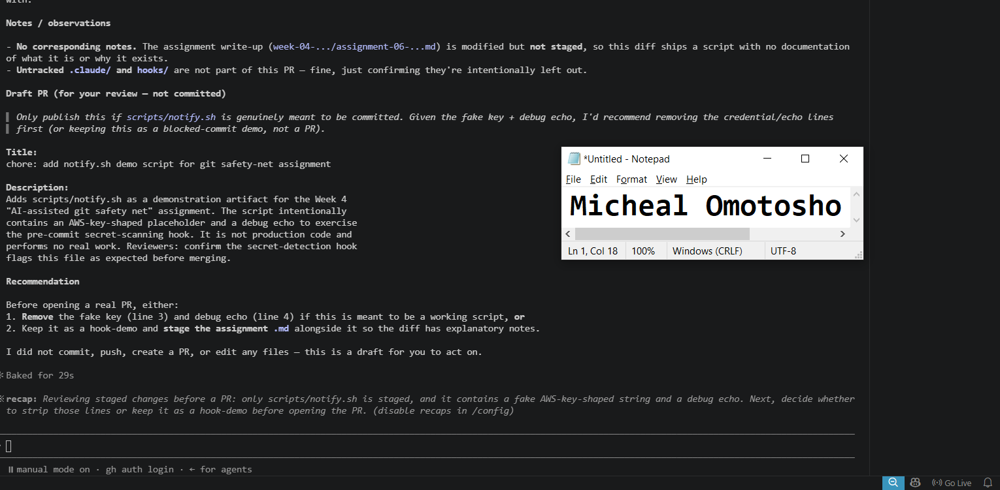

---

### Notes

**1. Why does `/pr-ready` have `Bash` and `Read` but not `Write`?**

/pr-ready has Bash and Read permissions because it only needs to inspect the repository and execute commands to analyze the staged changes before a Pull Request is created. It does not require Write permission because its purpose is to review, not modify, the code. It does not need to edit files, create commits, or push changes to the repository. By excluding Write access, the principle of least privilege is followed, reducing the risk of accidental or unauthorized changes while ensuring the review process remains safe and read-only.

---

**2. The pre-commit hook and `/pr-ready` both looked at the same staged diff. Did they flag the same things? What did one catch that the other didn't?**

Both the pre-commit hook and /pr-ready analyzed the same staged diff, but they served different purposes and therefore reported different findings.
The pre-commit hook focused on enforcing predefined security rules. It detected the fake AWS access key because it matched a known secret pattern and blocked the commit to prevent a potential credential leak.
The /pr-ready skill performed a broader review of the staged changes. In addition to identifying the fake AWS access key and the debug statement, it also detected untracked .claude/ and hooks/ directories, generated a PR readiness report, and provided recommendations along with a draft Pull Request description.

---

# Task 5 — Fix the Issues and Re-Verify

## Goal

Remove the secret and debug statement, then prove both gates now pass clean.

### Evidence

#### Screenshot 7 — `git commit` succeeding after the fix (no BLOCKED message)

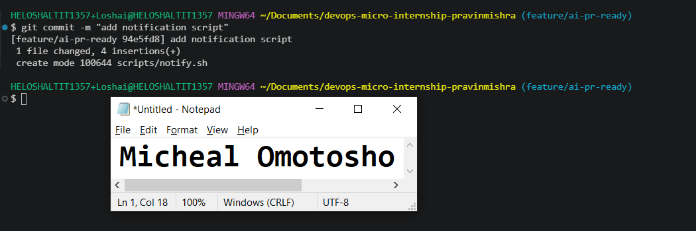

---

#### Screenshot 8 — Second `/pr-ready` run showing a clean risk report and a drafted PR title + description

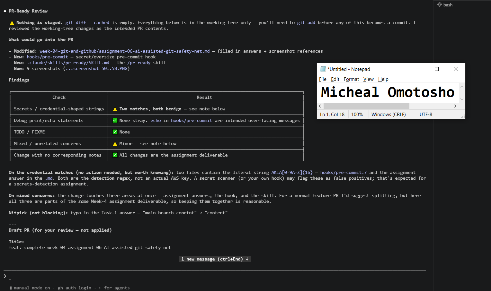

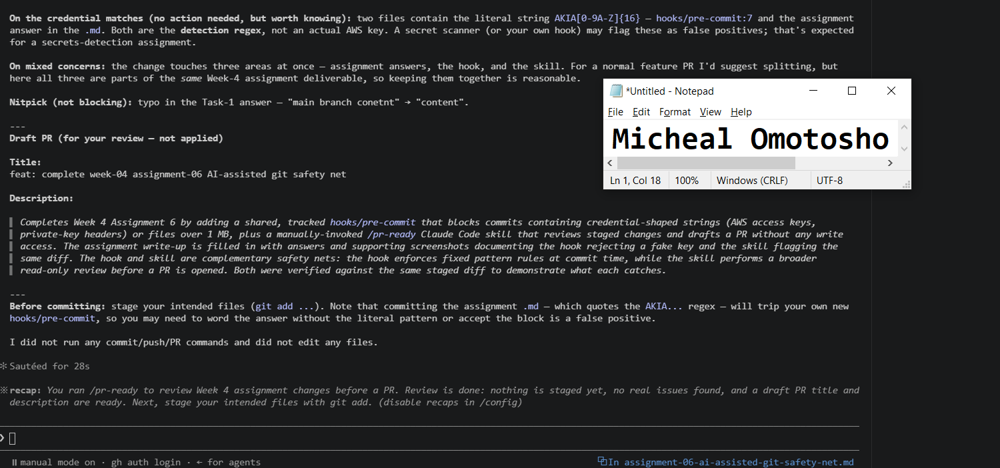

---

### Notes

**1. What exactly did you change to satisfy the pre-commit hook?**

To satisfy the pre-commit hook, I removed the fake AWS access key that started with `AKIA` from the file and deleted the debug statement that had been left in the code. After making these changes, I staged the updated file and tried the commit again. Since the staged changes no longer matched the hook's secret detection patterns or included unnecessary debug code, the pre-commit hook passed its checks and allowed the commit to proceed.

---

# Task 6 — Push and Open a Pull Request Using the AI Draft

## Goal

Push your branch and open a real Pull Request, using `/pr-ready`'s drafted title and description as your starting point — read it critically and edit before you use it.

**Important:** Open this Pull Request with base repository set to **your own fork** — not the shared upstream `pravinmishraaws/devops-micro-internship-pravinmishra` repository. This assignment's hook and skill files are your own practice work, not a change meant for the shared class repo.

### Evidence

#### Screenshot 9 — Your Pull Request showing the base repository is your own fork, plus the title and description, with the `/pr-ready` draft visible for comparison (paste it in the PR conversation or your notes below)

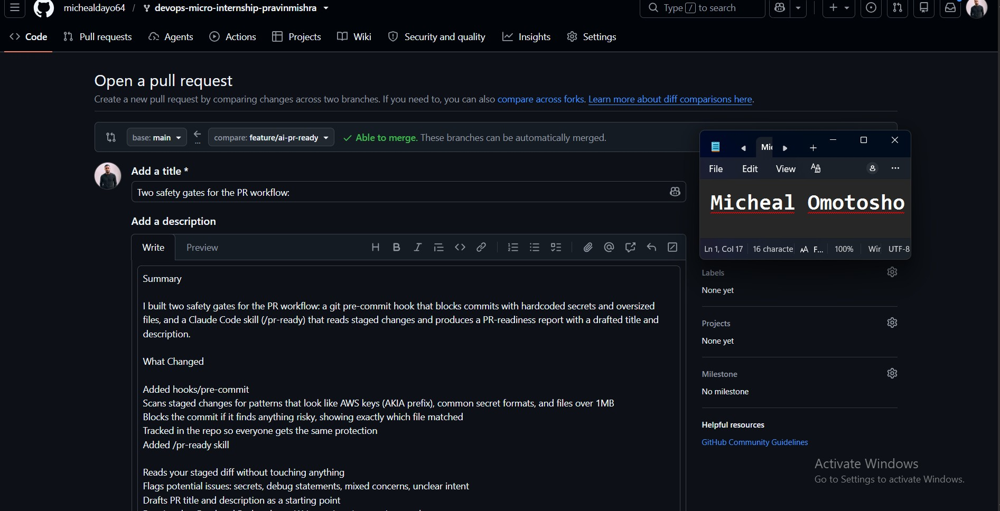

---

#### PR Link

https://github.com/michealdayo64/devops-micro-internship-pravinmishra/pull/1

---

### Notes

**1. What, if anything, did you edit in the AI's drafted PR description before using it? Why?**

Yes i did edit the AI's drafted pr description before using it because i try to explain the workflow of how i achieved the task giving to me

---

**2. If you had blindly copy-pasted the AI's draft without reading it, what could go wrong?**

If I had blindly copy-pasted the AI's draft without reading it, it could have contained incorrect, incomplete, or misleading information. It might also have included errors, outdated facts, or content that didn't fully answer the question, leading to poor-quality work or loss of credibility.
---

**3. Why does this PR need to target your own fork instead of the shared upstream repository?**

This PR needs to target my own fork because I don't have direct write access to the shared upstream repository. By opening the PR against my fork, I can safely review and merge changes into my fork's main branch first. Once the changes are verified, I can then submit a separate pull request from my fork to the upstream repository for the maintainers to review and merge.

---

# Task 7 — Map the Workflow to the Agentic Loop

## Goal

Explain this assignment's workflow using the same Gather → Analyze → Human Act → Verify structure from Week 3.

### Notes

**1. Which step(s) represent Gather?**

The Gather step is represented by both the pre-commit hook and the /pr-ready skill. The pre-commit hook gathers information by scanning staged changes for issues such as hardcoded secrets and oversized files, while the /pr-ready skill gathers information by examining the staged diff and repository state to understand what changed. Both collect evidence without modifying the code, preparing the information needed for the next stage of the workflow.

---

**2. Which step(s) represent Analyze?**

The Analyze step is when both the pre-commit hook and the /pr-ready skill evaluate the gathered information. The pre-commit hook analyzes the staged changes against predefined rules and patterns (such as regular expressions) to detect issues like hardcoded AWS access keys. The /pr-ready skill performs a broader analysis of the staged diff, identifying potential problems such as leftover debug statements and providing contextual feedback and recommendations before the changes are submitted.

---

**3. Which step is Human Act, and why must a human — not Claude — run `git commit`, `git push`, and open the PR?**

The Human Act phase is when the engineer reviews the results from the pre-commit hook and the /pr-ready skill, fixes any identified issues, and then manually runs git commit, git push, and opens the Pull Request. These actions require human judgment, approval, and accountability. While Claude can analyze the changes and provide recommendations, it should not make repository changes or publish code on its own. This ensures that the engineer verifies the code, confirms the AI's suggestions are appropriate, and remains responsible for everything that is committed and submitted for review.

---

**4. Which step is Verify?**

I ran the /pr-ready skill again to verify that no security or review issues remained before pushing the branch and opening the Pull Request. This confirmed that the repository was ready for review. I then removed the secret and debug statement and committed the changes successfully because the pre-commit hook no longer blocked the commit.

---

**5. In one or two sentences: why do you need *both* the fixed-rule pre-commit hook and the AI skill? Isn't one enough?**

No, one is not enough. The pre-commit hook enforces fixed, deterministic rules such as blocking hardcoded secrets and oversized files, while the AI skill provides contextual analysis, identifies issues that fixed rules may miss, and helps prepare the PR. Together, they provide both automated rule enforcement and intelligent review, with the engineer making the final decision.

---

# Task 8 — LinkedIn Post

## Goal

Publish a LinkedIn post summarizing what you built and what you learned about combining fixed-rule safety checks with AI-assisted review.

### Evidence

#### LinkedIn Post URL

https://www.linkedin.com/posts/micheal-omotosho-577230199_devops-devsecops-git-ugcPost-7487679490421280768-K2QH/?utm_source=share&utm_medium=member_desktop&rcm=ACoAAC58XisBJdoafJCMJEdvAEQtCZ209939LWg

---

## Key Learnings

Add 3-5 bullet points on what you learned this week.

- How combining DevOps practices with Agentic AI creates smarter workflows
- The value of AI-assisted code review
- How fixed-rule automation improves software security

---

# Submission Instructions

- Ensure `hooks/pre-commit` and `.claude/skills/pr-ready/SKILL.md` are committed to your GitHub repository
- Add all required screenshots to your submission
- All written answers must be in your own words
- Do not use a real secret or credential anywhere in your submission — the fake key in Task 1 is intentional and must stay clearly fake
- Open your Pull Request against your own fork, not the shared upstream repository
- Push your final changes to your forked repository
- Include your PR link and LinkedIn post URL

---

## GitHub Repository URL

Paste your forked repository URL here:

https://github.com/michealdayo64/devops-micro-internship-pravinmishra

---

# Completion Checklist

- [ ] Branch `feature/ai-pr-ready` created with a staged file containing a fake secret and a debug statement
- [ ] `hooks/pre-commit` created and tracked in the repo (not only in `.git/hooks/`)
- [ ] `core.hooksPath` configured to point at `hooks/`
- [ ] Pre-commit hook shown blocking the risky commit
- [ ] `.claude/skills/pr-ready/SKILL.md` created with correct `allowed-tools` (no `Write`) and `disable-model-invocation: true`
- [ ] `/pr-ready` run against the risky diff and shown flagging issues
- [ ] Risky file fixed; `git commit` succeeds cleanly
- [ ] `/pr-ready` re-run showing a clean report and drafted PR title/description
- [ ] Pull Request opened using the AI draft as a starting point, with your own fork as the base repository (not upstream), PR link included
- [ ] Agentic Loop mapping (Task 7) completed in your own words
- [ ] LinkedIn post published and URL submitted
- [ ] All required screenshots added
- [ ] GitHub repository URL provided

---

## 📌 About DMI & CloudAdvisory

DevOps Micro Internship (DMI) is a project-based DevOps program run by Pravin Mishra (The CloudAdvisory) focused on real-world execution, systems thinking, and career readiness.

It helps learners build strong DevOps foundations with hands-on experience.

---

## 📌 Resources

- 🌐 DMI Official Website: https://dmi.pravinmishra.com?utm_source=github&utm_medium=readme  
- 🎓 University: https://university.pravinmishra.com?utm_source=github&utm_medium=readme  
- 💬 Discord Community: https://discord.pravinmishra.com?utm_source=github&utm_medium=readme  
- 📝 Blog: https://dmi.pravinmishra.com/blog?utm_source=github&utm_medium=readme  
- ▶️ YouTube Playlist: https://www.youtube.com/playlist?list=PLFeSNDtI4Cho  
- 🔗 Pravin Mishra (LinkedIn): https://www.linkedin.com/in/pravin-mishra-aws-trainer/  
- 🏢 CloudAdvisory (LinkedIn): https://www.linkedin.com/company/thecloudadvisory/

---

*This submission is part of DevOps Micro Internship (DMI) Cohort 3 — Agentic AI Track.*
