# Assignment 5 — AI-Assisted Sprint Health Report via Jira MCP

Part of the DevOps Micro Internship (DMI) Cohort 3 with Agentic AI

---

## Purpose

In this assignment, you will connect Claude Code to your Jira board through an MCP server, the same way you connected it to GitHub in Week 2, and build a read-only `/sprint-health` skill. The skill reads your current sprint through Jira's API and reports sprint velocity, stories at risk of missing the sprint, and items missing an estimate — but it must never create, edit, comment on, or transition a single ticket itself. You will prove that boundary holds by making a real change on the board yourself and confirming the skill only ever reports, never acts.

---

# Task 1 — Create a Jira API Token

## Goal

Generate an API token from your Atlassian account that the MCP server will use to authenticate with your Jira site. Do not screenshot the token value itself.

### Evidence

#### Screenshot 1 — Jira API token creation confirmation page showing the token name, with the token value not visible

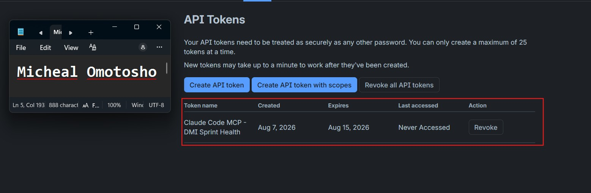

### Notes You Must Write (Very Important):

Why does the MCP server need your site URL and account email in addition to the token?

The MCP server needs the site URL, account email, and API token to authenticate and connect to the correct Jira instance. The site URL identifies the specific Jira workspace, the account email identifies the user account making the requests, and the API token securely verifies the user's identity without using their password. Together, these credentials allow the MCP server to communicate with the correct Jira account and perform authorized actions such as creating, updating, and retrieving project data.

---

# Task 2 — Create .mcp.json at the Project Root

## Goal

Create or update `.mcp.json` at your project root with a Jira MCP server block, following the same shape as the GitHub MCP server you configured in Week 2.

### Evidence

#### Screenshot 2 — `.mcp.json` open in VS Code showing the Jira server configuration

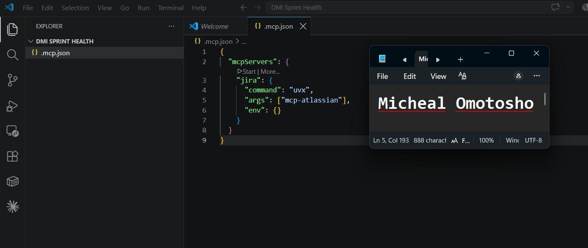

### Notes You Must Write (Very Important):

Compare this jira block to the github block from Week 2 Assignment 5. The GitHub server ran via npx (a Node.js package); this one runs via uvx (a Python package) — what stays exactly the same shape despite that difference, and why doesn't Claude Code care which language a given MCP server is written in?

The MCP protocol and configuration used to establish communication between Claude Code and the server stays the same. And why claude code does not care about the programming language it uses is because It only needs to know how to start the server and communicate with it through the MCP protocol. The MCP protocol provides a standard interface, so the underlying implementation language can be JavaScript, Python, or another supported language.

---

# Task 3 — Add Your Credentials to settings.local.json

## Goal

Add your Jira site URL, account email, and API token to `.claude/settings.local.json`, and confirm that file is listed in `.gitignore` so it is never committed.

### Evidence

#### Screenshot 3 — `settings.local.json` open in VS Code showing the `env` section, with the actual token value blurred or covered

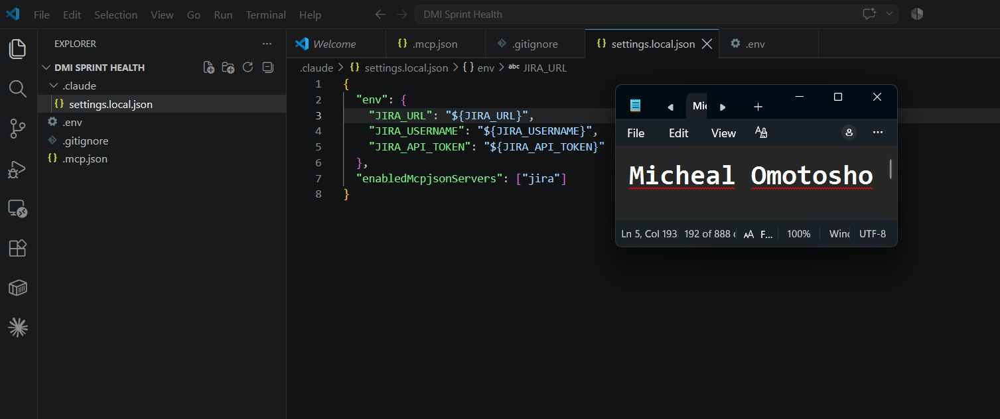

### Notes You Must Write (Very Important):

Why must JIRA_API_TOKEN live in settings.local.json and never in .mcp.json?

JIRA_API_TOKEN must be stored in settings.local.json because it is a secret credential and should never be committed to GitHub. The settings.local.json file is included in .gitignore, which prevents Git from tracking and pushing the file to the repository. 

Keeping the token in settings.local.json helps protect the credential while still allowing the local MCP configuration to access it when needed.

---

# Task 4 — Verify the Connection with /mcp

## Goal

Restart Claude Code and confirm the Jira MCP server shows as connected.

### Evidence

#### Screenshot 4 — `/mcp` output showing `jira: connected`

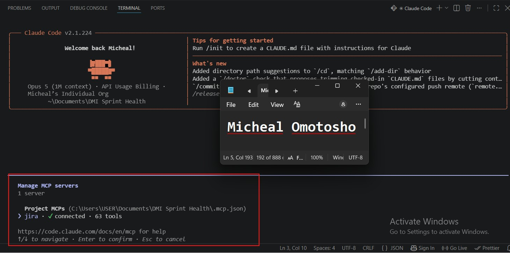

---

# Task 5 — Run a Live Query to Prove Real Board Data

## Goal

Ask Claude to list the issues in your current active sprint through the Jira MCP connection, and confirm the result matches what you see on your live board in the browser.

### Evidence

#### Screenshot 5 — Claude's response showing the live sprint issue list retrieved via Jira MCP

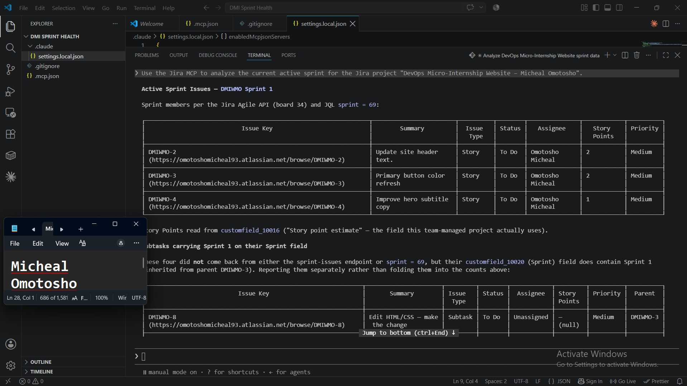

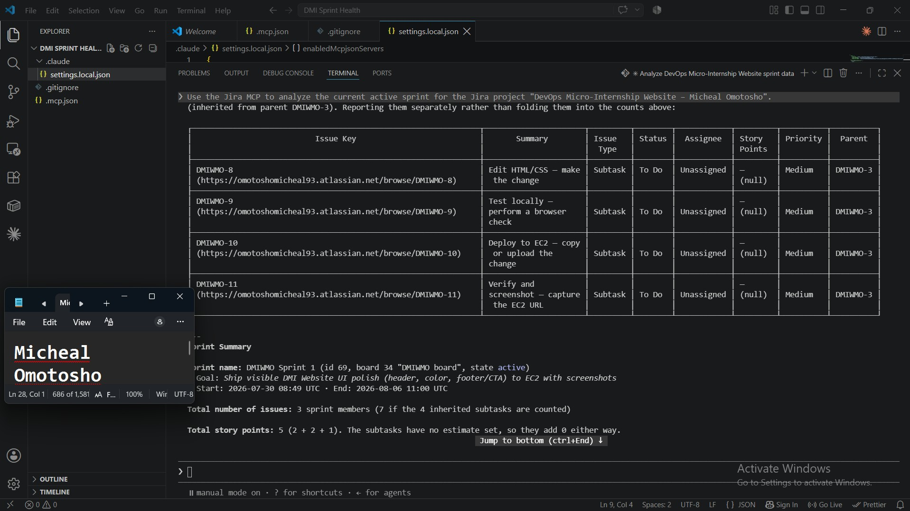

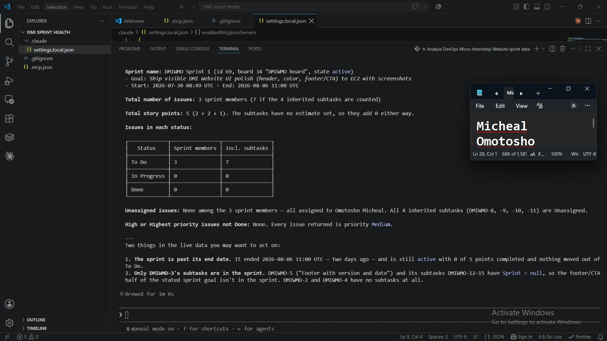

### Notes You Must Write (Very Important):

How did you confirm this was real board data and not something Claude guessed?

I confirmed that this was real Jira board data because Claude used the MCP tool to connect directly to my Jira account. After providing my Jira site URL, account email, and API token, Claude was able to access and read the actual data from my Jira project. This confirmed that the information came from my Jira board rather than being guessed or generated by Claude.

---

# Task 6 — Build the /sprint-health Skill

## Goal

Create a `/sprint-health` skill restricted to read-only Jira tools plus `Read`, with no issue-mutating tools and no `Write`. Run it and confirm it produces a report covering sprint velocity, at-risk stories, and items missing an estimate.

### Evidence

#### Screenshot 6 — `SKILL.md` frontmatter showing `allowed-tools` limited to read-only Jira tools plus `Read`, with `disable-model-invocation: true`

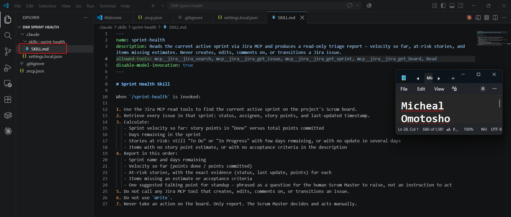

#### Screenshot 7 — `/sprint-health` output showing the full triage report against your real sprint

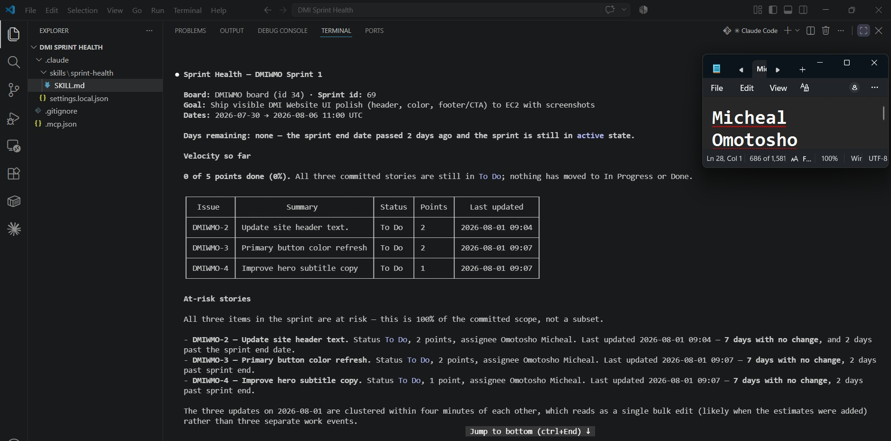

### Notes You Must Write (Very Important):

1. Which Jira MCP tools does this skill's allowed-tools list include, and which mutating tools (create issue, update issue, transition issue, add comment) does it deliberately exclude?

The Jira MCP tools skills allowed `mcp__jira__jira_search, mcp__jira__jira_get_issue, mcp__jira__jira_get_sprint, mcp__jira__jira_get_board, Read` while it exclude the mutating tools like `creating, edits, comments on, or transitions a Jira issue`

2. Why does a Scrum Master need this restriction more than almost any other role in this course?

A Scrum Master needs this restriction because the Scrum Master agent should primarily observe, inspect, report, and facilitate the Scrum process, rather than directly changing Jira data. By limiting the agent to read-only tools, It remain in control of decisions and actions that modify the project.

---

# Task 7 — Prove the Skill Never Mutates the Board

## Goal

Manually update one ticket on your board in the browser (for example, move a story to "Done" or add a missing estimate), then run `/sprint-health` again and confirm the new report reflects your change — proving the skill only ever reads live state and never wrote to the board itself.

### Evidence

#### Screenshot 8 — Second `/sprint-health` run showing the report now reflects your manual board change

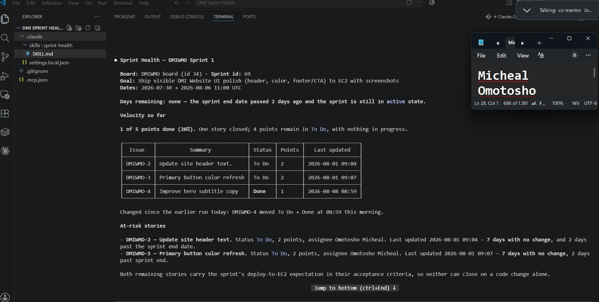

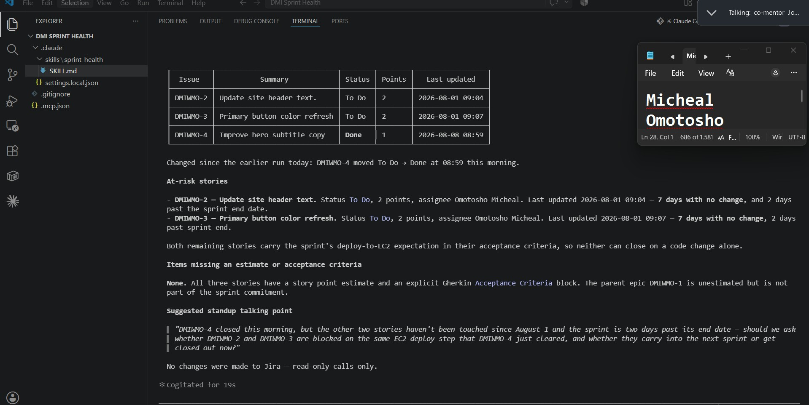

### Notes You Must Write (Very Important):

Map this assignment to Gather → Analyze → Human Act → Verify from Week 3 Assignment 6. Which step did you perform manually in the browser, and why must that step stay human?

According to the Gather → Analyze → Human Act → Verify workflow, the step I performed manually in the Jira browser was Human Act. I manually changed the sprint board item from To Do to Done.
This step must remain human because changing the status of a Jira issue is a project-modifying action. Keeping this action under human control prevents the AI from independently making decisions or modifying the project without my approval.

---

# Submission Instructions

Complete all tasks in sequence.

Your submission must include:
- All 8 required screenshots
- All the required notes

---

# Completion Checklist

- [ ] Task 1: Jira API token created, value never screenshotted (Screenshot 1)
- [ ] Task 2: `.mcp.json` has the Jira server block (Screenshot 2)
- [ ] Task 3: Credentials stored in `settings.local.json`, token blurred, file gitignored (Screenshot 3)
- [ ] Task 4: `/mcp` shows the Jira server connected (Screenshot 4)
- [ ] Task 5: Live query returned real sprint data, verified against the browser (Screenshot 5)
- [ ] Task 6: `/sprint-health` skill created with correct read-only `allowed-tools`, and produced a full report (Screenshots 6–7)
- [ ] Task 7: A manual board change was reflected in a second `/sprint-health` run (Screenshot 8)
- [ ] Skill never created, edited, transitioned, or commented on any issue
- [ ] Reflection answered (Notes)
- [ ] No API token value exposed

---

## 📌 About DMI & CloudAdvisory

DevOps Micro Internship (DMI) is a project-based DevOps program run by Pravin Mishra (The CloudAdvisory) focused on real-world execution, systems thinking, and career readiness.

It helps learners build strong DevOps foundations with hands-on experience.

---

## 📌 Resources

- 🌐 DMI Official Website: https://dmi.pravinmishra.com?utm_source=github&utm_medium=readme  
- 🎓 University: https://university.pravinmishra.com?utm_source=github&utm_medium=readme  
- 💬 Discord Community: https://discord.pravinmishra.com?utm_source=github&utm_medium=readme  
- 📝 Blog: https://dmi.pravinmishra.com/blog?utm_source=github&utm_medium=readme  
- ▶️ YouTube Playlist: https://www.youtube.com/playlist?list=PLFeSNDtI4Cho  
- 🔗 Pravin Mishra (LinkedIn): https://www.linkedin.com/in/pravin-mishra-aws-trainer/  
- 🏢 CloudAdvisory (LinkedIn): https://www.linkedin.com/company/thecloudadvisory/

---

*This submission is part of DevOps Micro Internship (DMI) Cohort 3 — Agentic AI Track.*
