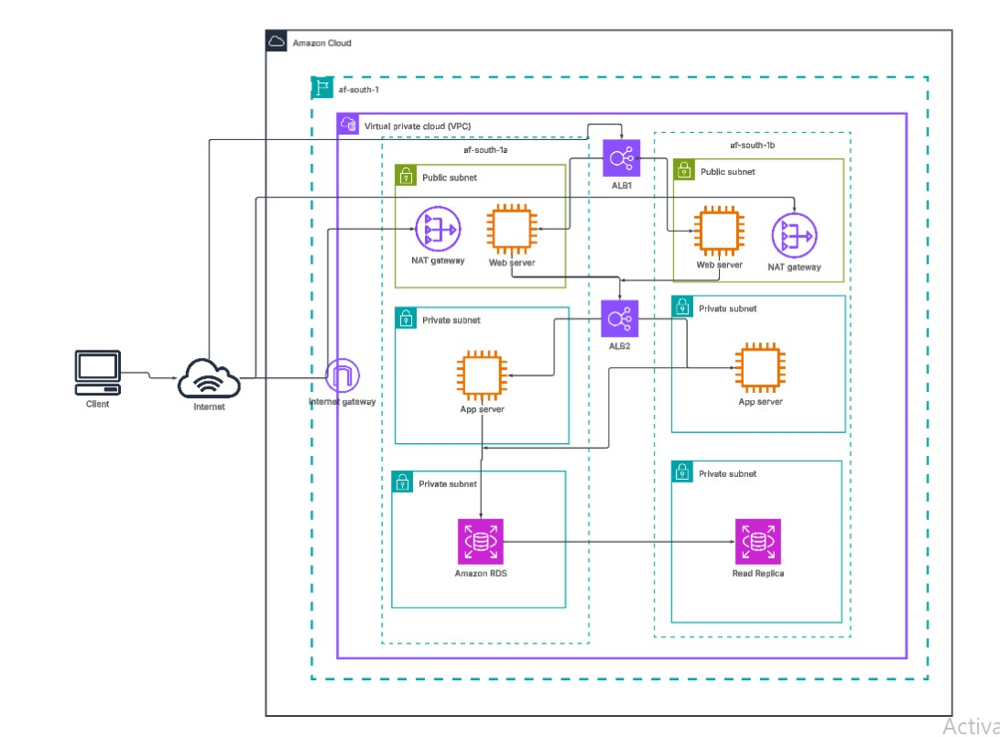
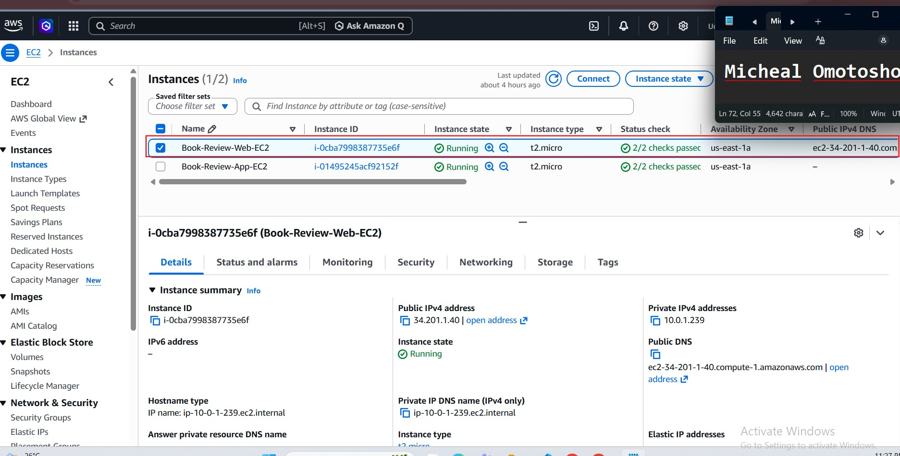
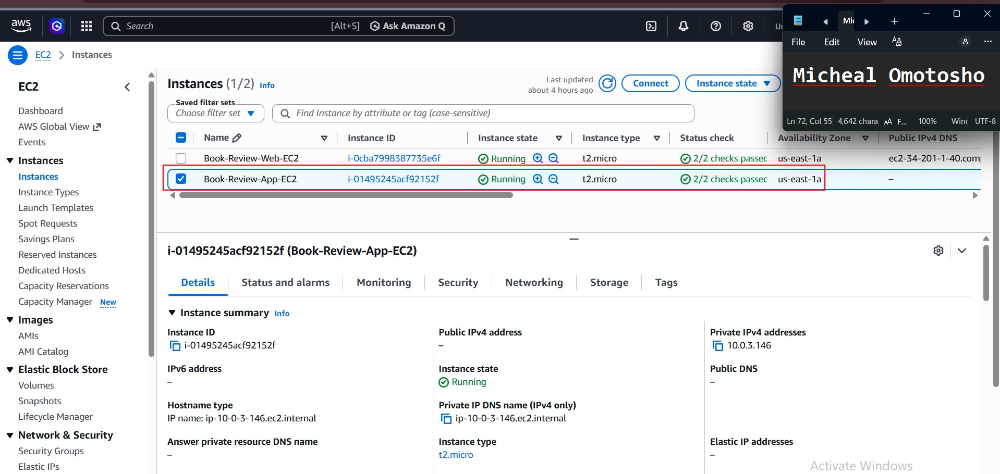
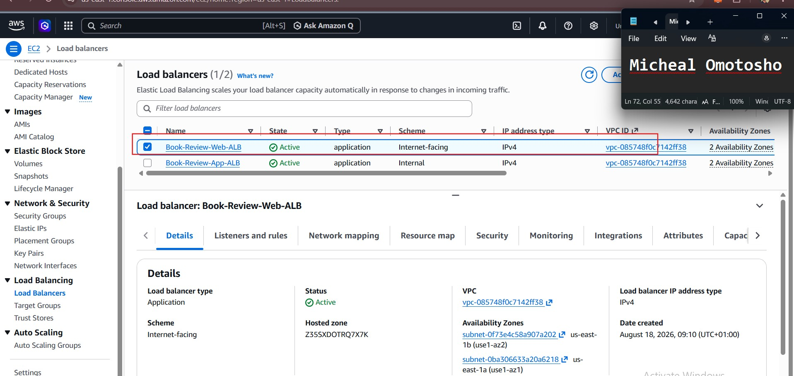
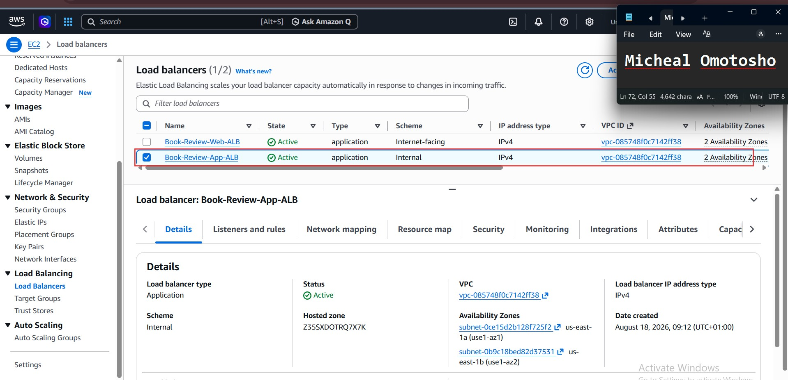
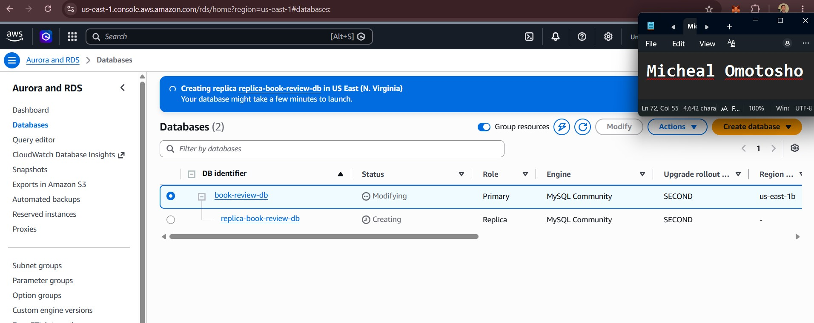
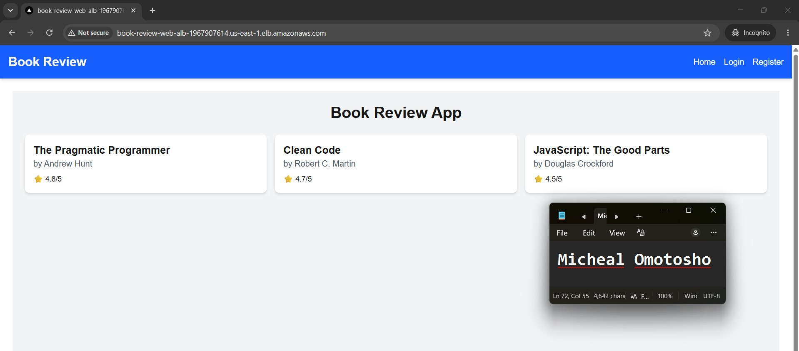

# Assignment 6 — Capstone Assignment — Deploy Book Review App (Three-Tier Architecture) on AWS

Part of the DevOps Micro Internship (DMI) Cohort 3 with Agentic AI

---

## Purpose

This is the most important assignment of the course. You will deploy the Book Review App in a fully production-style three-tier architecture on AWS: a Next.js Web Tier behind Nginx and a public ALB, a private Node.js/Express App Tier behind an internal ALB, and a private Multi-AZ MySQL RDS database with a read replica. You are expected to design, deploy, isolate, debug, and document the result independently.

---

# Task 1 — Architecture Diagram
 Vcpu
## Goal

Create an architecture diagram showing the custom VPC (10.0.0.0/16), the six subnets across two Availability Zones (two public Web Tier, two private App Tier, two private Database Tier), the public ALB, Web Tier EC2/Nginx, internal ALB, private App Tier EC2, private Multi-AZ RDS with its read replica, and the permitted traffic flow.

### Evidence

#### Diagram image or link

---

# Task 2 — AWS Region & Services Used

## Goal

Record the AWS Region used and list every AWS service used across networking, compute, load balancing, security, and the database.

### Notes

**Region:**

us-east-1

---

**Services:**

* VPC
    - Subnet
    - Internet Gateway
    - Nat Gateway
    - Route Table
    - Security Group
* EC2
    - AMI Ubuntu Distribution
    - T2 micro Vcpu
    - Keypair
* ALB
* Target Group
* RDS

---

# Task 3 — Public Entry Point

## Goal

Confirm the Book Review App loads through the public ALB DNS name.

### Evidence

#### Public ALB DNS

Paste your public ALB DNS name here:

http://book-review-web-alb-1967907614.us-east-1.elb.amazonaws.com/

---

# Task 4 — Evidence Screenshots

## Goal

Capture visual proof of every tier and load balancer.

### Evidence

#### Web EC2

---

#### App EC2

---

#### Public ALB

---

#### Internal ALB

---

#### RDS + Replica

---

#### App UI proof

---

# Task 5 — Summary

## Goal

Summarize what worked in the final deployment, the issues encountered and how each was fixed, and the tools or sources used to research and debug.

### Notes

**What worked:**

### What Worked

I would say that everything worked as expected. I successfully created the networking environment that enabled communication between the different resources. I also created the virtual servers and carried out the necessary installations and configurations to provide the environment where our application resides.

In addition, I configured a load balancer to distribute incoming traffic across healthy resources. This improved the application's performance, availability, and reliability by ensuring that traffic was routed only to healthy instances.

---

**Issues + fixes:**

The main challenges I encountered were related to application configuration and security group configuration.

Initially, the frontend and backend of the application were located in the same folder, which caused several configuration issues and made it difficult to deploy the application properly. After troubleshooting, I separated the frontend and backend into their respective directories and configured them independently. This resolved the configuration issues and allowed the application to work as expected.

I also encountered a security group configuration issue when sending requests from the web EC2 instance through the Application Load Balancer (ALB) to the private application EC2 instance. Since the application EC2 instance was placed in a private subnet, it needed to securely accept traffic only from the ALB.

To resolve this, I created a dedicated security group for the private application EC2 instance and configured the inbound rules to allow traffic from the ALB's security group. This ensured that the private application server could receive legitimate requests through the ALB while remaining protected from direct public access.

---

**Tools/sources used:**

The tools i used was
1. nodejs
2. nginx
3. pm2
4. git & github
5. nextjs
6. Express
7. mysql
6. chatgpt

---

# LinkedIn Post (Required)

## Goal

Publish a LinkedIn post sharing the capstone deployment, including the public ALB DNS (or a redacted screenshot), three to five lines on what you built and why it is production-style, and one proof screenshot.

## Evidence

#### LinkedIn Post URL

Paste your LinkedIn post URL here:

`Add your URL here`

---

#### Screenshot of LinkedIn post

Add your screenshot here.

---

# Submission Instructions

- Add all required screenshots and links in your submission
- Do not expose passwords, RDS credentials, connection strings, private keys, or account IDs

---

# Completion Checklist

- [ ] Task 1: Architecture diagram completed
- [ ] Task 2: AWS Region and services documented
- [ ] Task 3: Public ALB DNS confirmed working
- [ ] Task 4: All six evidence screenshots captured (Web Tier, App Tier, both ALBs, RDS + replica, app UI)
- [ ] Task 5: Deployment summary completed (what worked, issues/fixes, tools/sources)
- [ ] LinkedIn post published and URL submitted
- [ ] App Tier and Database Tier confirmed not publicly accessible
- [ ] No sensitive data exposed

---

## 📌 About DMI & CloudAdvisory

DevOps Micro Internship (DMI) is a project-based DevOps program run by Pravin Mishra (The CloudAdvisory) focused on real-world execution, systems thinking, and career readiness.

It helps learners build strong DevOps foundations with hands-on experience.

---

## 📌 Resources

- 🌐 DMI Official Website: https://dmi.pravinmishra.com?utm_source=github&utm_medium=readme  
- 🎓 University: https://university.pravinmishra.com?utm_source=github&utm_medium=readme  
- 💬 Discord Community: https://discord.pravinmishra.com?utm_source=github&utm_medium=readme  
- 📝 Blog: https://dmi.pravinmishra.com/blog?utm_source=github&utm_medium=readme  
- ▶️ YouTube Playlist: https://www.youtube.com/playlist?list=PLFeSNDtI4Cho  
- 🔗 Pravin Mishra (LinkedIn): https://www.linkedin.com/in/pravin-mishra-aws-trainer/  
- 🏢 CloudAdvisory (LinkedIn): https://www.linkedin.com/company/thecloudadvisory/

---

*This submission is part of DevOps Micro Internship (DMI) Cohort 3 — Agentic AI Track.*