# Assignment 7 — AI-Assisted AWS Security and Cost Audit

Part of the DevOps Micro Internship (DMI) Cohort 3 with Agentic AI

---

## Purpose

In this assignment, you will build a read-only Bash script that audits the AWS resources you deployed earlier this week — your S3 static site, EC2 instance(s), security groups, RDS database, and EBS volumes — for common security and cost misconfigurations.

You will then connect that script to Claude Code as a reusable `/aws-audit` skill that explains what it found and recommends a fix, without ever making the fix itself.

Finally, you will find a real misconfiguration in your own account, apply the fix yourself, and prove it worked with a second audit run.

---

# Task 1 — Confirm Your AWS Resources and Set Up Your Workspace

## Goal

Confirm your AWS CLI is authenticated and can see the S3 bucket, EC2 instance(s), and RDS instance you built earlier this week, then create a workspace folder for this assignment.

### Evidence

#### Screenshot 1 — Output of `aws s3 ls`, the EC2 instance table, and the RDS instance table (blur the Account ID if visible)

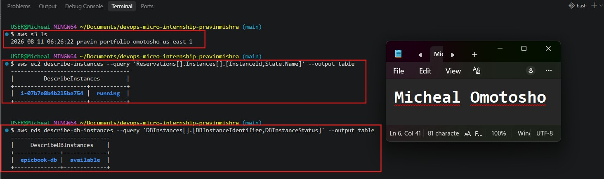

---

#### Screenshot 2 — Output of `pwd` and `find . -maxdepth 4 -type d | sort`

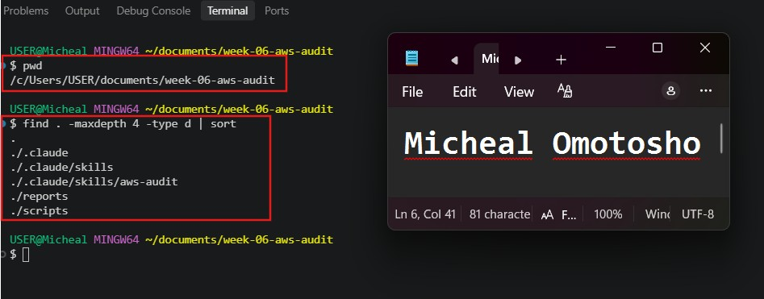

---

### Notes You Must Write (Very Important)

**1. Which resources from this week's earlier assignments did you see in the listings?**

The resources i saw in listing was 
1. S3 Bucket
2. EC2 Instance
3. RDS Instance

**2. Why must you confirm your resources exist before writing an audit script against them?**

I must confirm that the resources exist before running an audit script to ensure I am auditing the correct resources and not running the audit against an empty or nonexistent environment.

---

# Task 2 — Define Safety Rules in CLAUDE.md

## Goal

Create a `CLAUDE.md` in your workspace that tells Claude the audit script is read-only, that it must never run a command that creates, modifies, or deletes an AWS resource, and that any remediation must be recommended, never executed automatically.

### Evidence

#### Screenshot 3 — `CLAUDE.md` open in VS Code showing all four sections

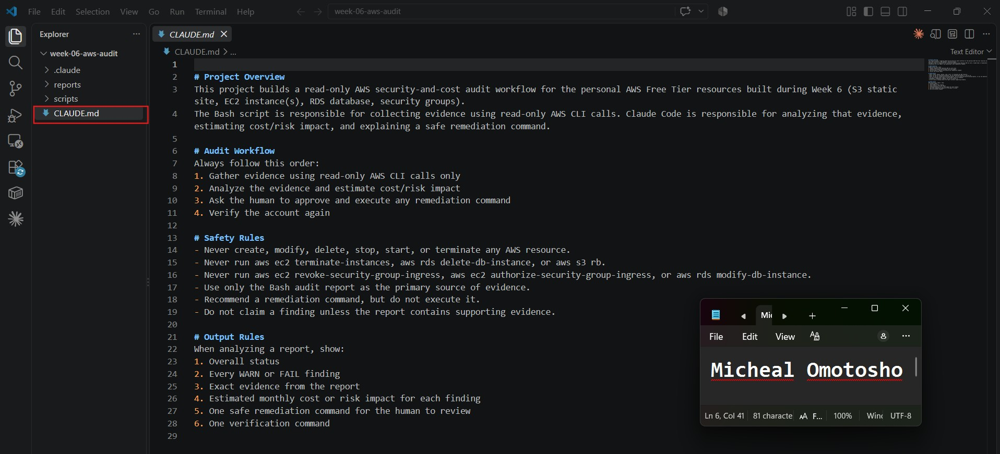

---

### Notes You Must Write (Very Important)

**1. Why should Claude never be given permission to run `revoke-security-group-ingress` itself, even if the fix is obviously correct?**

Claude should never be given permission to run revoke-security-group-ingress directly because remediation actions can have significant security and operational consequences. As humans, we should maintain control over our cloud resources and review any recommended changes before applying them. Claude can identify the issue and recommend the appropriate remediation, but the final decision and execution should remain under human control.

**2. Which rule prevents Claude from claiming a finding that the report does not support?**

The rule that prevents Claude from claiming a finding that the report does not support is: “Do not claim a finding unless the report contains supporting evidence.” This ensures that Claude only makes findings based on actual evidence collected in the Bash audit report and does not make assumptions or unsupported claims.

---

# Task 3 — Plan the Audit with Claude Code

## Goal

Ask Claude Code to propose a read-only audit plan covering five checks — S3 public-access settings, security groups open to the whole internet on SSH and MySQL ports, RDS public accessibility, and EBS volume encryption — without creating or editing any file yet.

### Evidence

#### Screenshot 4 — Claude Code showing the five-check plan

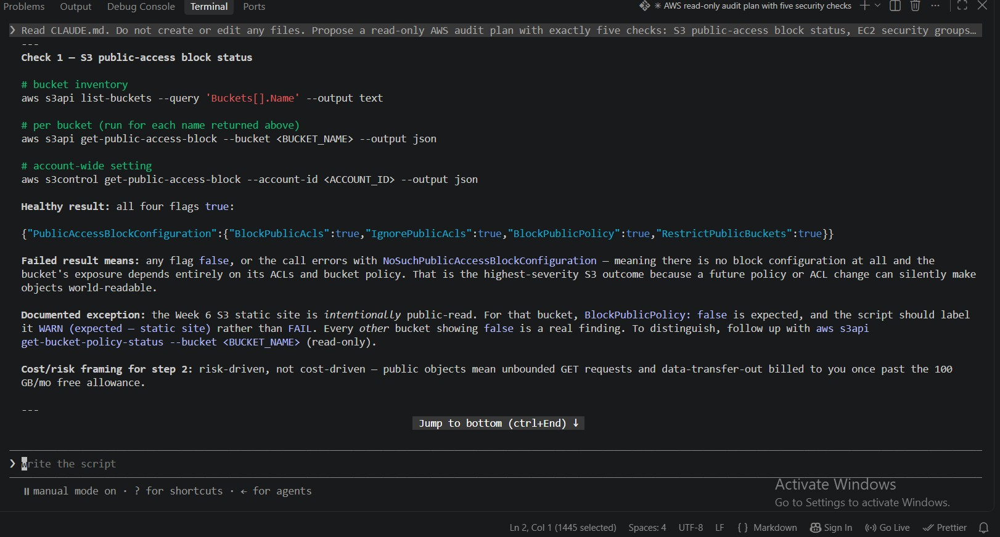

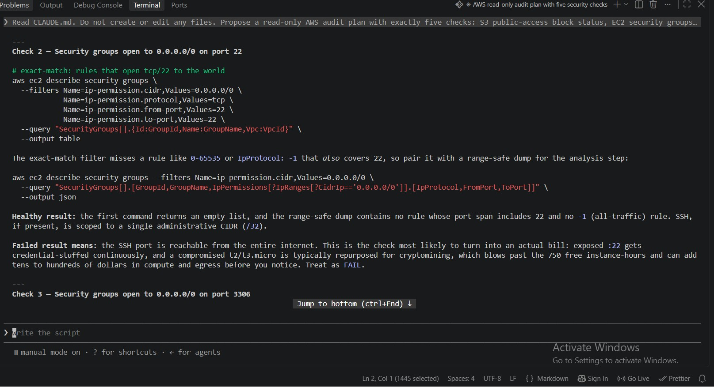

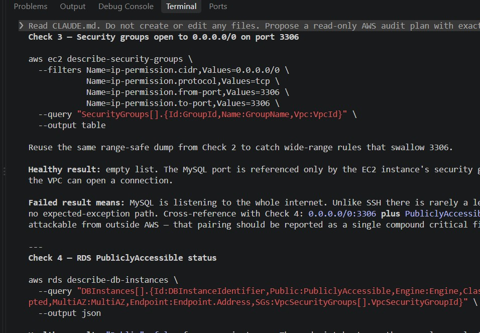

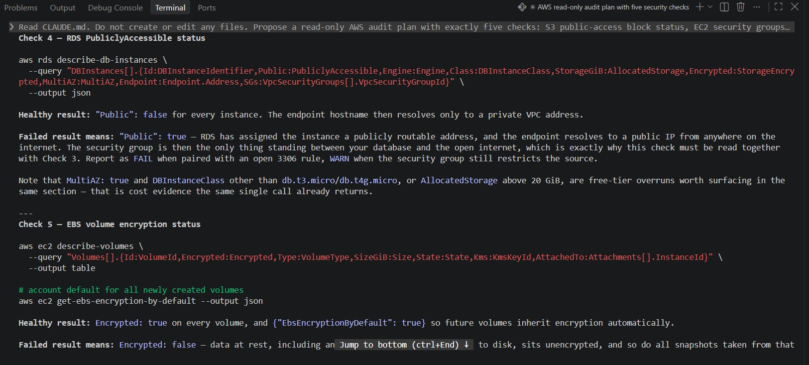

---

### Notes You Must Write (Very Important)

**1. Which part of this task represents the Gather phase?**

The Gather phase is the part of the task where the agent begins collecting evidence by running Check 1 through Check 5. These checks use read-only AWS CLI commands to gather information about the AWS resources before any analysis or recommendations are made.  

**2. Did every proposed command start with `describe-`, `get-`, or `list-`? Why does that matter?**

Yes every proposed commands starts with `describe-`, `get-`, or `list-`. This matters because these are read-only AWS CLI commands used by the agent to collect information about my AWS account and the resources I launched. They allow the agent to gather the necessary evidence for the audit without modifying, creating, or deleting any resources.

---

# Task 4 — Build the AWS Audit Script

## Goal

Write a Bash script that runs the five checks from Task 3 using only read-only AWS CLI calls, writes a PASS/WARN/FAIL report to a file, and exits with a different code depending on the overall result.

Make it executable and confirm it has no syntax errors.

### Evidence

#### Screenshot 5 — Top section of `aws-audit.sh` showing the variables and the checks array

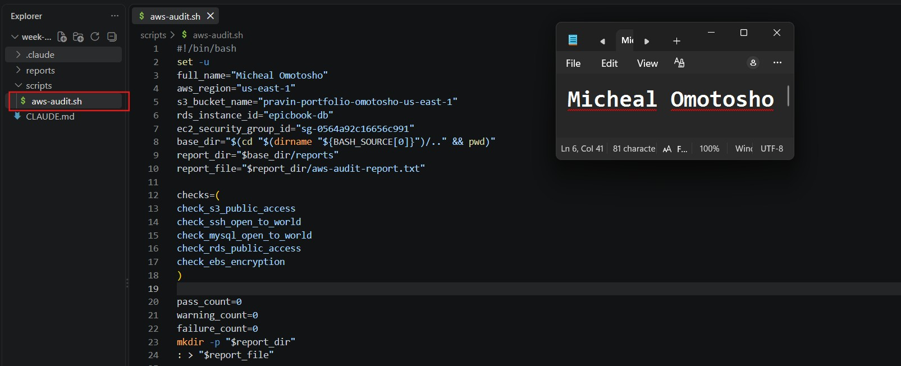

---

#### Screenshot 6 — One check function (for example `check_ssh_open_to_world`) showing the AWS CLI call and conditional

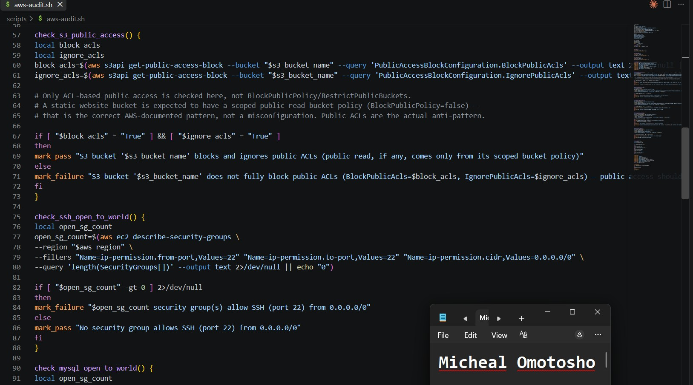

---

#### Screenshot 7 — Output of `bash -n scripts/aws-audit.sh` and `ls -l scripts/aws-audit.sh`

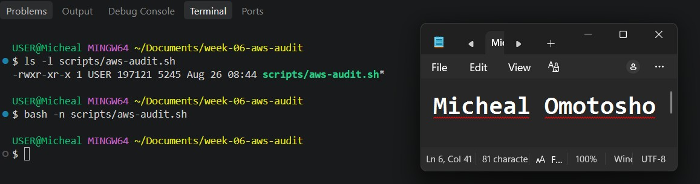

---

### Notes You Must Write (Very Important)

**1. What is stored in the checks array, and how does the loop use it?**

The checks array stores all the audit checks that need to be performed by the agent. The loop iterates through each check in the array, runs it, and evaluates the results until all the defined checks have been completed.

**2. Why does every AWS CLI call in this script use `--query` and `--output text` instead of parsing raw JSON?**

Every AWS CLI call uses --query and --output text to extract only the specific information needed and return it in a simple, readable text format. This makes the audit output easier for the script and Claude to analyze compared with parsing the full raw JSON response.

**3. Why does the script use different exit codes for HEALTHY, WARN, and FAIL?**

The script uses different exit codes to distinguish between the different audit results: HEALTHY, WARN, and FAIL. This allows the script or another process to easily determine the overall status of the audit based on the exit code returned when the script finishes.

---

# Task 5 — Run the Baseline Audit

## Goal

Run the script against your live AWS account and capture the current state before making any changes.

### Evidence

#### Screenshot 8 — Output of `./scripts/aws-audit.sh` showing your Full Name and all five checks

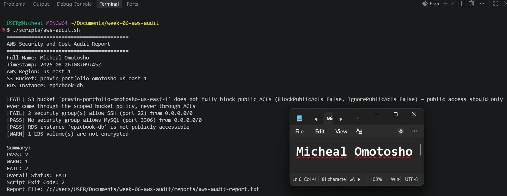

---

#### Screenshot 9 — Output showing the captured exit code and final summary

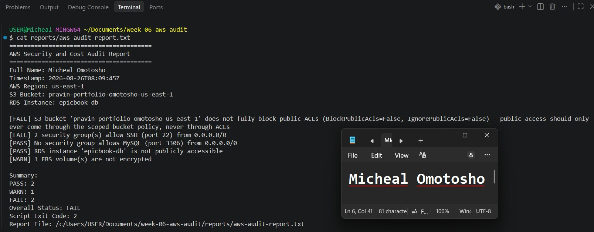

---

### Notes You Must Write (Very Important)

**1. What is the overall status of your baseline audit?**

The overall status of my baseline audit is FAIL 

**2. Did any check return FAIL or WARN? If so, which one, and what evidence did it show?**

The S3 Bucket and EC2 Security group allow SSH (port 22) from 0.0.0.0/0 returned Fail. The EBS volume(s) which are not encrypted returned WARN

**3. If every check passed, what does that tell you about the security posture of your account so far?**

if every checks passed, this does not guarantee that the entire AWS account is completely secure because the audit only covers the checks included in the script.

---

# Task 6 — Build and Run the /aws-audit Skill

## Goal

Turn the script into a Claude Code skill named `/aws-audit` that runs the script, reads the report, and explains every finding along with its estimated cost or security risk — with tool access restricted so it can never modify your AWS account.

### Evidence

#### Screenshot 10 — `SKILL.md` showing the frontmatter, tool restrictions, and safety rules

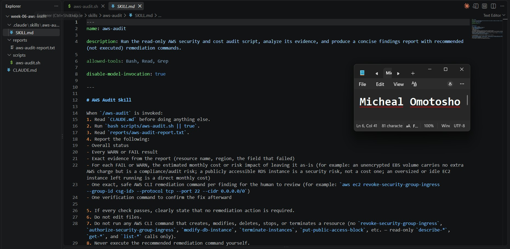

---

#### Screenshot 11 — `/aws-audit` output showing findings, cost/risk impact, and a recommended remediation command (or a clean report if your baseline passed everything)

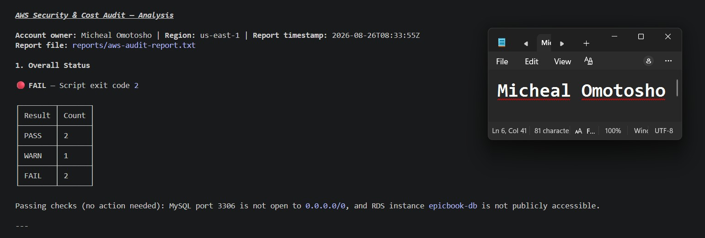

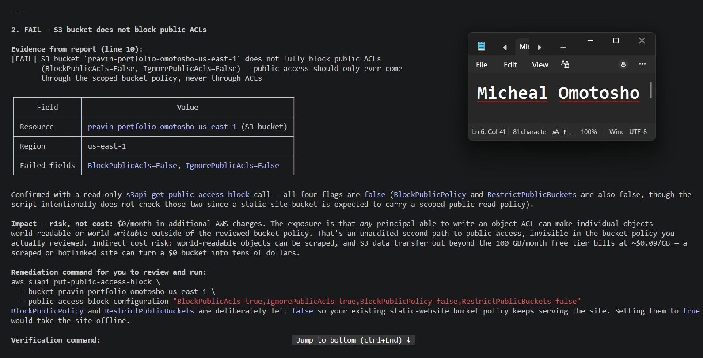

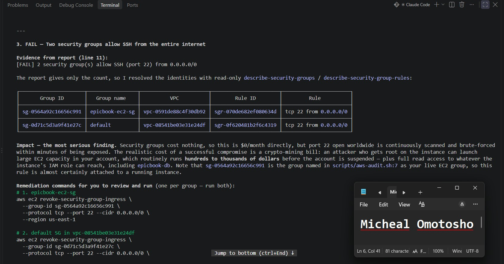

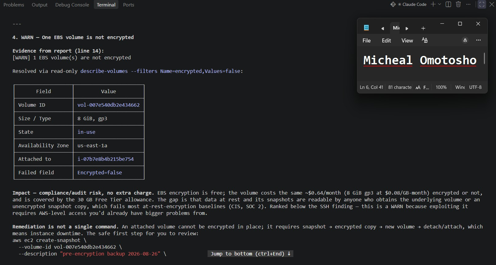

---

### Notes You Must Write (Very Important)

**1. Why does this skill have Bash, Read, and Grep, but not Write?**

The skill has Bash, Read, and Grep to keep the audit workflow read-only. Bash is used to run read-only AWS CLI commands, Read is used to inspect files, and Grep is used to search or filter information. Write is intentionally excluded to prevent the agent from modifying or creating files and to maintain the read-only nature of the audit.

**2. What part is performed by Bash, and what part is performed by Claude?**

Bash is responsible for collecting the AWS audit evidence by running read-only AWS CLI commands. Claude is responsible for analyzing the evidence collected by Bash, identifying WARN or FAIL findings, estimating the cost or risk impact, and recommending a safe remediation command for the human to review and execute. 

**3. Why is estimating cost/risk impact something the AI adds on top of a plain PASS/FAIL script?**

Estimating cost/risk impact adds context to a plain PASS/FAIL result. Instead of only showing whether a check passed or failed, the AI explains the potential financial cost or security risk of each finding. This helps the human understand the impact and make an informed decision about remediation.

---

# Task 7 — Fix a Real Finding and Re-Verify

## Goal

Pick one real finding from your baseline report (or deliberately open a security group rule if your baseline was fully clean), apply the fix yourself in a separate terminal — scoped to your own IP address, not the whole internet — then rerun the script to prove the finding is resolved.

### Evidence

#### Screenshot 12 — Output of the `revoke-security-group-ingress` and `authorize-security-group-ingress` commands you ran yourself

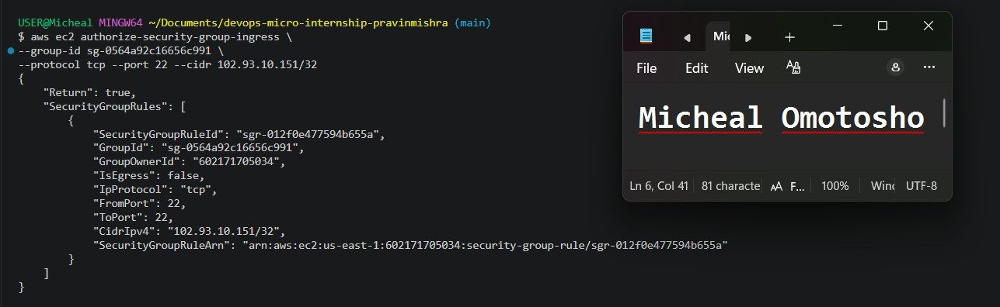

---

#### Screenshot 13 — Rerun of `./scripts/aws-audit.sh` showing the finding is now PASS

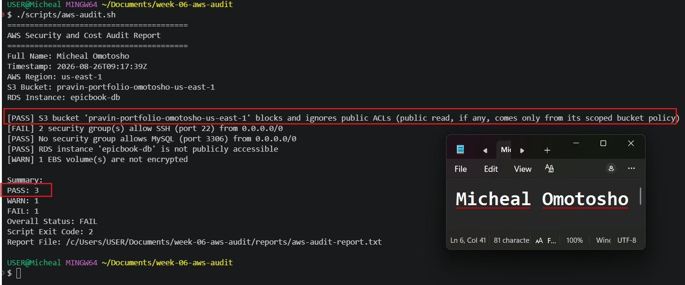

---

### Notes You Must Write (Very Important)

**1. Which exact finding did you fix, and what command did you run?**

I fix EC2 security group ssh that was open to the world. It was fix by restricting the ssh access to my IP alone. I used the command 
` aws ec2 authorize-security-group-ingress \
--group-id <your-security-group-id> \
--protocol tcp --port 22 --cidr <your-ip-address>/32 `

**2. Why did you scope the new rule to your own IP address instead of leaving it open to `0.0.0.0/0`?**

I scoped the new rule to my own IP address to follow the principle of least privilege. This ensures that only my trusted IP address can access the server on the specified port, rather than exposing the server to traffic from any IP address using 0.0.0.0/0.

**3. Did Claude execute the remediation command, or did you? Why does that matter?**

Claude did not execute the remediation command because its permissions are restricted to read-only operations. I manually reviewed and executed the remediation command myself. This matters because it keeps the human in control of changes to AWS resources and prevents the AI agent from making potentially risky or unintended changes without approval.

**4. Which phase of the Agentic Loop does the Bash script represent? Which phase does Claude's explanation represent? Which phase is you running the fix?**

1. Bash script — Gather/Observe phase: The Bash script represents the Gather phase because it runs read-only AWS CLI commands to collect evidence about the resources and their security/cost status.
2. Claude's explanation — Analyze/Plan phase: Claude represents the Analyze/Plan phase by reviewing the evidence collected by Bash, identifying risks or issues, estimating their impact, and recommending a remediation command.
3. Running the fix — Act/Execute phase: Running the remediation command is the Action/Execute phase, but in this workflow, the human performs the action after reviewing and approving Claude's recommendation. This maintains human control over AWS resources.

---

# LinkedIn Post (Required)

## Goal

Create a LinkedIn post including:

- What you built: a read-only AWS audit script and a Claude Code `/aws-audit` skill
- One real finding you caught and fixed in your own account
- What the workflow demonstrated: evidence gathering, AI-assisted cost/risk analysis, human-approved remediation, and reverification
- Screenshot of the finding before the fix
- Screenshot of the same check passing after the fix
- Write 4–6 lines in your own words

Suggested tags:

`#DMIByPravinMishra #AWS #AgenticAI #ClaudeCode #DevOps`

### Evidence

#### LinkedIn Post URL

Paste your LinkedIn post URL here:

https://lnkd.in/p/efrSBZqV

---

#### Screenshot of Published LinkedIn Post

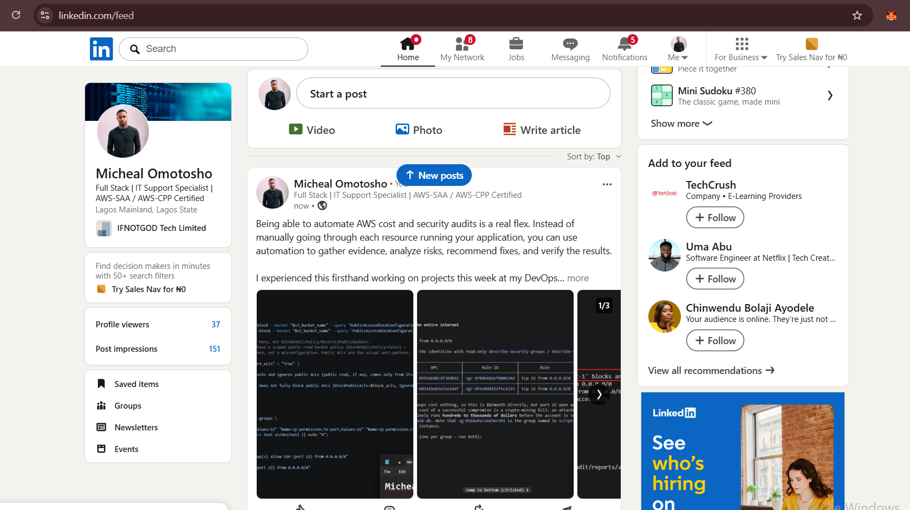

---

# Submission Instructions

Complete all tasks in sequence.

Your submission must include:

- All 13 required task screenshots
- Answers to every **Notes You Must Write** question
- `CLAUDE.md`
- `scripts/aws-audit.sh`
- `.claude/skills/aws-audit/SKILL.md`
- `reports/aws-audit-report.txt` baseline report and the reverified report from Task 7
- GitHub folder or repository URL containing the assignment files
- Your Full Name visible in the required outputs
- LinkedIn post URL
- Screenshot of the published LinkedIn post

Submit only a Google Doc link.

Add the GitHub URL inside the Google Doc.

Follow the Assignment Submission Guidelines.

---

# Completion Checklist

- [ ] Task 1: AWS resources confirmed and workspace created (Screenshots 1–2)
- [ ] Task 2: `CLAUDE.md` created with project context and safety rules (Screenshot 3)
- [ ] Task 3: Claude produced a read-only five-check audit plan before any script existed (Screenshot 4)
- [ ] Task 4: `aws-audit.sh` built, executable, and passes `bash -n` (Screenshots 5–7)
- [ ] Task 5: Baseline audit captured and saved with Full Name visible (Screenshots 8–9)
- [ ] Task 6: `/aws-audit` skill loads and runs successfully with no Write permission (Screenshots 10–11)
- [ ] Task 7: A real finding was fixed by you and reverified as PASS (Screenshots 12–13)
- [ ] Skill never executed a remediation command
- [ ] New security group rule is scoped to your own IP, not `0.0.0.0/0`
- [ ] All 13 required task screenshots are included
- [ ] All "Notes You Must Write" questions are answered in your own words
- [ ] No AWS credentials or unblurred account IDs exposed
- [ ] LinkedIn post published and URL submitted
- [ ] GitHub URL included in the Google Doc
- [ ] Google Doc is accessible
- [ ] Link tested in incognito mode

---

# Final Submission

Submit only your Google Doc link.

### Question

Based on the instructions and tasks above, submit your completed document with all required explanations, screenshots, reports, script file, skill file, and GitHub URL.

`Add your Google Doc link here`

---

## 📌 About DMI & CloudAdvisory

DevOps Micro Internship (DMI) is a project-based DevOps program run by Pravin Mishra (The CloudAdvisory) focused on real-world execution, systems thinking, and career readiness.

It helps learners build strong DevOps foundations with hands-on experience.

---

## 📌 Resources

- 🌐 DMI Official Website: https://dmi.pravinmishra.com?utm_source=github&utm_medium=readme  
- 🎓 University: https://university.pravinmishra.com?utm_source=github&utm_medium=readme  
- 💬 Discord Community: https://discord.pravinmishra.com?utm_source=github&utm_medium=readme  
- 📝 Blog: https://dmi.pravinmishra.com/blog?utm_source=github&utm_medium=readme  
- ▶️ YouTube Playlist: https://www.youtube.com/playlist?list=PLFeSNDtI4Cho  
- 🔗 Pravin Mishra (LinkedIn): https://www.linkedin.com/in/pravin-mishra-aws-trainer/  
- 🏢 CloudAdvisory (LinkedIn): https://www.linkedin.com/company/thecloudadvisory/

---

*This submission is part of DevOps Micro Internship (DMI) Cohort 3 — Agentic AI Track.*