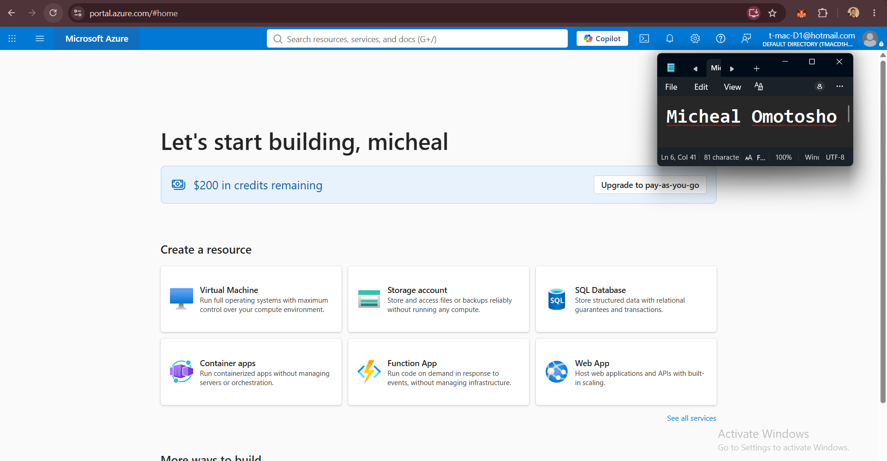
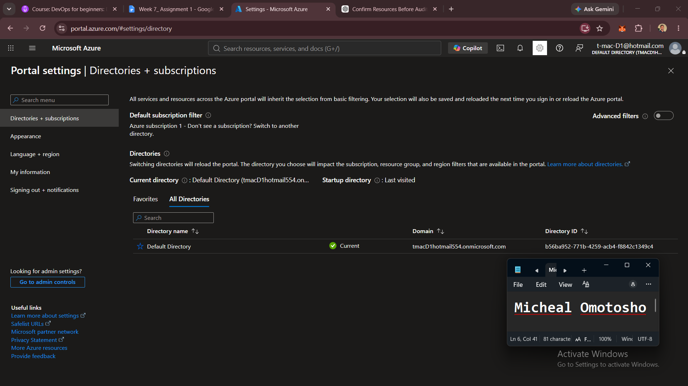

# Assignment 1 — Create and Set Up Your Azure Free Account

Part of the DevOps Micro Internship (DMI) Cohort 3 with Agentic AI

---

## Purpose

In this assignment, you will set up a fully functional Microsoft Azure Free Account so you are ready to start cloud-based assignments and hands-on labs. You will complete identity and payment verification, accept the required terms, sign in to the Azure Portal, and confirm the Free Trial subscription is available.

---

# Task 1 — 4 Create and Set Up Your Azure Free Account

## Goal

Complete the Azure Free Account registration process, including Microsoft account sign-in, personal details, identity and phone verification, payment verification, and acceptance of the required terms.

> No screenshot required for this task. Do not capture payment-card details. Completion is verified through Task 2.

---

# Task 5 — Access and Explore the Azure Portal

## Goal

Confirm successful Azure Portal access and Locate the required services and subscription.

### Evidence

#### Screenshot 1 — Azure Portal homepage after successful login

---

#### Screenshot 2 — "Subscriptions" section showing the "Free Trial" subscription

---

### Notes

Write a three-to-four-line paragraph explaining which Azure services you plan to explore first and why.

I would like to explore Azure Networking and Compute services first because they form the foundation for deploying and running applications in the cloud. Understanding services such as Azure Virtual Network and Azure Virtual Machines will help me build a strong foundation in Azure infrastructure. These services will also allow me to apply my existing AWS and DevOps knowledge to the Azure ecosystem.

---

# Submission Instructions

- Add all required screenshots in your submission
- Do not expose payment-card details, phone numbers, or other sensitive account information

---

# Completion Checklist

- [ ] Azure Free Account created with identity, phone, and payment verification completed
- [ ] Microsoft Agreement and Offer Terms accepted
- [ ] Azure Portal accessed successfully (Screenshot 1)
- [ ] Free Trial subscription confirmed (Screenshot 2)
- [ ] Reflection paragraph written (Notes)
- [ ] No sensitive information exposed

---

## 📌 About DMI & CloudAdvisory

DevOps Micro Internship (DMI) is a project-based DevOps program run by Pravin Mishra (The CloudAdvisory) focused on real-world execution, systems thinking, and career readiness.

It helps learners build strong DevOps foundations with hands-on experience.

---

## 📌 Resources

- 🌐 DMI Official Website: https://dmi.pravinmishra.com?utm_source=github&utm_medium=readme  
- 🎓 University: https://university.pravinmishra.com?utm_source=github&utm_medium=readme  
- 💬 Discord Community: https://discord.pravinmishra.com?utm_source=github&utm_medium=readme  
- 📝 Blog: https://dmi.pravinmishra.com/blog?utm_source=github&utm_medium=readme  
- ▶️ YouTube Playlist: https://www.youtube.com/playlist?list=PLFeSNDtI4Cho  
- 🔗 Pravin Mishra (LinkedIn): https://www.linkedin.com/in/pravin-mishra-aws-trainer/  
- 🏢 CloudAdvisory (LinkedIn): https://www.linkedin.com/company/thecloudadvisory/

---

*This submission is part of DevOps Micro Internship (DMI) Cohort 3 — Agentic AI Track.*
