# Assignment 6 — Capstone: Deploy Book Review App (Three-Tier Architecture) on Azure

Part of the DevOps Micro Internship (DMI) Cohort 3 with Agentic AI

---

## Purpose

This is the most important assignment of the course. You will deploy the Book Review App in a production-ready, best-practice-compliant three-tier architecture on Azure: separated presentation, application, and database tiers, least-privilege network access, a controlled public entry point, protected secrets, and availability/monitoring evidence.

---

# Task 1 — Design the Azure Three-Tier Architecture

## Goal

Create an architecture diagram and implementation plan identifying the presentation, application, and database components, the chosen Azure services, the public entry point, and the internal traffic paths.

### Evidence

#### Screenshot 1 — Architecture diagram showing the public entry point, three tiers, network boundaries, and traffic flow

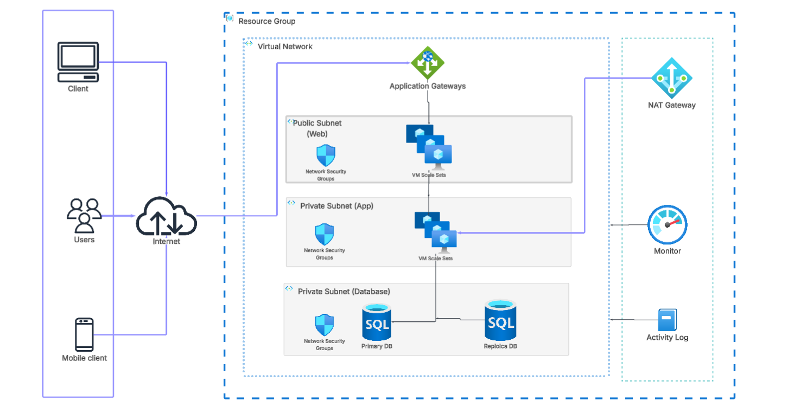

---

#### Screenshot 2 — Written architecture assumptions and selected Azure services

# Architecture Assumptions

## 1. Business and Application

* The application follows a standard three-tier architecture consisting of the **Presentation Tier, Application Tier, and Data Tier**.
* The application is accessed by users over the public internet using **HTTPS**.

## 2. Network

* A single **Azure Virtual Network (VNet)** is used to host the application components.
* Each tier is deployed in a separate subnet to provide network isolation.
* **Network Security Groups (NSGs)** are used to control inbound and outbound traffic for each tier.

## 3. Security

* All internet traffic enters the environment through **Azure Front Door** and **Azure Application Gateway with Web Application Firewall (WAF)**.
* **TLS/SSL encryption** is used to secure client connections.
* The database tier is not directly accessible from the public internet.
* The principle of **least privilege** is applied to users, applications, and network access.

## 4. High Availability and Scalability

* The Web and Application tiers use **Azure Virtual Machine Scale Sets** to provide high availability and automatic scaling.
* The database tier uses **Azure Database for MySQL** with a primary database and read replica to support availability and read scalability.

## 5. Traffic Flow

The assumed traffic flow is:

**Internet/User → Azure Front Door → Application Gateway (WAF) → Web Tier → Application Tier → Database Tier**

* User requests first enter through the public endpoint.
* The requests are inspected and routed by the Application Gateway/WAF.
* The Web Tier forwards application requests to the Application Tier.
* The Application Tier communicates with the database to store and retrieve application data.
* The response follows the appropriate path back to the user.

## 6. Management and Monitoring

* Centralized monitoring, logging, and alerting are enabled across the environment.
* Infrastructure and application resources are monitored for **performance, availability, and security**.

## 7. Backup and Recovery

* Regular backups are enabled for critical resources, particularly the database.
* Recovery procedures are assumed to be available for critical components in case of failure or data loss.

## 8. Environment

* The architecture can be replicated across different environments such as **Development, Testing, and Production** while maintaining the same fundamental design.

---

# Selected Azure Services

| Azure Service                                          | Purpose                                                                                                                                                             |
| ------------------------------------------------------ | ------------------------------------------------------------------------------------------------------------------------------------------------------------------- |
| **Azure Front Door**                                   | Provides the global public entry point for the application, including routing, HTTPS termination, CDN capabilities, and protection against certain network attacks. |
| **Azure Application Gateway + WAF**                    | Acts as a Layer 7 load balancer and Web Application Firewall. It inspects HTTP/HTTPS traffic and routes legitimate requests to the Web Tier.                        |
| **Azure Virtual Machine Scale Set – Web Tier**         | Hosts the presentation/web servers and provides automatic scaling and high availability.                                                                            |
| **Azure Virtual Machine Scale Set – Application Tier** | Hosts the application's business logic and APIs while providing scalability and high availability.                                                                  |
| **Azure Database for MySQL – Primary**                 | Provides the managed relational database used to store application data.                                                                                            |
| **Azure Database for MySQL – Read Replica**            | Provides a replica for read scalability and can support availability and disaster-recovery strategies depending on the selected configuration.                      |
| **Network Security Group (NSG)**                       | Controls network traffic at the subnet or network-interface level and restricts unauthorized access between tiers.                                                  |
| **Azure NAT Gateway**                                  | Provides controlled outbound internet connectivity for resources in private subnets without assigning public IP addresses to those resources.                       |
| **Azure Bastion**                                      | Provides secure SSH/RDP management access to virtual machines without exposing their management ports directly to the public internet.                              |
| **Azure Monitor**                                      | Collects metrics and monitoring information to track the health, performance, and availability of Azure resources.                                                  |
| **Log Analytics**                                      | Provides centralized collection, storage, and querying of logs for troubleshooting, monitoring, and security analysis.                                              |
| **Microsoft Defender for Cloud**                       | Provides security posture management, threat detection, recommendations, and vulnerability assessment for the Azure environment.                                    |
| **Azure Backup**                                       | Provides backup and recovery capabilities for supported Azure resources and helps protect critical data from accidental deletion or failures.                       |

## Overall Architecture

The selected services work together to provide a **secure, scalable, highly available, and manageable three-tier application architecture**. Public traffic is controlled through Azure Front Door and Application Gateway/WAF, while the Web, Application, and Database tiers are isolated within the Azure Virtual Network. NSGs enforce network-level security, Bastion provides secure administrative access, and Azure Monitor, Log Analytics, Defender for Cloud, and Azure Backup provide operational visibility, security, and recovery capabilities.

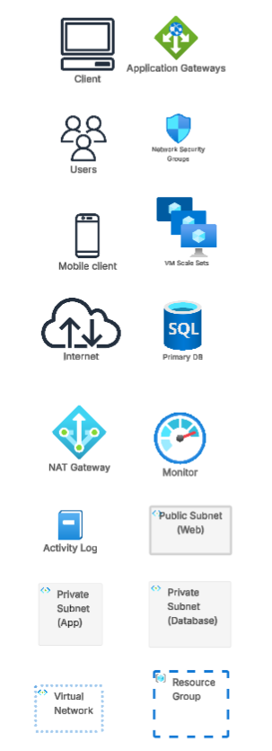

---

# Task 2 — Create the Azure Network Foundation

## Goal

Create a dedicated Resource Group and VNet with separate subnets for the web, application, and database tiers, keeping the application and database tiers without direct public access.

### Evidence

#### Screenshot 3 — Resource Group overview showing the assignment resources

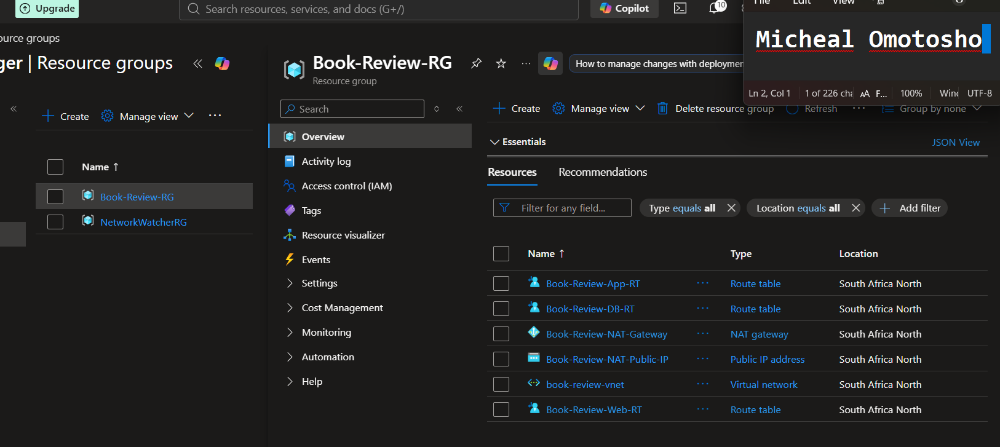

---

#### Screenshot 4 — VNet overview showing the address space and all required subnets

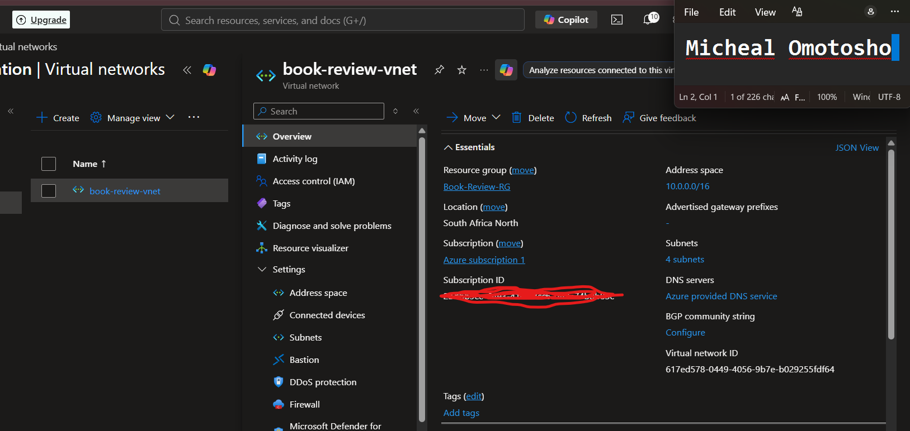

---

#### Screenshot 5 — Route-table or Private DNS evidence where applicable

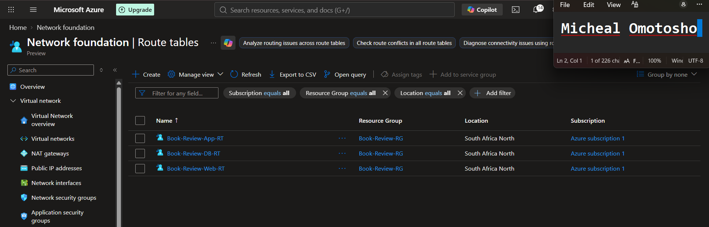

---

# Task 3 — Configure Security and Secret Management

## Goal

Apply least-privilege NSG rules so traffic flows Internet → public entry point → web tier → application tier → database tier, and store credentials in Azure Key Vault or another approved secure mechanism.

### Evidence

#### Screenshot 6 — NSG rules proving least-privilege access between the tiers

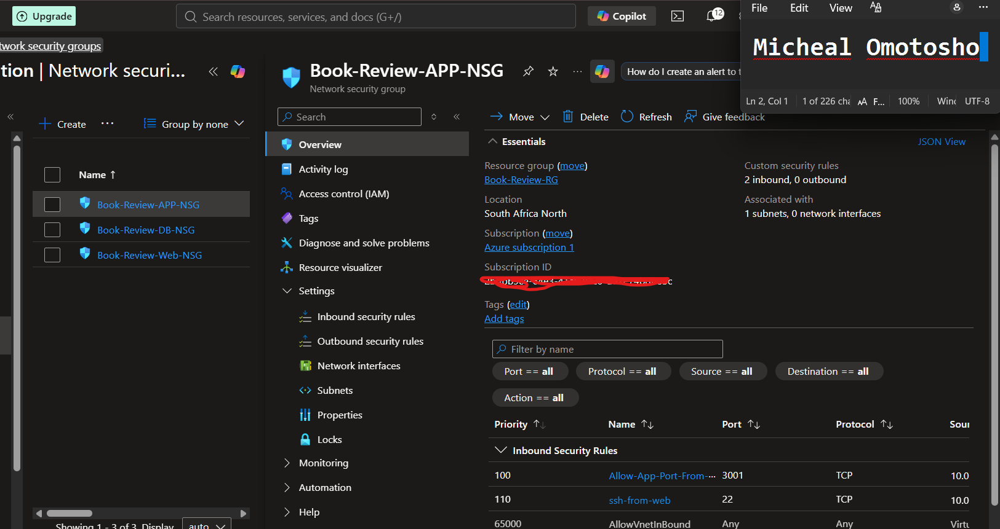

---

#### Screenshot 7 — Key Vault or approved secret-management configuration (without displaying secret values)

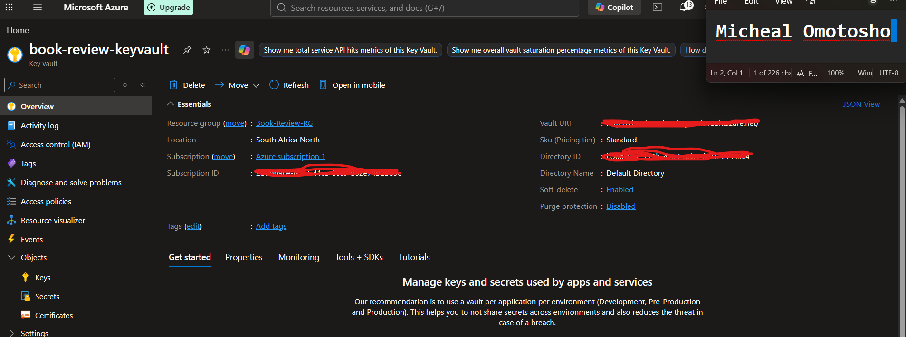

---

# Task 4 — Deploy the Presentation (Web) Tier

## Goal

Deploy the Book Review App presentation layer on the approved web-tier compute service, configured to route requests to the internal application-tier endpoint, and not directly exposed except through the public entry service.

### Evidence

#### Screenshot 8 — Web-tier compute overview showing subnet and availability configuration

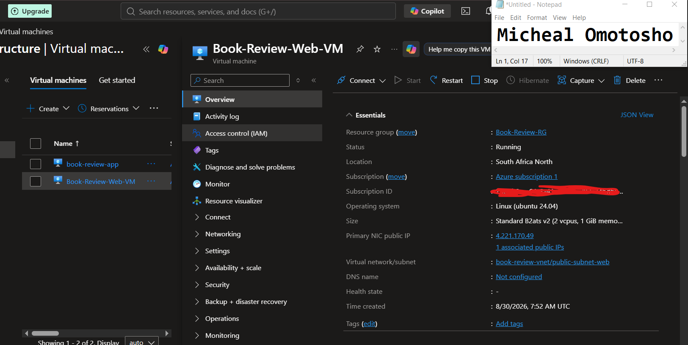

---

#### Screenshot 9 — Terminal or service output proving the presentation layer is running

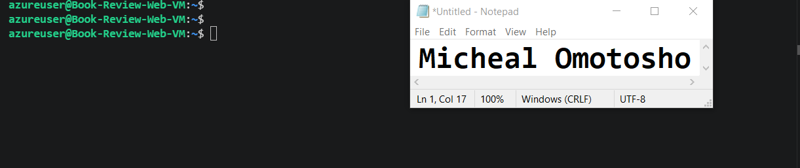

---

# Task 5 — Deploy the Business (Application) Tier

## Goal

Deploy the Book Review App backend privately in the application subnet, configured to use the private database endpoint and secured environment values, reachable only through its internal endpoint.

### Evidence

#### Screenshot 10 — Application-tier compute overview showing private subnet placement

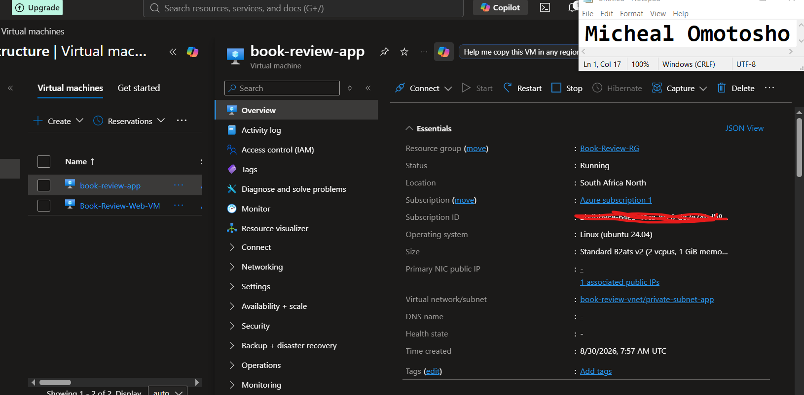

---

#### Screenshot 11 — Backend process, service, or listening-port evidence

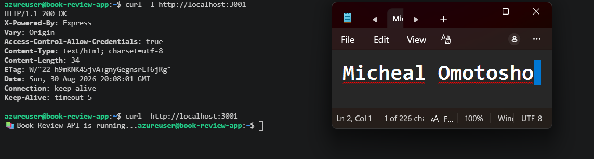

---

#### Screenshot 12 — Internal health-check or API response (without exposing secrets)

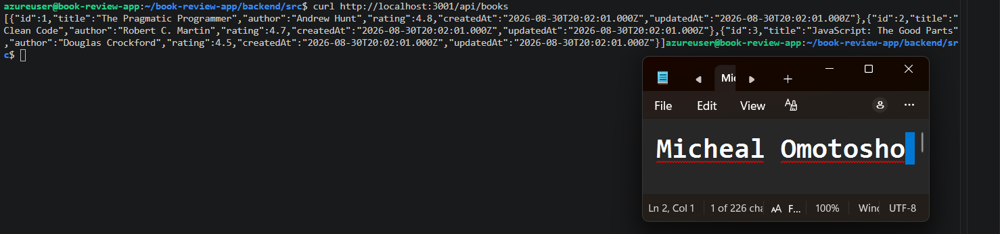

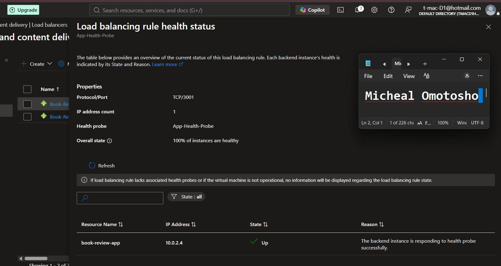

---

# Task 6 — Deploy the Managed Database Tier

## Goal

Create a private Azure managed database (public access disabled), with availability/backup/retention settings, the Book Review App schema imported, and access restricted to the application tier only.

### Evidence

#### Screenshot 13 — Database overview showing private connectivity and public access disabled

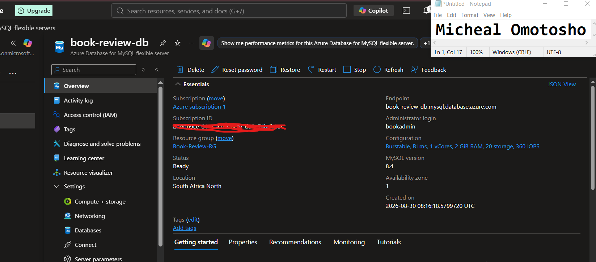

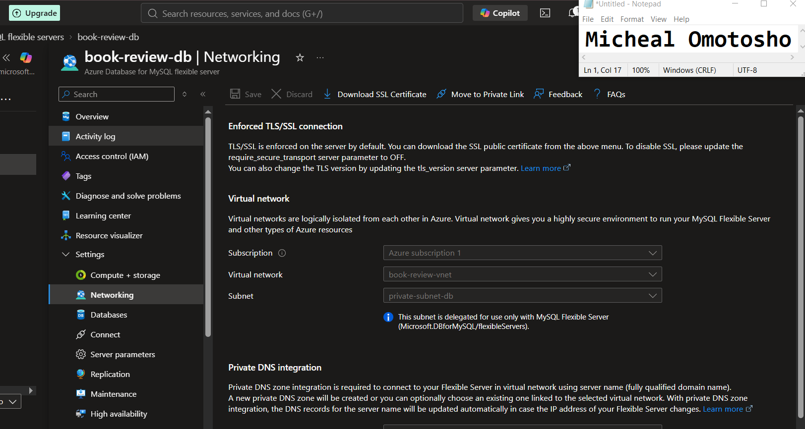

---

#### Screenshot 14 — Availability, backup, and retention configuration

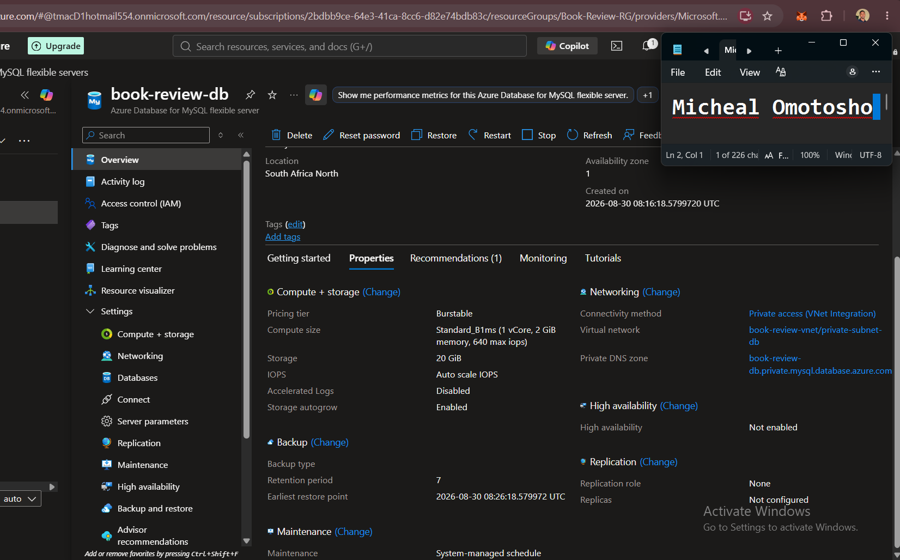

---

#### Screenshot 15 — Successful schema or connectivity verification (without exposing credentials)

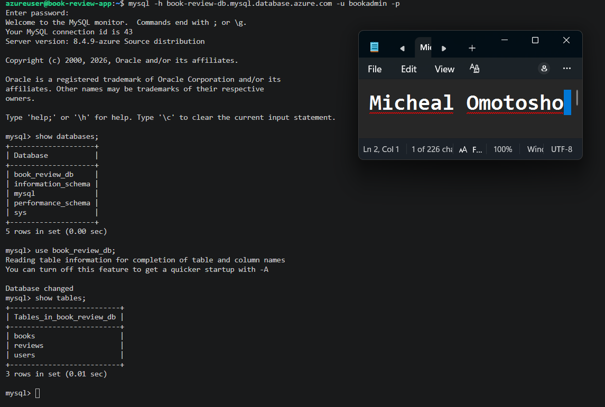

---

# Task 7 — Configure Traffic Management, Availability, and Monitoring

## Goal

Configure the approved public entry service with health probes and backend pools, internal routing for the application tier where required, and enable Azure Monitor/diagnostics/logs/alerts for the key resources.

### Evidence

#### Screenshot 16 — Public entry service showing listener, frontend endpoint, and healthy web targets

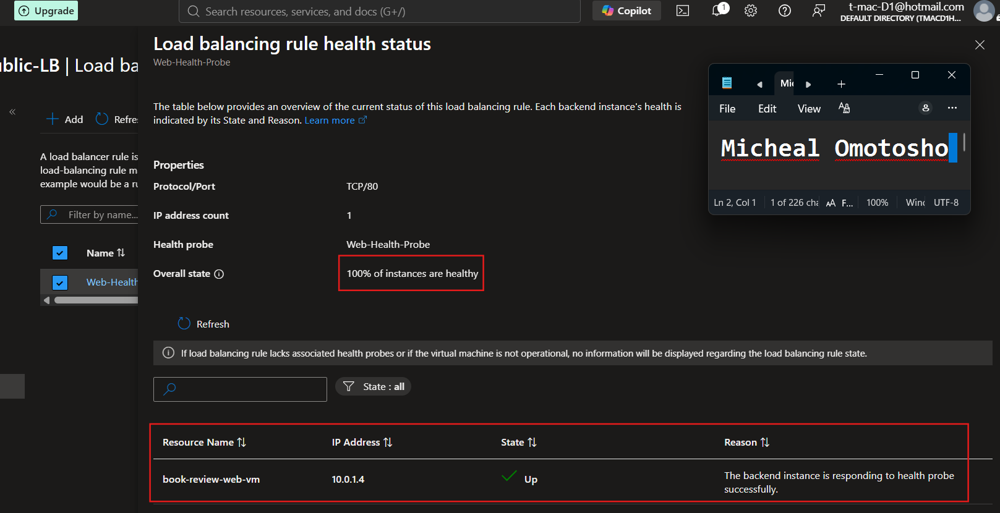

---

#### Screenshot 17 — Internal application-tier load-balancing or routing configuration where applicable

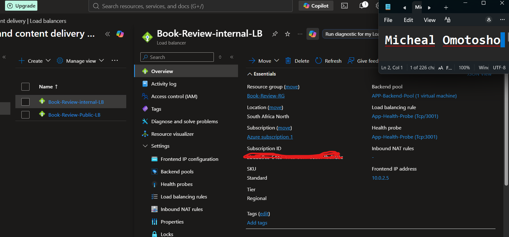

---

#### Screenshot 18 — Azure Monitor, diagnostic settings, logs, metrics, or alert evidence

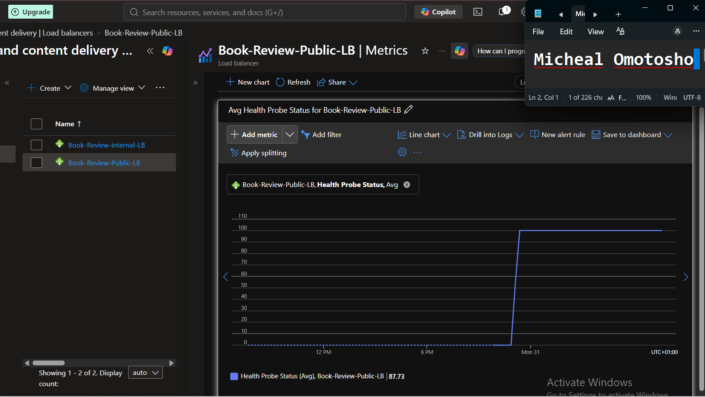

---

# Task 8 — Validate the Production-Style Deployment

## Goal

Confirm the Book Review App works end to end through the public endpoint, with at least one database read and one write, confirm private tiers are not internet-reachable, and complete a safe availability test.

### Evidence

#### Screenshot 19 — Browser showing the Book Review App through the public endpoint

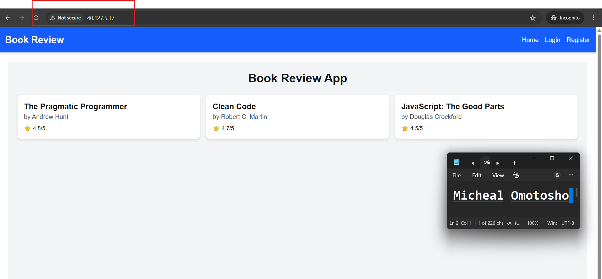

---

#### Screenshot 20 — Proof of successful database-backed read and write operations

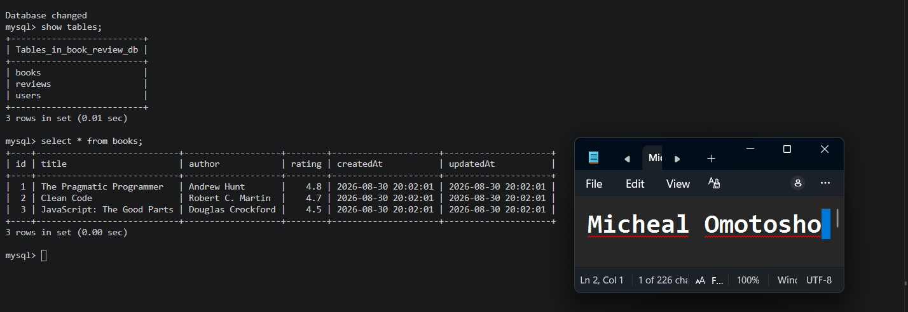

---

#### Screenshot 21 — Evidence that private tiers are not publicly accessible

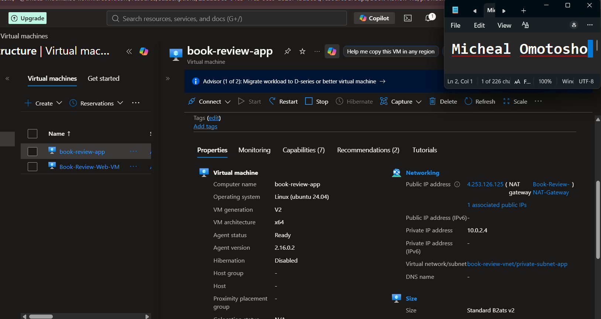

---

#### Screenshot 22 — Availability-test and healthy-target evidence

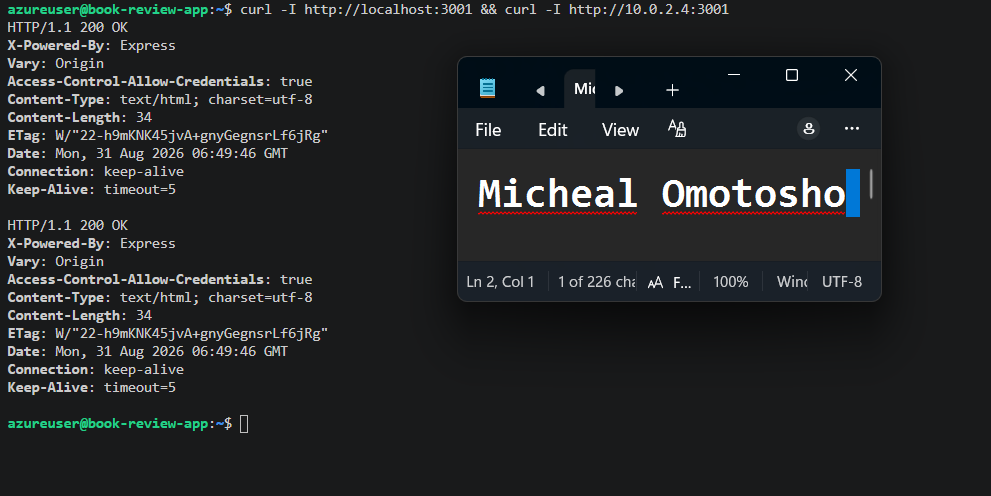

---

#### Public Endpoint

Paste your public endpoint URL here:

http://40.127.5.17/

---

### Notes

Summarize what worked, issues encountered and how they were fixed, and the availability/security/secrets/monitoring/backup choices made.

### Project Overview

This project involved deploying a Book Review web application on Microsoft Azure using a production-style three-tier architecture consisting of the presentation/web tier, application/business-logic tier, and database tier.

The primary objective was to design and deploy an architecture that demonstrates high availability, security, scalability, monitoring, and data protection by leveraging Azure networking, compute, load balancing, and database services.

### Project Execution

I began by creating an Azure Resource Group to logically organize and manage all resources associated with the application.

I then created an Azure Virtual Network (VNet) using the CIDR range 10.0.0.0/16. The VNet provided an isolated networking environment that enabled controlled communication between the different application tiers.

The network was divided into three subnets: one public subnet for the web tier and two private subnets for the application and database tiers. The resources were distributed across availability zones where supported to improve resilience and reduce the risk of a single infrastructure failure affecting the entire application.

I provisioned two virtual machines to support the application infrastructure and an Azure Database for MySQL instance for persistent data storage.

Network Security Groups (NSGs) were configured to restrict traffic according to the application's communication requirements. The intended traffic flow was:

Internet → Public Load Balancer → Web Tier → Internal Load Balancer → Application Tier → Database

Only the required ports were permitted between the different tiers, reducing unnecessary network exposure.

Load balancing was implemented to distribute incoming traffic across healthy virtual machines. Health probes were configured to determine whether backend instances were available to receive traffic, improving application availability and resilience.

I also installed and configured the required operating-system, web-server, runtime, and application dependencies on the virtual machines. Environment variables were configured to allow the application to connect securely to its required services.

### Issues Encountered and Resolution
Load Balancer Health Probes Showing Unhealthy

One of the major issues encountered during deployment was that the Azure Load Balancer health probes initially reported the virtual machines as unhealthy, even though the application appeared to be running.

To troubleshoot the issue, I connected to the web and application servers through SSH and performed several checks:

- Verified that Nginx was running correctly.
- Used curl to test whether the application was responding locally.
- Checked the ports on which the services were listening.
- Reviewed the Network Security Group rules.
- Compared the Load Balancer health probe port with the ports permitted by the NSG.

The root cause was an incorrect port configuration in the NSG. The port allowed by the NSG did not match the port being used by the Load Balancer health probe.

I corrected the NSG rules to allow the appropriate health-probe traffic. After the change, the Load Balancer successfully identified the virtual machines as healthy and began distributing traffic correctly.

### Availability, Security, Secrets, Monitoring and Backup

#### Availability

High availability was addressed by deploying multiple application instances and using Azure Load Balancing to distribute traffic across healthy servers. Availability zones were also used where supported to reduce the impact of infrastructure-level failures.

The Load Balancer health probes automatically identify unhealthy instances and prevent traffic from being directed to them.

#### Security

Security was implemented using a defense-in-depth network approach. Network Security Groups were configured to permit only the required traffic between application tiers.

The architecture minimized direct exposure of internal resources by keeping the application and database tiers private and controlling communication through defined network paths.

The intended secure traffic flow was:

Public Internet → Public Load Balancer → Web Server → Internal Load Balancer → Application Server → Database

#### Secrets Management

Application credentials and database connection information were kept outside the application source code using environment variables in a .env file. The .env file was not committed to the source-code repository and was referenced through environment-variable names by the application.

#### Monitoring

The Load Balancer health probes were used to continuously monitor the availability of backend instances and ensure that traffic was directed only to healthy servers.

Additional monitoring and logging can be implemented using Azure Monitor and Log Analytics to provide deeper visibility into VM performance, application behavior, network activity, and operational issues.

#### Backup

Backup was enabled for the Azure Database for MySQL instance during database provisioning. This provides a mechanism for protecting application data and supporting recovery in the event of data loss or infrastructure failure.

### Overall Outcome

The project provided practical experience in deploying a production-style three-tier application on Azure. I gained hands-on experience with Azure networking, subnets, NSGs, virtual machines, load balancing, Azure Database for MySQL, availability, troubleshooting, application deployment, SSL database connectivity, and process management using PM2.

The project also demonstrated the importance of validating communication between infrastructure components rather than assuming that an application is fully operational simply because its individual services appear to be running.

---

# Submission Instructions

- Add all required screenshots and links in your submission
- Do not expose passwords, keys, connection strings, or subscription IDs

---

# Completion Checklist

- [ ] Task 1: Architecture diagram and assumptions documented (Screenshots 1–2)
- [ ] Task 2: Network foundation created with isolated tiers (Screenshots 3–5)
- [ ] Task 3: Least-privilege security and secret management configured (Screenshots 6–7)
- [ ] Task 4: Presentation tier deployed (Screenshots 8–9)
- [ ] Task 5: Application tier deployed privately (Screenshots 10–12)
- [ ] Task 6: Managed database tier deployed privately (Screenshots 13–15)
- [ ] Task 7: Public entry, internal routing, and monitoring configured (Screenshots 16–18)
- [ ] Task 8: End-to-end validation and availability test completed (Screenshots 19–22, Public Endpoint, Notes)
- [ ] No sensitive data exposed

---

## 📌 About DMI & CloudAdvisory

DevOps Micro Internship (DMI) is a project-based DevOps program run by Pravin Mishra (The CloudAdvisory) focused on real-world execution, systems thinking, and career readiness.

It helps learners build strong DevOps foundations with hands-on experience.

---

## 📌 Resources

- 🌐 DMI Official Website: https://dmi.pravinmishra.com?utm_source=github&utm_medium=readme  
- 🎓 University: https://university.pravinmishra.com?utm_source=github&utm_medium=readme  
- 💬 Discord Community: https://discord.pravinmishra.com?utm_source=github&utm_medium=readme  
- 📝 Blog: https://dmi.pravinmishra.com/blog?utm_source=github&utm_medium=readme  
- ▶️ YouTube Playlist: https://www.youtube.com/playlist?list=PLFeSNDtI4Cho  
- 🔗 Pravin Mishra (LinkedIn): https://www.linkedin.com/in/pravin-mishra-aws-trainer/  
- 🏢 CloudAdvisory (LinkedIn): https://www.linkedin.com/company/thecloudadvisory/

---

*This submission is part of DevOps Micro Internship (DMI) Cohort 3 — Agentic AI Track.*
