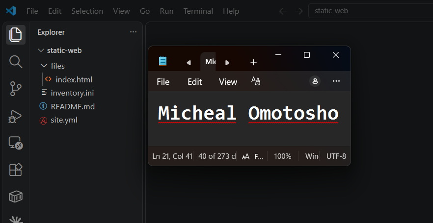
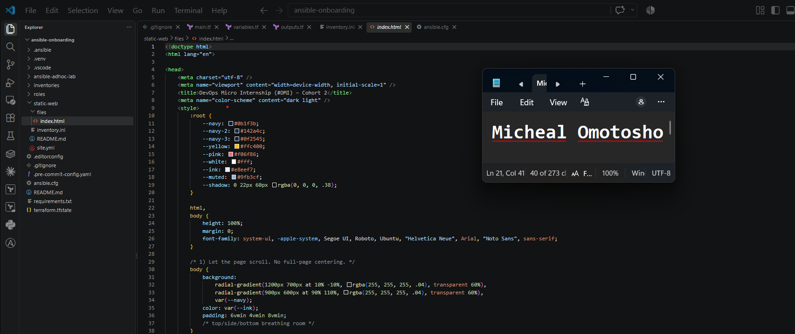
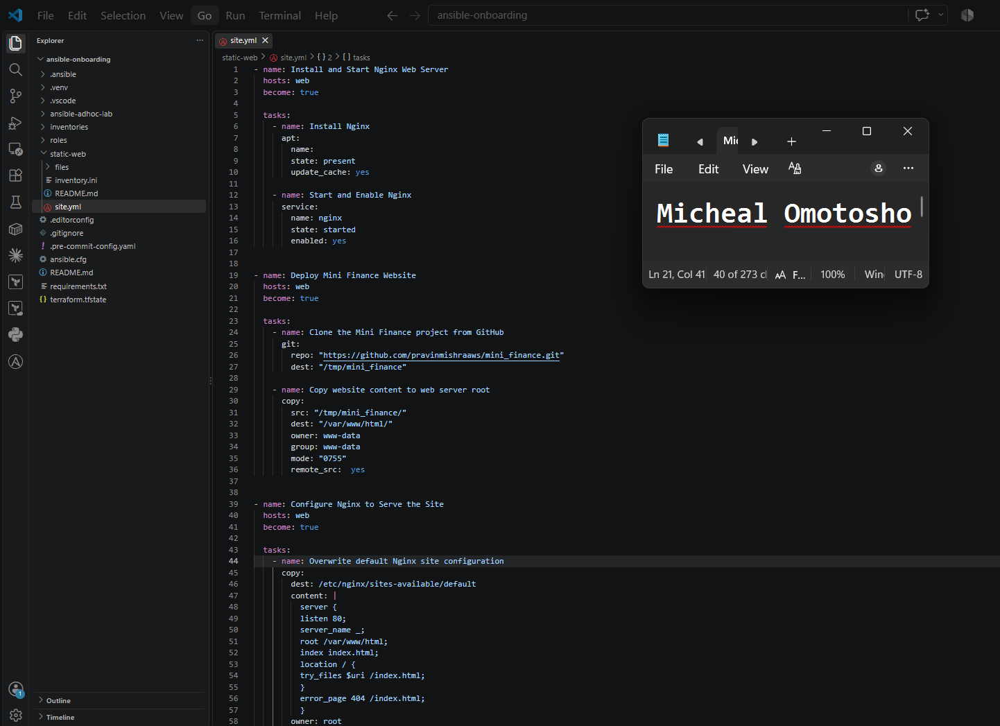
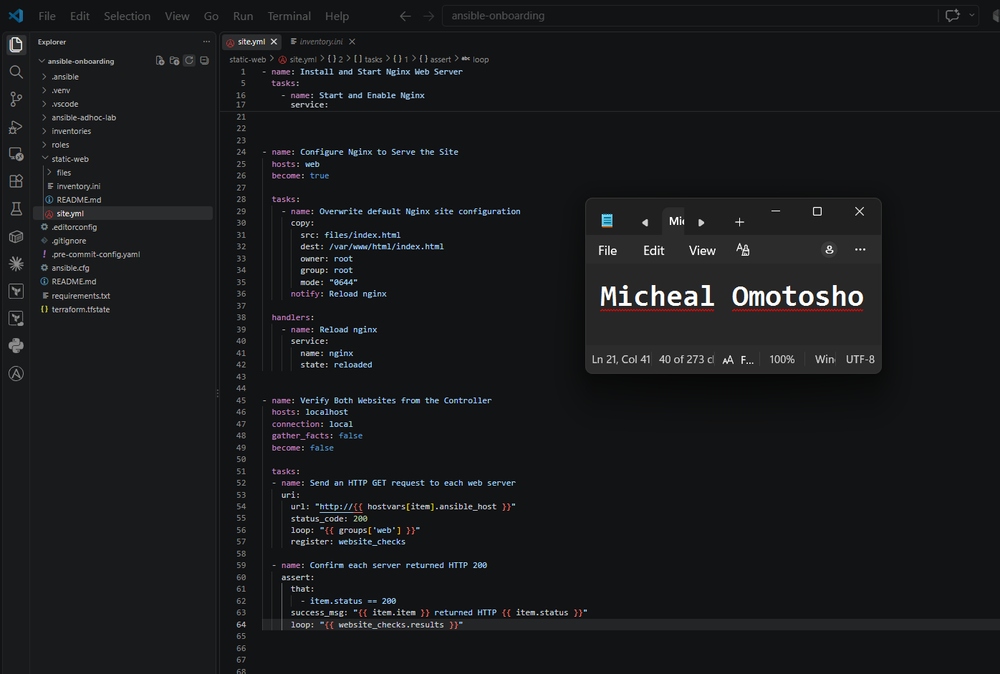
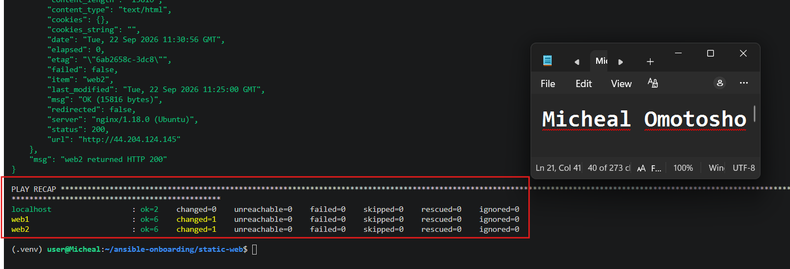
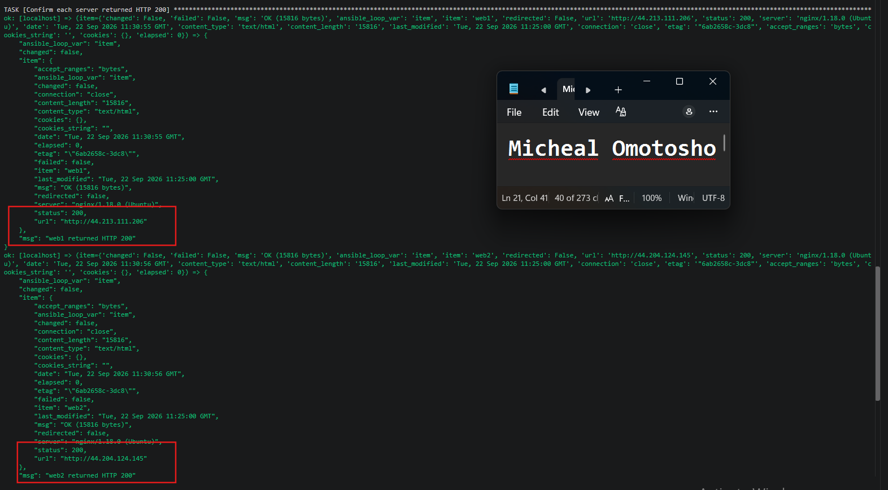
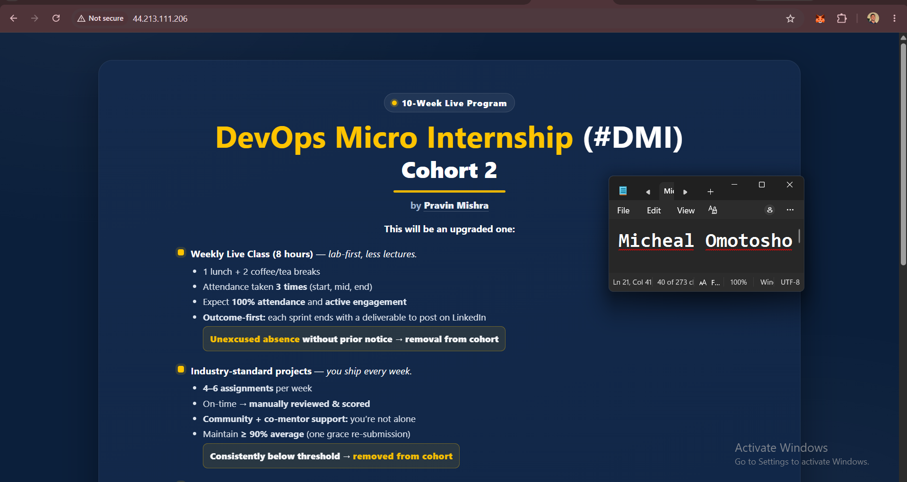

# Assignment 3 — Multi-Play Web Deploy on Azure

Part of the DevOps Micro Internship (DMI) Cohort 3 with Agentic AI

---

## Purpose

In this assignment, you will create one Ansible playbook (`site.yml`) with three plays — install Nginx, deploy a static website with the `copy` module, and verify the deployment from the controller — against the `[web]` group from your existing inventory.

---

# Task 1 — Set Up Folder Layout

## Goal

Create the `static-web` project directory with `inventory.ini`, `site.yml`, a `files/` subdirectory, and `README.md`.

### Evidence

#### Screenshot 1 — Terminal or editor showing the complete `static-web` folder layout

---

# Task 2 — Get the Content

## Goal

Stage `index.html` from `https://github.com/pravinmishraaws/Azure-Static-Website` locally under `static-web/files/`.

### Evidence

#### Screenshot 2 — Editor or terminal showing `files/index.html` staged inside the `static-web` project

---

# Task 3 — Create the Multi-Play Playbook: site.yml

## Goal

Write `site.yml` with three plays: Play 1 (install/start Nginx on `web`), Play 2 (`copy` `files/index.html` to `/var/www/html/index.html` with owner `www-data`/mode `0644`, notifying an Nginx reload handler), and Play 3 (verify every web host with the `uri` module from `localhost`, asserting HTTP 200).

### Evidence

#### Screenshot 3 — Editor showing the three plays in `site.yml`

---

#### Screenshot 4 — Editor showing the copy task, file ownership/mode, handler, uri task, and HTTP 200 assertion

---

# Task 4 — Run the Playbook

## Goal

Run `ansible-playbook -i inventory.ini site.yml` and confirm all plays complete with no failures.

### Evidence

#### Screenshot 5 — Terminal showing the `ansible-playbook` run and final recap with OK/changed results and no failures

---

#### Screenshot 6 — Terminal showing the successful localhost URI verification results

---

# Task 5 — Manual Verification

## Goal

Confirm the deployed static website is reachable directly from a web-server public IP via `curl` and a browser.

### Evidence

#### Screenshot 7 — Browser showing the static website loaded from a web-server public IP

---

### Notes

Describe an issue you faced and how you fixed it, what you learned, why installation and deployment were split into separate plays, and one benefit of using `copy` instead of cloning from Git directly.

1. The main issue I faced was an indentation error in my Ansible playbook. Under the uri task, I did not place the loop at the correct indentation level. This caused the error: Error while resolving value for 'url': 'item' is undefined. I fixed the issue by correcting the indentation and placing the loop at the appropriate level under the task.

2. From this experience, I learned how powerful Ansible playbooks can be for achieving idempotency, consistency, and module reusability when automating infrastructure and application deployment.

3. Installation and deployment were split into separate plays because they represent different stages of the automation process and use different Ansible modules and tasks. Separating them makes the playbook easier to organize, understand, troubleshoot, and maintain.

4. One benefit of using the copy module instead of cloning directly from Git is that it can copy files from the local control machine to the target server without requiring the target server to access the Git repository. This can make file deployment simpler and useful when the required files are already available locally.

---

# Submission Instructions

- Add all required screenshots in your submission
- IP addresses in `inventory.ini` may be redacted
- Do not expose SSH private keys

---

# Completion Checklist

- [ ] Task 1: `static-web` project structure created (Screenshot 1)
- [ ] Task 2: `index.html` staged under `files/` (Screenshot 2)
- [ ] Task 3: Three-play `site.yml` written (Screenshots 3–4)
- [ ] Task 4: Playbook run successfully with no failures (Screenshots 5–6)
- [ ] Task 5: Site verified manually via browser (Screenshot 7)
- [ ] Reflection notes written (Notes)
- [ ] No sensitive data exposed

---

## 📌 About DMI & CloudAdvisory

DevOps Micro Internship (DMI) is a project-based DevOps program run by Pravin Mishra (The CloudAdvisory) focused on real-world execution, systems thinking, and career readiness.

It helps learners build strong DevOps foundations with hands-on experience.

---

## 📌 Resources

- 🌐 DMI Official Website: https://dmi.pravinmishra.com?utm_source=github&utm_medium=readme  
- 🎓 University: https://university.pravinmishra.com?utm_source=github&utm_medium=readme  
- 💬 Discord Community: https://discord.pravinmishra.com?utm_source=github&utm_medium=readme  
- 📝 Blog: https://dmi.pravinmishra.com/blog?utm_source=github&utm_medium=readme  
- ▶️ YouTube Playlist: https://www.youtube.com/playlist?list=PLFeSNDtI4Cho  
- 🔗 Pravin Mishra (LinkedIn): https://www.linkedin.com/in/pravin-mishra-aws-trainer/  
- 🏢 CloudAdvisory (LinkedIn): https://www.linkedin.com/company/thecloudadvisory/

---

*This submission is part of DevOps Micro Internship (DMI) Cohort 3 — Agentic AI Track.*
