# Assignment 5 — Production-Grade EpicBook: Terraform + Ansible Roles (Azure or AWS)

Part of the DevOps Micro Internship (DMI) Cohort 3 with Agentic AI

---

## Purpose

In this assignment, you will deploy the EpicBook web application on a cloud VM provisioned with Terraform (Azure or AWS — pick one) and configured through reusable Ansible roles (`common`, `nginx`, `epicbook`) orchestrated by one playbook, using group variables, templates, and handlers, with a verified idempotent second run.

---

# Task 1 — Set Up Folder Layout

## Goal

Create the `epicbook-prod` project with `terraform/azure` or `terraform/aws`, `ansible/inventory.ini`, `ansible/site.yml`, `ansible/group_vars/web.yml`, and the `common`, `nginx`, and `epicbook` role directories.

### Evidence

#### Screenshot 1 — Terminal or editor showing the complete `epicbook-prod` project tree

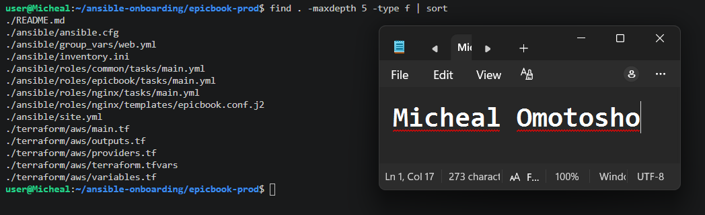

---

# Task 2 — Terraform (Pick One: Azure or AWS)

## Goal

Provision one secure Ubuntu 22.04 VM with SSH key authentication, inbound SSH (22) and HTTP (80), and `public_ip`/`admin_user` outputs, on your chosen cloud.

### Evidence

#### Screenshot 2 — Terminal showing successful `terraform apply` and `terraform output` with `public_ip` and `admin_user`

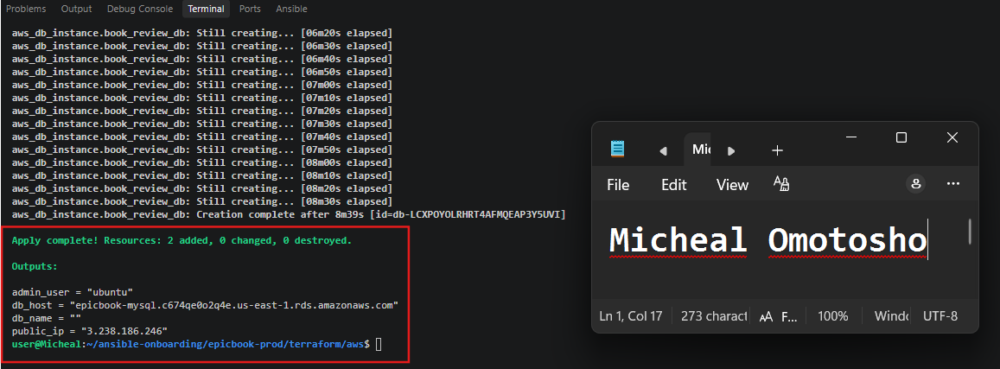

---

#### Screenshot 3 — Terraform code or cloud console showing inbound rules for ports 22 and 80

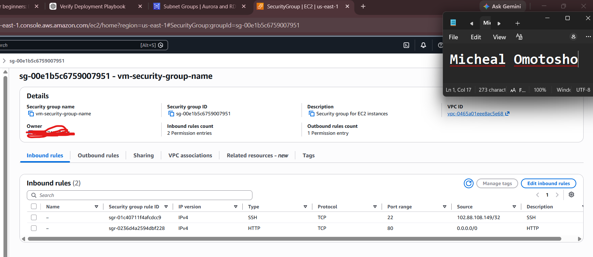

---

# Task 3 — Ansible Inventory

## Goal

Create the `[web]` inventory using the Terraform `public_ip` and `admin_user` outputs, and verify passwordless SSH and `ansible ping`.

### Evidence

#### Screenshot 4 — Terminal showing the successful passwordless SSH hostname check

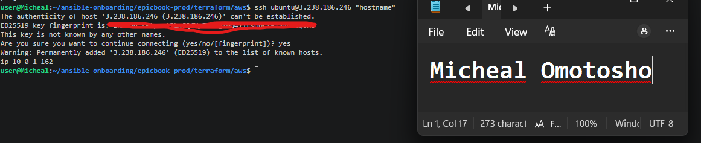

---

#### Screenshot 5 — Editor or terminal showing `inventory.ini` and a successful Ansible ping

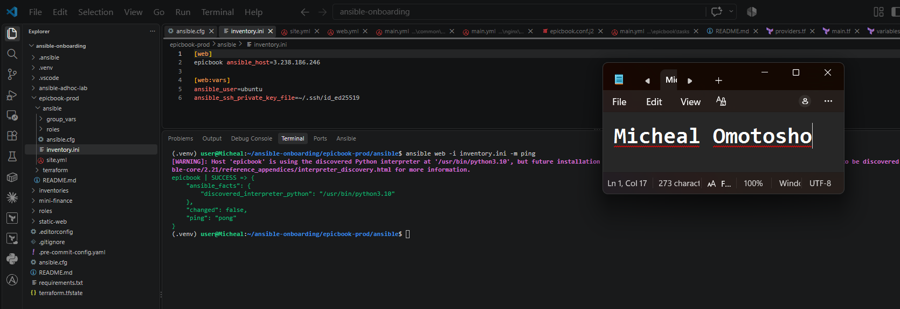

---

# Task 4 — Create site.yml (Role Orchestration)

## Goal

Create `site.yml` invoking the `common`, `nginx`, and `epicbook` roles in that exact order.

### Evidence

#### Screenshot 6 — Editor showing `ansible/site.yml` with the three roles in the required order

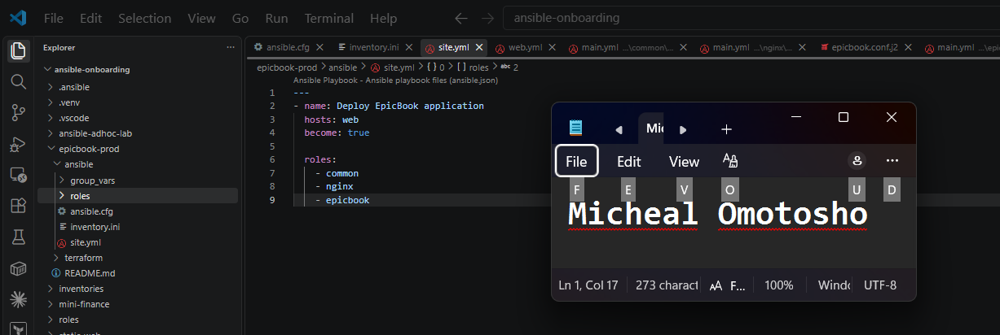

---

# Task 5 — Role: common

## Goal

Create `roles/common/tasks/main.yml` to update apt, upgrade packages, install baseline packages (`git`, `curl`, `unzip`, `software-properties-common`), with optional SSH hardening applied only after key-based access is confirmed.

### Evidence

#### Screenshot 7 — Editor showing `roles/common/tasks/main.yml`

---

# Task 6 — Role: nginx

## Goal

Create the `nginx` role to install Nginx, deploy the `epicbook.conf.j2` template to `/etc/nginx/sites-available/epicbook`, enable the site, remove the default site, and reload via handler.

### Evidence

#### Screenshot 8 — Editor showing the Nginx role tasks, handler, and `epicbook.conf.j2` template

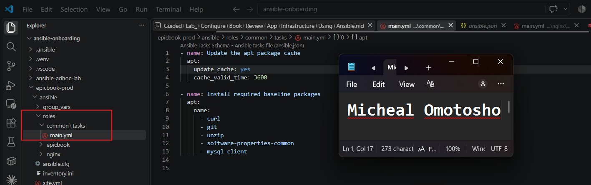

---

#### Screenshot 9 — Terminal showing `/etc/nginx/sites-available/epicbook` and a successful Nginx configuration test

Add your screenshot here.

---

# Task 7 — Role: epicbook

## Goal

Create the `epicbook` role to clone the repository to `{{ app_dest }}`, set ownership/permissions using group variables, and notify the Nginx reload handler on change.

### Evidence

#### Screenshot 10 — Editor showing `roles/epicbook/tasks/main.yml`

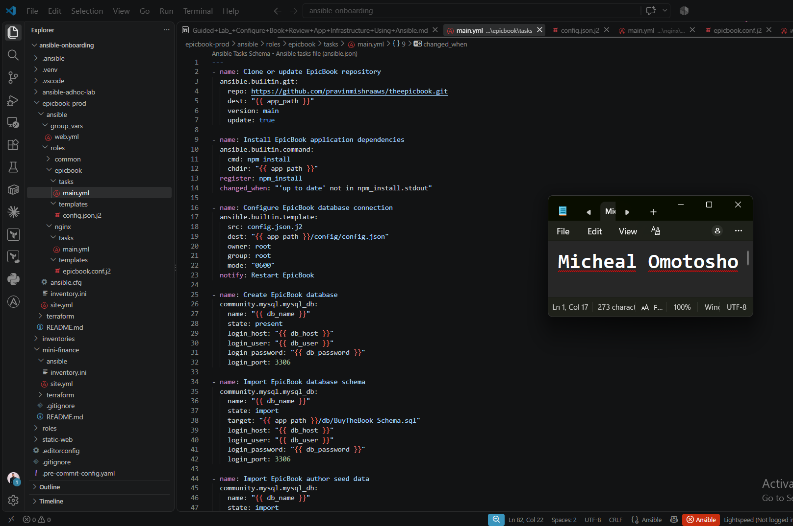

---

# Task 8 — Group Variables

## Goal

Define `app_repo`, `app_dest`, `app_user`, and `app_group` in `ansible/group_vars/web.yml`.

### Evidence

#### Screenshot 11 — Editor showing `ansible/group_vars/web.yml`

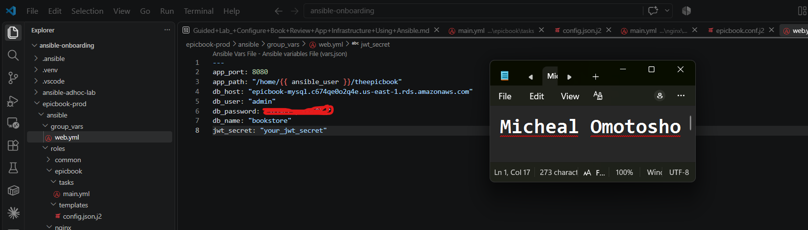

---

# Task 9 — Run the Playbook

## Goal

Run `ansible-playbook -i inventory.ini site.yml` and confirm `common` → `nginx` → `epicbook` all complete with `failed=0`.

### Evidence

#### Screenshot 12 — Terminal showing the role-based Ansible run and final recap with `failed=0`

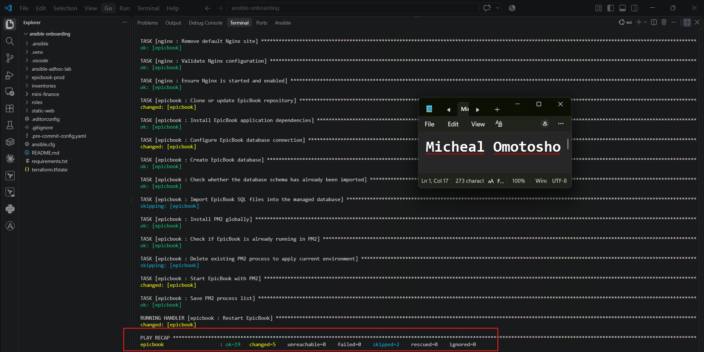

---

# Task 10 — Verify

## Goal

Confirm the EpicBook site loads with HTTP 200, inspect the Nginx configuration, and rerun the playbook to confirm the second run is mostly OK/UNCHANGED with `failed=0`.

### Evidence

#### Screenshot 13 — Browser showing the EpicBook site with the public IP visible

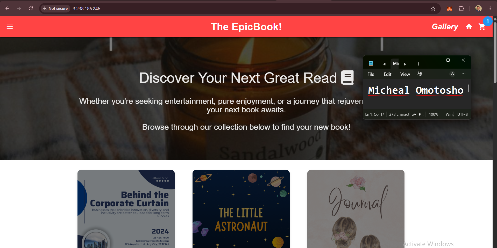

---

#### Screenshot 14 — Terminal showing HTTP 200 and the Nginx site-file snippet

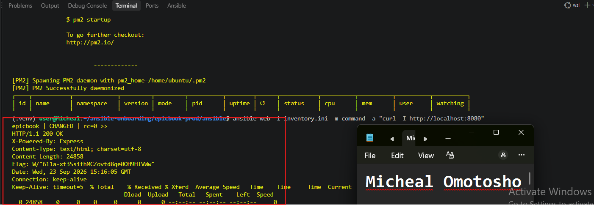

---

#### Screenshot 15 — Terminal showing the idempotent second Ansible run with mostly OK/UNCHANGED and `failed=0`

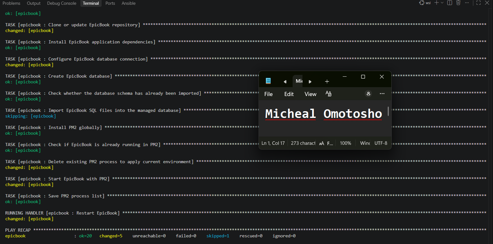

---

### Notes

Describe an issue you faced and how you fixed it, what you learned, any security issues you identified, and your production remediation plan.

## issue you faced and how you fixed it
The main issue I faced was in the application deployment role, specifically during database configuration. After configuring the database and running the Ansible playbook successfully, I ran it again and encountered an error because some of the database tables already existed.

I fixed this by making the database tasks idempotent, so Ansible checks the current state before making changes. If the required database objects already exist, the task skips them instead of attempting to recreate them. This allowed me to run the playbook repeatedly without causing database conflicts.

## What i learned
I learned the importance and power of Ansible roles. Roles helped me separate different responsibilities, such as server configuration, Nginx configuration, application deployment, and database configuration.

This improved the organization and consistency of my automation and made the deployment easier to maintain and reuse. I also learned that good Ansible automation should be idempotent, meaning I should be able to run the same playbook multiple times and achieve the desired state without unnecessarily breaking or recreating existing resources.

## any security issues you identified, and your production remediation plan
One security issue I identified was the handling of the database password. Initially, the password could have been exposed through configuration files or potentially committed to GitHub.

To address this, I moved the password into Ansible variable management instead of hard-coding it directly into my application deployment tasks. I also ensured that files containing sensitive variables were excluded from Git using .gitignore.

For a production environment, I would improve this further by using Ansible Vault or a dedicated secrets manager rather than relying only on .gitignore. I would also rotate any credentials that may have been exposed, apply the principle of least privilege to the database user, restrict database network access to only the required application servers, and ensure that secrets are never stored in the Git repository.

---

# LinkedIn Post (Required)

## Goal

Publish a LinkedIn post describing the Terraform + Ansible roles deployment (cloud chosen, role structure, Nginx deployment, idempotency result), and add a 4–6 line video reflection covering one challenge/fix, security issues observed, and your production remediation plan.

Deployed a production-grade web application called epicbook which touches two important concepts in devops which are terraform and ansible and i am ready to tell you guys how i was able to achieve it.

I started with designing the cloud infrastruction leveraging AWS cloud provider and all was defined as a code uing terraform. I defined the vpc with the required ip range, subnets with two avvailability zone, an ec2 where our application will be sitting on, rds database that help store our data and security groups that stand as a defend mechanism to protect our ec2 instance and database.

To automate configurations and deployment in my ec2 instnance, i leverage ansible. With ansible i was able define inventory that connect my local node to my manage node. Then comes playbook where the real job comes in. I defined the base playbook that reference other plays. Then i switch to creating multiple plays called role structure. I started with the definition of the role `common` which runs the installation of the common dependencies needed with by the server. Then i defined the installation and configuration of nginx webserver which is another role  called `nginx`. nginx helps to server user request through port 80. Then lastly was application deployment called `epicbook` role where i install application dependencies, configure nginx to talk to localhost then configured mysql database. 

One security issue I identified was the handling of the database password. Initially, the password could have been exposed through configuration files or potentially committed to GitHub.

To address this, I moved the password into Ansible variable management instead of hard-coding it directly into my application deployment tasks. I also ensured that files containing sensitive variables were excluded from Git using .gitignore.

To test the power of ansible, i ran the ansible playbook twice to see if my playbook is idempotent enough. No matter how much i run the playbook, it still gives me the same result. 

With the help of terraform + ansible, deployment of infrastructure and server management can be automated which gives a good positive rise to idempotency, module reusability, consistency and isolation.

## Evidence

#### LinkedIn Post URL

Paste your LinkedIn post URL here:

https://www.linkedin.com/posts/micheal-omotosho-577230199_devops-terraform-ansible-ugcPost-7508809236265541632-nayT/?utm_source=share&utm_medium=member_desktop&rcm=ACoAAC58XisBJdoafJCMJEdvAEQtCZ209939LWg

---

#### Screenshot — Published LinkedIn post

---

#### Video reflection screenshot

---

# Submission Instructions

- Add all required screenshots in your submission
- Do not expose private keys, credentials, tokens, or unrestricted management access

---

# Completion Checklis

- [ ] Task 1: `epicbook-prod` project and role structure created (Screenshot 1)
- [ ] Task 2: Cloud VM provisioned with Terraform (Screenshots 2–3)
- [ ] Task 3: Passwordless SSH and Ansible ping verified (Screenshots 4–5)
- [ ] Task 4: `site.yml` orchestrates roles in common → nginx → epicbook order (Screenshot 6)
- [ ] Task 5: `common` role created (Screenshot 7)
- [ ] Task 6: `nginx` role, template, and handler created (Screenshots 8–9)
- [ ] Task 7: `epicbook` role created (Screenshot 10)
- [ ] Task 8: Group variables defined (Screenshot 11)
- [ ] Task 9: Playbook run successfully with `failed=0` (Screenshot 12)
- [ ] Task 10: Site verified and idempotent rerun confirmed (Screenshots 13–15)
- [ ] Reflection and security remediation notes written (Notes)
- [ ] LinkedIn post and video reflection submitted
- [ ] No sensitive data exposed

---

## 📌 About DMI & CloudAdvisory

DevOps Micro Internship (DMI) is a project-based DevOps program run by Pravin Mishra (The CloudAdvisory) focused on real-world execution, systems thinking, and career readiness.

It helps learners build strong DevOps foundations with hands-on experience.

---

## 📌 Resources

- 🌐 DMI Official Website: https://dmi.pravinmishra.com?utm_source=github&utm_medium=readme  
- 🎓 University: https://university.pravinmishra.com?utm_source=github&utm_medium=readme  
- 💬 Discord Community: https://discord.pravinmishra.com?utm_source=github&utm_medium=readme  
- 📝 Blog: https://dmi.pravinmishra.com/blog?utm_source=github&utm_medium=readme  
- ▶️ YouTube Playlist: https://www.youtube.com/playlist?list=PLFeSNDtI4Cho  
- 🔗 Pravin Mishra (LinkedIn): https://www.linkedin.com/in/pravin-mishra-aws-trainer/  
- 🏢 CloudAdvisory (LinkedIn): https://www.linkedin.com/company/thecloudadvisory/

---

*This submission is part of DevOps Micro Internship (DMI) Cohort 3 — Agentic AI Track.*
